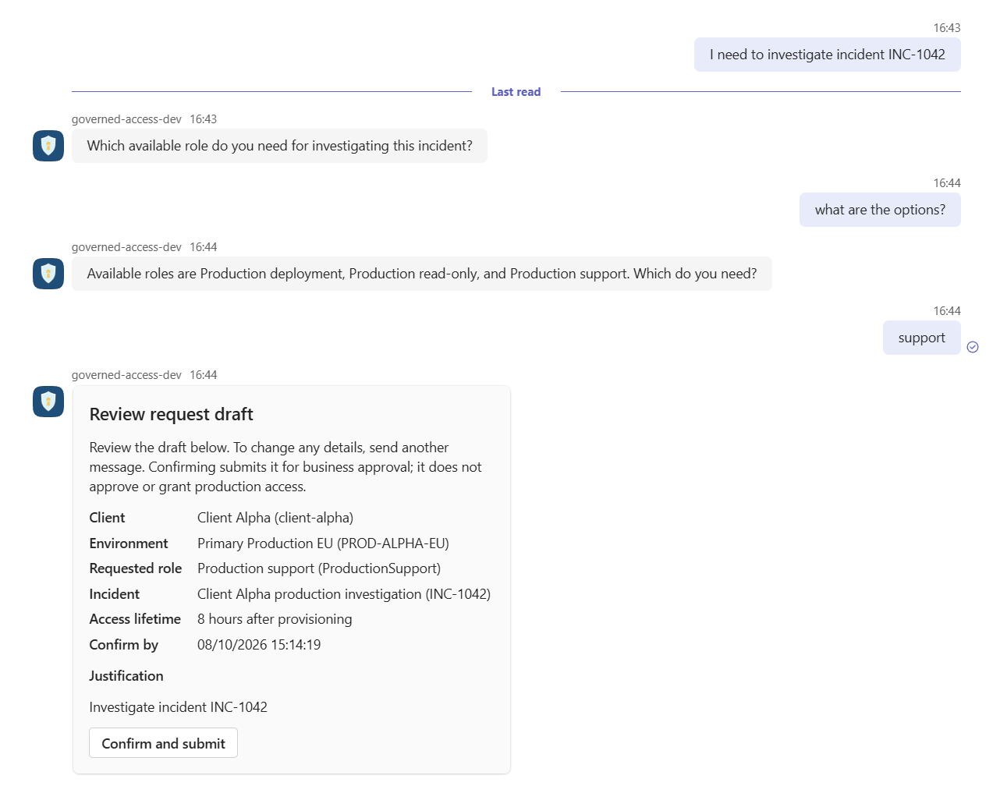
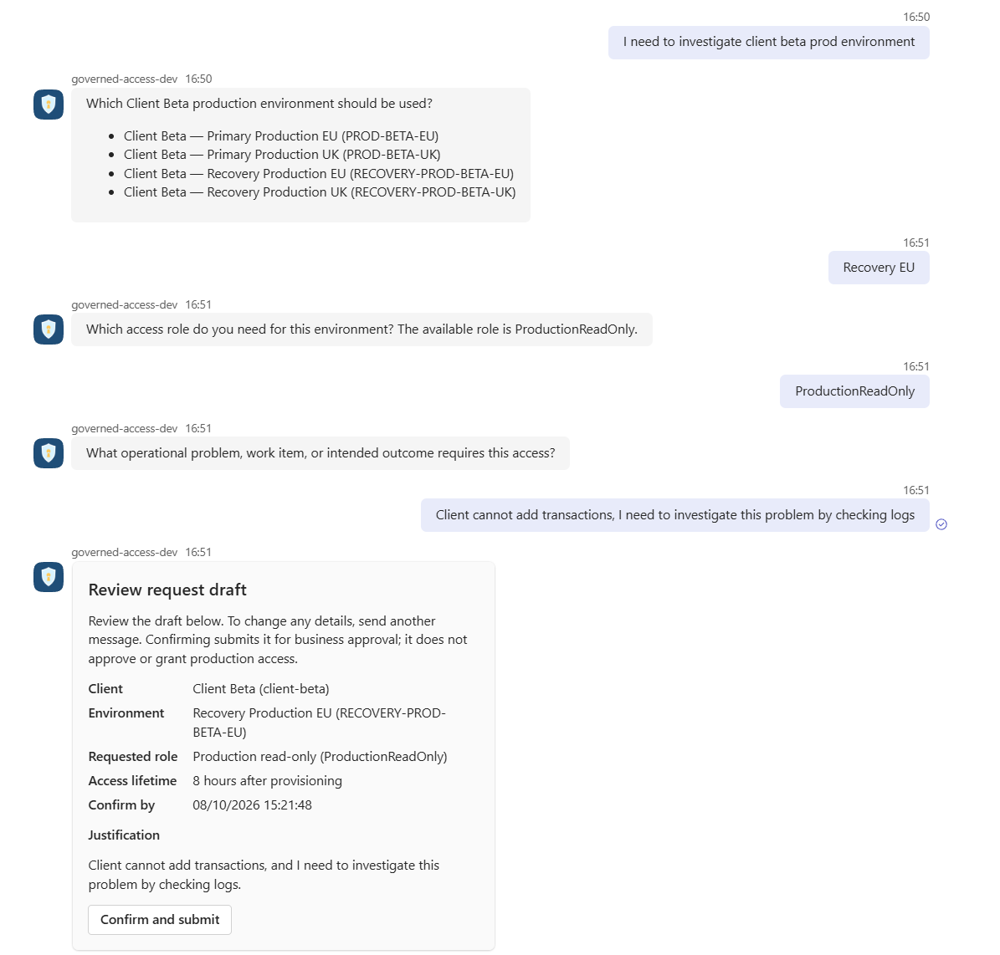
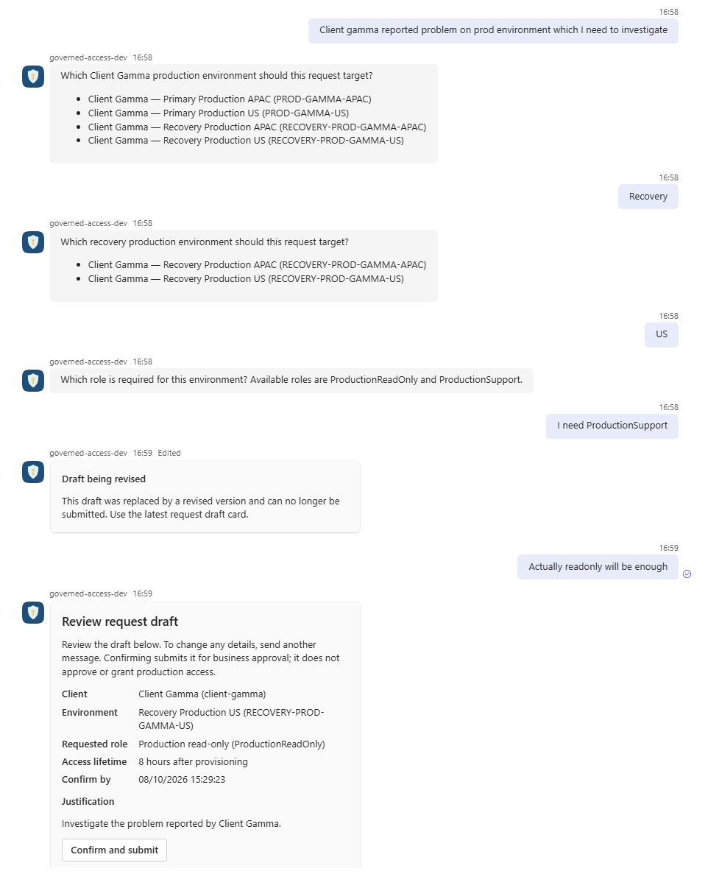

# Governed Production Access Request Assistant

This is a bounded, synthetic, production-shaped portfolio implementation of a
temporary production-access request workflow. It demonstrates how a language model
can help prepare a request without becoming an authorization boundary. It is not a
production-ready access-management platform and grants no real production access.

> AI interprets and gathers context. Humans approve. Deterministic services authorize
> and execute.

One modular ASP.NET Core host contains the Microsoft Teams request channel, a thin
React request register and approval UI, a Microsoft Agent Framework (MAF)
interpreter, a stateless MCP endpoint, deterministic application services, SQLite
persistence, and a synthetic provisioner. Teams confirmation is the only path that
creates a request; the browser has no request-creation endpoint.

## Example Teams conversations

The assistant can ground a request in an authoritative incident, ask only for the
missing role, and present the completed draft for explicit confirmation.



When a description matches several environments, the assistant presents bounded
choices and gathers the role and operational justification before producing a draft.



A requester can refine an ambiguous environment choice and revise the proposed role;
the earlier draft is invalidated and replaced instead of being silently changed.



## The AI boundary

With the live model profile selected, the MAF-based interpreter:

- interprets a server-owned envelope containing the latest natural-language message
  and the currently accepted candidate;
- extracts, preserves, or revises client, environment, role, justification, and
  optional incident information;
- uses approved read-only MCP tools when authoritative context is needed;
- resolves unambiguous readable environment descriptions and asks a focused question
  when information is missing, ambiguous, or conflicting; and
- returns one closed, schema-bound result: either a complete nullable candidate or a
  clarification with a typed target and structured environment option IDs.

The model does **not** decide whether a candidate is valid or ready. It has no
capability to:

- create or submit an access request;
- authenticate or authorize a person;
- approve, reject, retry, provision, revoke, or otherwise transition workflow state;
- choose the business approver, alter the requested role during approval, or change
  the fixed eight-hour grant lifetime; or
- call arbitrary database, generic-query, credential, or side-effecting tools.

Model output, clarification options, and MCP results are untrusted inputs. Core
services reload proposed identifiers and relationships from authoritative storage,
canonicalize or reject them, and independently determine readiness. An authenticated
Teams card action, rather than model text, confirms a ready intake and creates the
immutable request.

The checked-in model profile is `Deterministic`. It returns a fixed candidate so the
transport and governed workflow can be exercised without credentials; it is not a
natural-language-quality demonstration. The optional `FoundryResponses` profile uses
an explicitly configured Azure AI Foundry Responses deployment through
`DefaultAzureCredential`. Invalid configuration or provider failure fails closed and
does not fall back to the deterministic client.

## Why MAF and MCP are here

| Boundary | What this project uses it for |
|---|---|
| MAF | One bounded interpretation run, process-local conversation sessions keyed by server-generated intake ID, schema-constrained responses, and sequential function invocation through `IChatClient`. The loop allows at most six iterations, disables concurrent tool invocation, and terminates on unknown calls. |
| MCP | A real stateless Streamable HTTP boundary for request context. The interpreter requires an exact two-tool catalog and read-only annotations before model execution. MCP is not used for the approval or provisioning workflow. |
| Core | Provider- and protocol-independent validation, authorization, state transitions, confirmation, approval policy, provisioning eligibility, and fixed grant lifetime. |

The MCP server exposes exactly:

- `get_production_environment`: bounded discovery of at most 20 synthetic
  environments or exact lookup by stable ID, including authoritative client and
  assigned-role context; and
- `get_incident`: exact lookup by a requester-supplied stable incident ID.

There is no separate role-listing tool. The MCP project has no workflow store,
decision service, or provisioning dependency. Identifier-like environment input uses
exact lookup only; application-controlled gating prevents a later catalog-discovery
call in the same model turn.

## End-to-end flow


The AI path ends at the proposal. SQLite stores the sanitized candidate and intake
lifecycle, immutable requests, approvals, provisioning operations, grants, and audit
events. It does not store prompts, transcripts, or serialized MAF history.
Conversation history and per-intake serialization gates are process-local; a restart
loses conversational context but preserves the accepted candidate. Relative replies
that can no longer be grounded are clarified again rather than guessed.

Confirmation reloads the owned, unexpired ready intake and revalidates its scope.
Business approval is restricted to the approver configured for the authoritative
client. DevOps approval requires valid prior business approval and revalidates current
scope, but cannot replace the role or duration. Protected provisioning accepts only a
request ID, reloads persisted request, approval, and operation evidence, and constructs
provider input from the immutable request. The synthetic provider uses the request ID
as its get-or-create idempotency key.

## Security and governance controls

- The Teams endpoint requires the Azure Bot Service bearer policy plus the configured
  tenant, `msteams` channel, personal conversation, and stable actor/conversation
  identifiers.
- Browser identities are six fixed demo identities mapped to server-owned claims.
  Unsafe browser actions require authentication and antiforgery validation; command
  payloads do not accept acting identity, approved scope, role, or duration.
- The interpreter rejects a missing, additional, or non-read-only MCP catalog. Neither
  MCP tool can mutate workflow state.
- Model proposals use a closed JSON schema with unknown fields rejected. Core reloads
  candidate identifiers, structured options, client/environment relationships,
  assigned roles, and incident relationships before accepting them.
- Submitted scope is immutable. Corrections require another intake, request ID, and
  approval sequence.
- Both authenticated human approvals are required before provisioning. The
  provisioning handler independently reloads persisted evidence and supports a
  narrowly authorized, request-keyed retry after failure.
- Correlation IDs, actors, decisions, transitions, operation metadata, duration, and
  safe outcomes are logged or persisted without requiring raw prompts, transcripts,
  credentials, or complete MCP payloads.

See the [security model](docs/security-model.md) for the threat register and residual
risks.

## Evaluation and testing

Deterministic automated tests and live-model evaluation answer different questions.

The credential-free backend suites use deterministic chat clients, while the
frontend suite is isolated from a live model. Together they cover domain policy,
candidate validation, SQLite persistence,
MAF session behavior, the real MCP transport and contract, Teams and browser
authentication boundaries, antiforgery, confirmation, approvals, concurrency,
provisioning failure/retry/idempotency, audit evidence, and representative UI wiring.
They do not require a live LLM, Teams tenant, Azure subscription, or production
system.

The explicit `evaluate-live-model` mode instead evaluates stochastic interpretation.
It starts an isolated loopback host exposing only `/mcp`, creates a temporary SQLite
database, and runs the checked-in 20-scenario dataset through the real
`RequestDraftService` path. It grades final normalized application outcomes and
declared candidate or clarification facts, and it requires zero access requests,
approval decisions, provisioning operations, and grants. It does not inspect prompts,
transcripts, tool order, provider iterations, raw payloads, or token usage, and it
cannot confirm, approve, retry, or provision.

The evaluated checked-in dataset is version `1.2.0` (schema version `1`) and
contains 20 scenarios in six categories. The latest retained reviewed run records:

- run ID `e4943a61-16af-4e13-8edd-b735d28c48a0`, completed 2026-08-10;
- deployment label `production-access-request-model`;
- 20/20 scenarios passed; and
- zero requests, approval decisions, provisioning operations, and grants.

See the [human-readable report](docs/evaluation/report.md) and
[machine-readable result](docs/evaluation/result.json). The retained artifact records
the run ID, timestamps, dataset version, deployment label, scenario outcomes,
latencies, and side-effect counts. It does **not** record a commit SHA, prompt or
schema hash, dataset hash, or exact provider model version. This is evidence from one
reviewed run, not proof of production reliability, security, reproducibility across
deployments, or performance at scale.

## Deliberate limitations

- All clients, environments, roles, incidents, identities, requests, and grants are
  synthetic. Teams actors map to one fixed synthetic requester, browser authentication
  is a demo identity selector, and no production credential or access provider exists.
- The application is one process and one deployment unit. SQLite is created with
  `EnsureCreated`; there are no production migrations, high availability, database
  encryption, row-level security, or protected backup/recovery controls.
- MAF conversation sessions and keyed concurrency gates are in memory. They are lost
  on restart, retained for the process lifetime, and are not designed for distributed
  replicas or high-volume workloads.
- The synthetic provider keeps its external grant simulation in process memory.
  Grant expiry is recorded and evaluated logically, but there is no automatic
  revocation or background reconciliation.
- The local `/mcp` route is unauthenticated. Its fixed synthetic, read-only scope is
  acceptable only for this local baseline; real data requires endpoint authentication,
  authorization, network isolation, and rate controls.
- Observability is limited to structured logs, correlation IDs, persisted audit
  evidence, and an `ActivitySource` seam. There is no configured OpenTelemetry export,
  production monitoring, abuse detection, or production capacity SLO.
- Several Microsoft Agent packages are preview or beta dependencies. The project does
  not claim stable production support for those integration surfaces.

The project intentionally excludes real identity federation, mutable enterprise
reference systems, automatic reconciliation and revocation, distributed transactions,
generic workflow engines, RAG, multi-agent orchestration, and multiple deployable
services.

## Run and validate locally

Credential-free development requires the .NET 10 SDK, Node.js 24 (`>=24 <25`), npm,
and PowerShell for the helper scripts. The scripts declare PowerShell 5.1 as their
minimum; the runbooks use PowerShell 7. Running the Teams channel additionally needs a
Microsoft 365 development tenant, Teams Developer CLI 3.x, and Dev Tunnels CLI. A live
model additionally needs an authorized Azure AI Foundry deployment.

Restore from the repository root:

```powershell
dotnet restore ProductionAccessRequestAssistant.sln
npm ci --prefix src/GovernedAccess.Web/ClientApp
```

Run the backend gates sequentially, then the frontend suite:

```powershell
dotnet build ProductionAccessRequestAssistant.sln --no-restore --warnaserror
dotnet test tests/GovernedAccess.UnitTests/GovernedAccess.UnitTests.csproj --no-build --no-restore
dotnet test tests/GovernedAccess.IntegrationTests/GovernedAccess.IntegrationTests.csproj --no-build --no-restore --blame-hang-timeout 3m
npm test --prefix src/GovernedAccess.Web/ClientApp -- --run
```

Give the integration command an outer timeout of at least four minutes. The normal
host intentionally fails closed with the blank checked-in Teams settings. Follow the
[Teams quickstart](docs/teams-quickstart.md) to configure and run the tunnel, protected
bot endpoint, and Web host. The default deterministic model profile is suitable for
exercising confirmation, approval, and synthetic provisioning; select the live profile
only when evaluating natural-language behavior.

To run the complete live-model dataset without Teams:

```powershell
az login
$env:RequestPreparationModel__ExecutionProfile = "FoundryResponses"
$env:RequestPreparationModel__FoundryResponses__Endpoint = "https://<project>.services.ai.azure.com/openai/v1"
$env:RequestPreparationModel__FoundryResponses__DeploymentName = "<deployment-name>"
dotnet run --project src/GovernedAccess.Web --no-launch-profile -- evaluate-live-model --output artifacts/live-model-evaluation
```

The [local development guide](docs/local-development.md) covers configuration, React
hot reload, database handling, and troubleshooting. The
[live-model evaluation guide](docs/live-model-evaluation.md) documents scenario
selection, exit codes, artifact interpretation, and cleanup.

## Design records

- [Architecture](docs/architecture.md) and
  [architecture decisions](docs/adr/README.md)
- [Security and trust model](docs/security-model.md) and
  [current product baseline](docs/governed-production-access-product-baseline.md)
- [Request-intake orchestration](docs/request-intake-orchestration.md) and the
  [current MCP contract](specs/004-resolve-context-identifiers/contracts/mcp-tools.json)
- [Testing strategy](docs/testing-strategy.md),
  [live-model evaluation](docs/live-model-evaluation.md), and
  [latest reviewed evidence](docs/evaluation/README.md)
