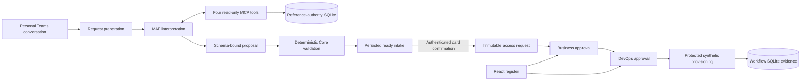
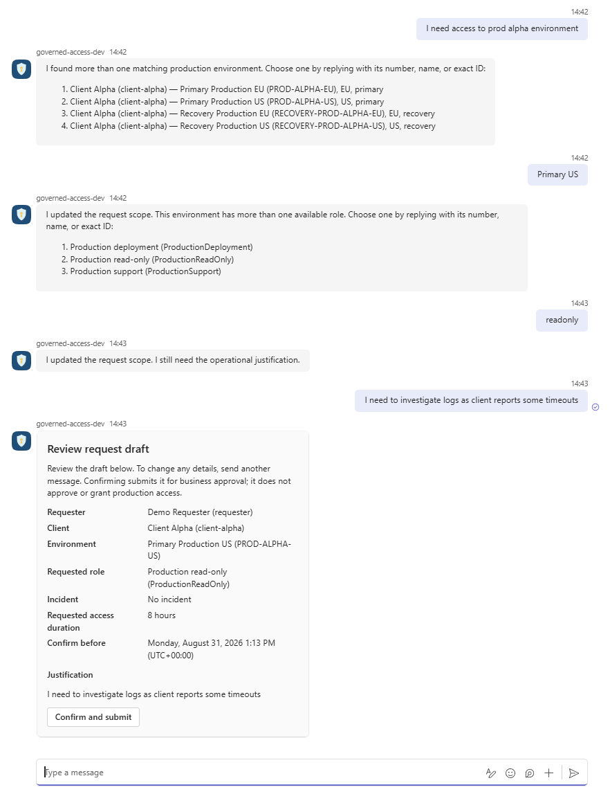
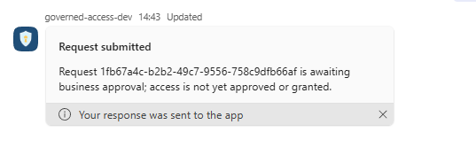
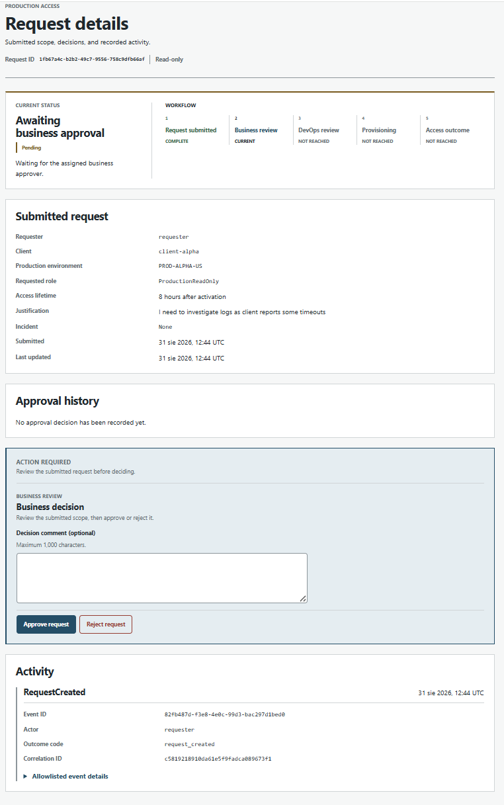
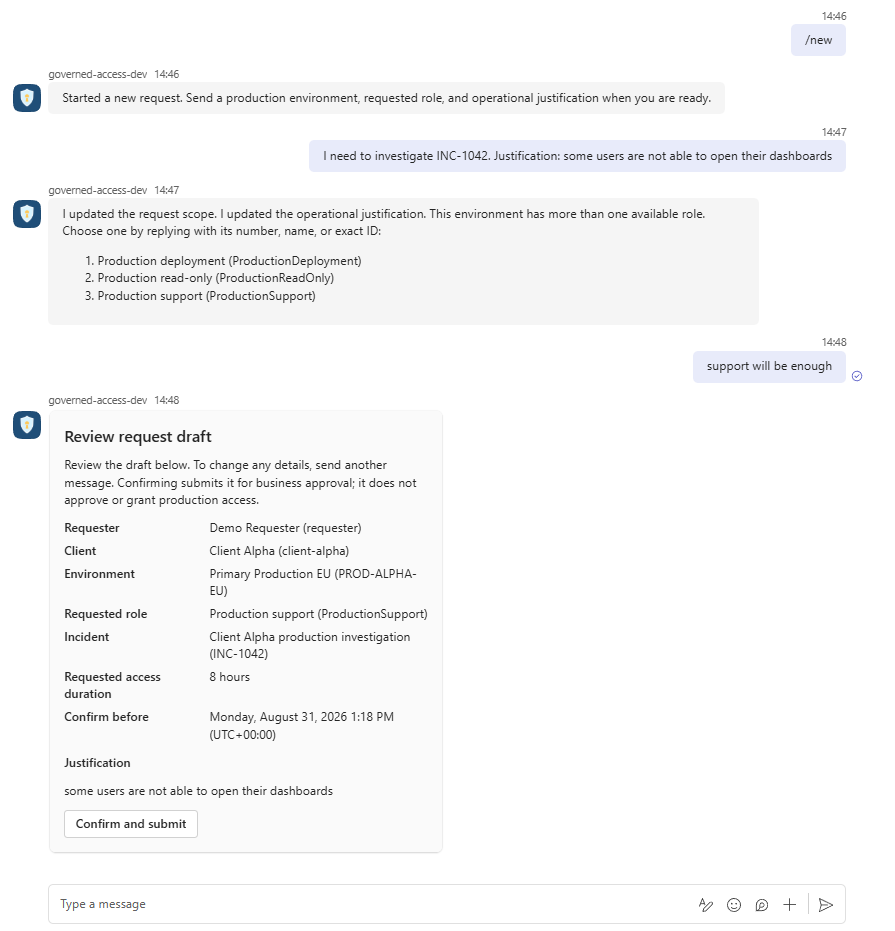
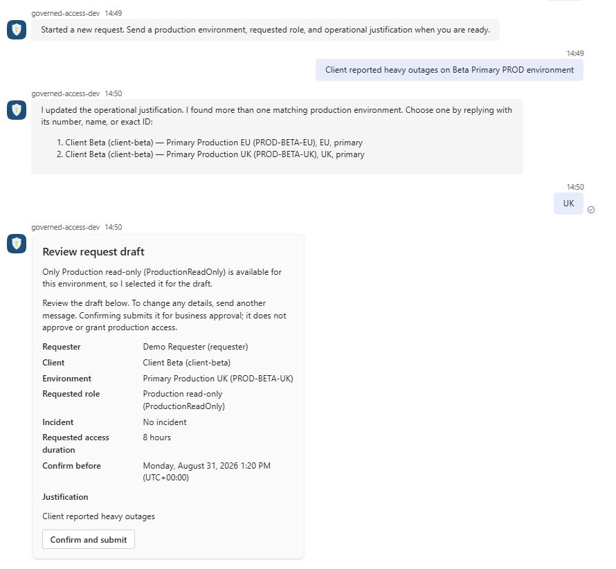

# Governed Production Access Request Assistant

A governed AI-assisted production-access workflow that turns ambiguous Teams
requests into validated, immutable approval records—without allowing the model to
authorize or provision access.

[**Project guide**](#project-guide) · [**Demo**](#demo) ·
[**Run locally**](#run-and-validate-locally)

> **Implementation boundary:** This is a bounded, synthetic, production-shaped local
> implementation. It is not a production-ready access-management platform and grants
> no real production access.

> AI interprets and gathers context. Humans approve. Deterministic services authorize
> and execute.

One modular ASP.NET Core host contains the Microsoft Teams request channel, a thin
React request register and approval UI, a Microsoft Agent Framework (MAF)
interpreter, a stateless MCP endpoint, deterministic application services, SQLite
persistence, and a synthetic provisioner. Teams confirmation is the only path that
creates a request; the browser has no request-creation endpoint.

## End-to-end flow



The AI path ends at the proposal. The independently owned reference database stores
synthetic clients, eligible environments, assignments, and incidents. The workflow
database stores canonical preparations and bounded clarification context, immutable
requests, approvals, provisioning operations, grants, and audit events. Neither stores
raw prompts, requester transcripts, provider sessions, model reasoning, raw proposals,
or complete MCP payloads. Restart preserves the canonical candidate and active ordered
choices; no process-local conversation history is required.

Confirmation reloads the owned, unexpired ready intake and revalidates its scope.
Business approval is restricted to the approver configured for the authoritative
client. DevOps approval requires valid prior business approval and revalidates current
scope, but cannot replace the role or duration. Protected provisioning accepts only a
request ID, reloads persisted request, approval, and operation evidence, and constructs
provider input from the immutable request. The synthetic provider uses the request ID
as its get-or-create idempotency key.

## Project guide

Use the following documents to explore the system:

1. [Architecture](docs/architecture.md) — as-built system boundaries, module
   ownership, runtime flows, persistence, and interfaces.
2. [Security model](docs/security-model.md) — trust boundaries, controls, threats,
   residual risks, and review triggers.
3. [Request preparation and orchestration](docs/request-intake-orchestration.md) —
   context construction, MCP tool policy, sparse proposal reduction, clarification,
   and confirmation.
4. [MCP contracts](docs/contracts/deterministic-request-intake-mcp-contract.md) —
   human-readable tool, authority, transport, and failure rules; the
   [catalog](docs/contracts/mcp-tools.json) is the canonical machine-readable four-tool
   surface.
5. [Testing strategy](docs/testing-strategy.md) — deterministic validation ownership
   across domain and integration boundaries.
6. [Model evaluation](docs/live-model-evaluation.md) — versioned datasets, safety and
   promotion gates, execution guidance, artifacts, and recorded evidence.
7. [Architecture decisions](docs/adr/README.md) — significant design choices, their
   trade-offs, and revisit criteria.

## Architectural proof

- **Bounded AI interpretation:** the model produces a schema-constrained proposal and
  can use exactly four read-only MCP tools; deterministic Core services reload and
  validate every proposed identifier and relationship.
- **Human-controlled, immutable approval:** an authenticated Teams confirmation
  creates the request, and authenticated business and DevOps decisions remain bound
  to its exact scope.
- **Deterministic, idempotent execution:** protected provisioning accepts only the
  request ID, reloads persisted approval evidence, and creates at most one fixed
  eight-hour synthetic grant for that request.

## Demo

These screenshots trace the workflow from natural-language intake to an immutable
request awaiting authenticated human approval.

### Ambiguous environment through business review

The assistant narrows an ambiguous Client Alpha production environment, asks for the
role and operational justification, and presents the completed draft for explicit
confirmation.



Confirmation creates the immutable request and makes clear that access is still
awaiting human approval.



The browser register shows the exact submitted scope, the current business-review
stage, the authenticated decision controls, and the recorded request-created event.



### Incident-grounded request

An authoritative incident identifies the Client Alpha EU environment. The assistant
preserves the supplied justification, asks only for the missing role, and presents the
incident-linked draft.



### Single-role environment

When an ambiguous Client Beta description is narrowed to the UK environment, the
assistant reloads authoritative roles and selects the only assignable role before
presenting the draft.



## The AI boundary

With the live model profile selected, the MAF-based interpreter:

- interprets a server-owned envelope containing the latest natural-language message
  plus the canonical candidate and any persisted bounded clarification choices;
- expresses supported changes as a sparse `set`/`clear` patch over environment, role,
  justification, and incident;
- uses approved read-only MCP tools when authoritative context is needed;
- resolves unambiguous readable environment descriptions and active displayed-choice
  references while returning `unclear` when they cannot be resolved safely; and
- returns one closed dialogue act with either a compatible sparse patch, one closed
  discussion topic, or no semantic payload. It returns no requester-visible prose.

The model does **not** decide whether a candidate is valid or ready. It has no
capability to:

- create or submit an access request;
- authenticate or authorize a person;
- approve, reject, retry, provision, revoke, or otherwise transition workflow state;
- choose the business approver, alter the requested role during approval, or change
  the fixed eight-hour grant lifetime; or
- call arbitrary database, generic-query, credential, or side-effecting tools.

Model output, clarification options, and MCP results are untrusted inputs. Core
services reload proposed identifiers and relationships from authoritative storage,
canonicalize or reject them, and independently determine readiness. An authenticated
Teams card action, rather than model text, confirms a ready intake and creates the
immutable request.

The checked-in model profile is `Deterministic`. It returns a fixed candidate so the
transport and governed workflow can be exercised without credentials; it is not a
natural-language-quality demonstration. The optional `FoundryResponses` profile uses
an explicitly configured Azure AI Foundry Responses deployment through
`DefaultAzureCredential`. Invalid configuration or provider failure fails closed and
does not fall back to the deterministic client.

## Why MAF and MCP are here

| Boundary | What this project uses it for |
|---|---|
| MAF | One fresh bounded interpretation session per message, a schema-constrained sparse proposal, and sequential function invocation through `IChatClient`. The loop allows at most six iterations, disables concurrent tool invocation, and terminates on unknown calls. Provider sessions are not retained. |
| MCP | A real stateless Streamable HTTP boundary for request context. The interpreter requires an exact four-tool catalog and read-only annotations before model execution. MCP is not used for the approval or provisioning workflow. |
| Core | Provider- and protocol-independent validation, authorization, state transitions, confirmation, approval policy, provisioning eligibility, and fixed grant lifetime. |

The MCP server exposes exactly:

- `search_production_environments`: deterministic bounded search returning at most
  five eligible environment/client projections;
- `get_production_environment`: exact lookup of one eligible environment and its
  authoritative client;
- `get_environment_roles`: current assignable roles for one exact environment; and
- `get_incident`: exact lookup by a requester-supplied stable incident ID.

The MCP project has no workflow store, decision service, or provisioning dependency.
Every result remains untrusted interpretation context and is independently reproduced
or exact-reloaded by Core.

## Security and governance controls

- The Teams endpoint requires the Azure Bot Service bearer policy plus the configured
  tenant, `msteams` channel, personal conversation, and stable actor/conversation
  identifiers.
- Browser identities are six fixed demo identities mapped to server-owned claims.
  Unsafe browser actions require authentication and antiforgery validation; command
  payloads do not accept acting identity, approved scope, role, or duration.
- The interpreter rejects a missing, additional, or non-read-only MCP catalog. No MCP
  tool can mutate workflow state.
- Model proposals use a closed JSON schema with unknown fields rejected. Core reloads
  candidate identifiers, structured options, client/environment relationships,
  assigned roles, and incident relationships before accepting them.
- Submitted scope is immutable. Corrections require another intake, request ID, and
  approval sequence.
- Both authenticated human approvals are required before provisioning. The
  provisioning handler independently reloads persisted evidence and supports a
  narrowly authorized, request-keyed retry after failure.
- Correlation IDs, actors, decisions, transitions, operation metadata, duration, and
  safe outcomes are logged or persisted without requiring raw prompts, transcripts,
  credentials, or complete MCP payloads.

See the [security model](docs/security-model.md) for the threat register and residual
risks.

## Evaluation and testing

Deterministic automated tests and live-model evaluation answer different questions.

The credential-free backend suites use deterministic chat clients, while the
frontend suite is isolated from a live model. Together they cover domain policy,
candidate validation, independent SQLite persistence and migrations,
bounded MAF turn behavior, the real MCP transport and contract, Teams and browser
authentication boundaries, antiforgery, confirmation, approvals, concurrency,
provisioning failure/retry/idempotency, audit evidence, and representative UI wiring.
They do not require a live LLM, Teams tenant, Azure subscription, or production
system.

The explicit `evaluate-live-model` mode instead evaluates stochastic interpretation
against the isolated deterministic-intake composition. It starts a loopback-only host
exposing the four read-only MCP tools, creates separate
temporary reference and workflow SQLite databases, and runs the complete versioned
scenario inventory by default. One exact variation can be selected for diagnosis, but
that run is explicitly not promotion evidence. Promotion requires every promoted group
and every universal safety gate to pass, including zero requests, approval decisions,
provisioning operations, and grants. The mode cannot confirm, approve, retry, or
provision.

The checked-in English-only
[`deterministic-intake-v1.json`](src/GovernedAccess.Web/Evaluation/Datasets/deterministic-intake-v1.json)
is the golden source for the executable evaluation inventory and declared safe
outcomes. Its current dataset version is `deterministic-intake-3.1.0` (schema version
`2`): 14 promoted groups, 42 variations, and 43 turns covering sparse field
operations, environment-search cardinalities, clarification references, role
authority, justification transformations, represented discussion/non-update acts,
trust channels, and bounded failures. A documented 2026-08-31 full-inventory run
passed all 14 groups and 41 variations for an earlier
`deterministic-intake-3.0.1` snapshot with recorded SHA-256 `1d6feb66...`. The golden
dataset was edited after that run and no retained full run covers its current exact
bytes and expectations. Because the evaluated working tree was also not clean, the run
is stable passing documentation for its recorded snapshot rather than current-dataset
or clean-source promotion evidence. Its reviewed
[report and result](docs/evaluation/runs/README.md) are retained in the repository;
newly generated runs remain local and gitignored by default.

## Deliberate limitations

- All clients, environments, roles, incidents, identities, requests, and grants are
  synthetic. Teams actors map to one fixed synthetic requester, browser authentication
  is a demo identity selector, and no production credential or access provider exists.
- The application is one process and one deployment unit. Reference and workflow
  SQLite files have separate EF Core contexts, migrations, and seeders, but no high
  availability, encryption, row-level security, or protected backup/recovery controls.
  Disposable local schemas must be fresh or exactly current; there is no supported
  in-place upgrade path.
- Each message uses a fresh MAF session. Only provider-neutral canonical state and one
  bounded clarification context survive a restart; general transcript-based
  coreference is intentionally unsupported.
- The synthetic provider keeps its external grant simulation in process memory.
  Grant expiry is recorded and evaluated logically, but there is no automatic
  revocation or background reconciliation.
- The local `/mcp` route is unauthenticated. Its fixed synthetic, read-only scope is
  acceptable only for this local baseline; real data requires endpoint authentication,
  authorization, network isolation, and rate controls.
- Observability is limited to structured logs, correlation IDs, persisted audit
  evidence, and an `ActivitySource` seam. There is no configured OpenTelemetry export,
  production monitoring, abuse detection, or production capacity SLO.
- Several Microsoft Agent packages are preview or beta dependencies. The project does
  not claim stable production support for those integration surfaces.

The project intentionally excludes real identity federation, mutable enterprise
reference systems, automatic reconciliation and revocation, distributed transactions,
generic workflow engines, RAG, multi-agent orchestration, and multiple deployable
services.

## Run and validate locally

Credential-free development requires the .NET 10 SDK, Node.js 24 (`>=24 <25`), npm,
and PowerShell for the helper scripts. The scripts declare PowerShell 5.1 as their
minimum; the runbooks use PowerShell 7. Running the Teams channel additionally needs a
Microsoft 365 development tenant, Teams Developer CLI 3.x, and Dev Tunnels CLI. A live
model additionally needs an authorized Azure AI Foundry deployment.

Restore from the repository root:

```powershell
dotnet restore ProductionAccessRequestAssistant.sln
npm ci --prefix src/GovernedAccess.Web/ClientApp
```

Run the backend gates sequentially, then the frontend suite:

```powershell
dotnet build ProductionAccessRequestAssistant.sln --no-restore --warnaserror
dotnet test tests/GovernedAccess.UnitTests/GovernedAccess.UnitTests.csproj --no-build --no-restore
dotnet test tests/GovernedAccess.IntegrationTests/GovernedAccess.IntegrationTests.csproj --no-build --no-restore --blame-hang-timeout 3m
npm test --prefix src/GovernedAccess.Web/ClientApp -- --run
```

Give the integration command an outer timeout of at least four minutes. The normal
host intentionally fails closed with the blank checked-in Teams settings. Follow the
[Teams quickstart](docs/teams-quickstart.md) to configure and run the tunnel, protected
bot endpoint, and Web host. The default deterministic model profile is suitable for
exercising confirmation, approval, and synthetic provisioning; select the live profile
only when evaluating natural-language behavior.

To run the complete live-model dataset without Teams:

```powershell
az login
$env:RequestPreparationModel__ExecutionProfile = "FoundryResponses"
$env:RequestPreparationModel__FoundryResponses__Endpoint = "https://<project>.services.ai.azure.com/openai/v1"
$env:RequestPreparationModel__FoundryResponses__DeploymentName = "<deployment-name>"
dotnet run --project src/GovernedAccess.Web --no-launch-profile -- evaluate-live-model --output artifacts/live-model-evaluation
```

Live evaluation uses `LiveModelEvaluation:CumulativeTimeout`, checked in as two
minutes and bounded to five minutes. It can be changed through evaluation-specific
configuration without adding a command argument. Normal application runs ignore that
setting and retain their checked-in 30-second per-turn budget.

The [local development guide](docs/local-development.md) covers configuration, React
hot reload, database handling, and troubleshooting. The
[live-model evaluation guide](docs/live-model-evaluation.md) documents the versioned
inventory, exit codes, artifact interpretation, and cleanup.
