# Router-Led Policy Guidance Evolution Specification

- **Status:** Approved target feature; not current as-built behavior
- **Prepared:** 2026-09-04
- **Approved:** 2026-09-04 by the project maintainer
- **Revision:** Lean router + policy architecture; deterministic dispatch; minimal router context; bounded route-tagged history; Azure AI Search hybrid RAG; Microsoft evaluation stack; submitted-request status deferred
- **Repository:** `mariusz-kacz/production-access-request-assistant`
- **Target presentation name:** Governed Production Access Assistant
- **Delivery limit:** one model-based turn router, the existing Access Request specialist, and one new Policy Advisor
- **Governance:** [constitution amendment 3.1.0](docs/constitution-amendment-3.1.0.md),
  [ADR 0012](docs/adr/0012-router-and-context-isolation.md),
  [ADR 0013](docs/adr/0013-policy-grounding.md), and
  [ADR 0014](docs/adr/0014-routed-evaluation-and-observability.md)
- **Implementation budget:** approximately 24–34 hours

## 1. Objective

Evolve the current access-request assistant into a routed Teams assistant with two responsibilities in one conversation:

1. **Governed production-access request preparation** through the existing sparse-proposal and deterministic workflow.
2. **Grounded production-access policy guidance** through a read-only Policy Advisor.

The router is a bounded model-based turn classifier, not an autonomous supervisor. Deterministic application code validates the router's structured decision and dispatches to a fixed route implementation.

The main engineering goal is to demonstrate the practical consequences of routing:

- route-specific context construction;
- keeping policy history and RAG evidence out of access-request interpretation;
- bounded conversational continuity for policy discussions;
- route-specific tools, retrieval, model configuration, timeouts, and token budgets;
- safe route switching and ambiguity handling;
- latency and token overhead introduced by semantic routing;
- grounded requester-visible policy answers; and
- evaluation using the Microsoft Agent Framework / `Microsoft.Extensions.AI.Evaluation` stack.

The target product rule is:

> AI classifies conversational turns, interprets access-request intent, and explains grounded production-access policy. Humans approve. Deterministic services authorize and execute.

## 2. Settled architecture decisions

The implementation must use the following architecture:

- every ordinary nonblank Teams text turn is classified by one schema-bound model router;
- deterministic application code validates the router response and dispatches through a plain `RoutedTurnCoordinator`;
- at most one specialist is invoked per ordinary text turn;
- MAF `WorkflowBuilder`, dynamic handoffs, planners, supervisors, group chat, recursive delegation, and free-form agent-to-agent messaging are not used;
- malformed router output fails the turn; no second model call repairs or converts it;
- the existing Access Request specialist and deterministic Core workflow remain authoritative for request preparation;
- the Policy Advisor is read-only and receives no access-request MCP tools;
- Policy Advisor RAG uses MAF `TextSearchProvider` in `BeforeAIInvoke` mode backed by Azure AI Search hybrid retrieval;
- conversation history is application-owned and bounded; provider history is not application memory;
- router context contains only the current message, a small recent cross-route window, and minimal active-access context; it does not mirror the canonical preparation;
- Access Request receives no general conversation history;
- Policy Advisor receives only a small recent `PolicyGuidance` history window;
- ambiguous free-text routing returns `Unclear` and requires a new, clearer user message; no pending clarification workflow is persisted;
- `Mixed` turns are not decomposed or queued; the requester must send one complete task as a new message;
- submitted-request status lookup is deferred to a separate future feature; and
- evaluation uses Microsoft's evaluation infrastructure, with custom logic limited to product-specific exact invariants.

The current governing documentation excludes routing and RAG. This specification defines the target state. Implementation must update the repository's governing and as-built documents when the target state becomes real.

## 3. Existing behavior that must remain unchanged

The evolution must preserve these current guarantees:

- `/new` remains an exact deterministic command.
- The Access Request specialist receives the latest requester message, canonical preparation, lifecycle, and active bounded clarification choices.
- It returns an untrusted schema-bound sparse proposal and no requester-visible prose.
- Core independently reloads and validates proposed identifiers and relationships.
- Teams confirmation remains the only request-creation path.
- Submitted scope remains immutable.
- Business and DevOps approvals remain authenticated structured actions bound to one request ID.
- The model cannot submit, approve, provision, retry, revoke, or otherwise perform consequential workflow actions.
- Provisioning remains deterministic and request-keyed for idempotency.
- Existing access-intake, approval, provisioning, security, and live-model evaluation evidence remains valid.

The router and Policy Advisor compose around the current access workflow; they do not replace it.

## 4. Scope

### Included

- one model-based structured turn router;
- deterministic router-decision validation and dispatch;
- the existing Access Request specialist;
- one read-only Policy Advisor;
- bounded application-owned route-tagged recent history;
- a safe policy projection of the active access preparation;
- MAF `TextSearchProvider` with Azure AI Search hybrid RAG;
- a small checked-in synthetic production-access policy corpus used as a reproducible evaluation fixture;
- application-owned validation and rendering of Policy Advisor output;
- route-specific latency, token, history, tool, and retrieval measurements;
- standard MAF/OpenTelemetry instrumentation; and
- Microsoft Agent Framework / `Microsoft.Extensions.AI.Evaluation`-based evaluation.

### Excluded

- additional specialist agents;
- planners, supervisors, dynamic handoffs, group chat, recursive delegation, or parallel specialist execution;
- execution of multiple independent intents in one turn;
- persisted `Unclear` resolution, original-message replay, or pending routing state;
- generic company-policy or unrestricted enterprise search;
- state-changing Policy Advisor tools;
- model-controlled tool selection, knowledge-domain selection, retrieval filters, model deployment, timeout, or token budget;
- a second model used to repair malformed structured output;
- new MCP tools, MCP transport changes, another MCP endpoint, or another deployable service;
- Qdrant or an additional vector store;
- SharePoint crawling, document upload UI, generic ingestion infrastructure, multi-index routing, semantic-ranker tuning, or secondary rerankers in this increment;
- a model-visible RAG search tool;
- topic keys, semantic long-term memory, model-generated memory summaries, generic compaction infrastructure, or a full transcript/event-log platform;
- a new React screen or observability dashboard;
- behavioral changes to request confirmation, approval, provisioning, retry, grant duration, or immutable request scope;
- authoritative submitted-request status lookup or historical-request navigation; and
- real identities, real policies, or real access providers.

## 5. Target architecture

```mermaid
flowchart LR
    User[Requester in Teams] --> Boundary[Authenticated Teams boundary]
    Boundary --> Direct{Protocol action?}
    Direct -->|/new / cards / approvals| Existing[Existing deterministic paths]
    Direct -->|ordinary text| RCtx[Build compact router context]
    History[(Bounded routed history)] --> RCtx
    RCtx --> Router[Structured model router]
    Router --> Validate[Validate route decision]
    Validate --> Coord[RoutedTurnCoordinator]
    Coord -->|AccessRequest| AccessCtx[Existing access context]
    Coord -->|PolicyGuidance| PolicyCtx[Policy context + Azure AI Search RAG]
    Coord -->|Mixed / Unclear / Unsupported| App[Application-owned response]
    AccessCtx --> Access[Existing Access Request specialist]
    Access --> Core[Existing deterministic reducer]
    PolicyCtx --> Policy[Policy Advisor]
    Policy --> PVal[Validate answer + citations]
    Core --> Present[Application-owned Teams presenter]
    PVal --> Present
    App --> Present
    Present --> History
```



Every ordinary text turn performs:

1. compact router-context construction;
2. one structured router invocation;
3. deterministic route validation;
4. deterministic dispatch; and
5. zero or one specialist invocation.

The router never invokes a specialist directly and never paraphrases the current user
message for specialist execution. In this specification, the normalized current
message is the authenticated Teams text after trimming surrounding whitespace only.
References to the “original” message mean that normalized text unchanged: no
route-produced rewrite, summary, translation, or semantic normalization is forwarded.

## 6. Router contract

```csharp
public enum AssistantRoute
{
    AccessRequest,
    PolicyGuidance,
    Mixed,
    Unclear,
    Unsupported
}

public enum RouteContextReference
{
    None,
    ActiveAccessPreparation
}

public sealed record RouterDecision(
    int SchemaVersion,
    AssistantRoute Route,
    RouteContextReference ContextReference);
```

The router uses native structured output with a closed schema. Unknown properties and enum values are rejected. The response contains no confidence, explanation, rewritten user message, request patch, policy answer, retrieval query, tool request, execution setting, or requester-visible prose.

Compatibility rules:

- `AccessRequest` allows `None` or `ActiveAccessPreparation`.
- `PolicyGuidance` allows `None` or `ActiveAccessPreparation`.
- `Mixed`, `Unclear`, and `Unsupported` require `None`.

An invalid combination fails the turn and invokes no specialist.

### Route semantics

| Route | Meaning | Result |
|---|---|---|
| `AccessRequest` | Start, update, discuss, or resume access preparation. | Invoke the existing Access Request specialist with the normalized current message unchanged. |
| `PolicyGuidance` | Explain production-access policy, role meaning, approval rules, lifecycle rules, or related governance. | Invoke the Policy Advisor with bounded policy context and fresh RAG evidence. |
| `Mixed` | Independent access-update and policy-question intents occur in one message. | Invoke no specialist; ask the requester to send one complete task as a new message. |
| `Unclear` | The route or referent cannot be selected safely. | Invoke no specialist; ask the requester to restate the message more explicitly. |
| `Unsupported` | Intent is understood but outside the current access-request/policy scope. | Invoke no specialist; return an application-owned scope response. |

Examples:

```text
"I need Production Read Only access to Alpha EU."
→ AccessRequest
```

```text
"Why does Production Support require business approval?"
→ PolicyGuidance
```

```text
"Change my role to Support and explain whether Support can restart services."
→ Mixed
```

```text
Active access choices and recent policy messages both contain plausible numbered options.
User: "first one"
→ Unclear
```

The router must prefer `Unclear` over guessing when more than one currently represented context plausibly resolves a relative reference.

## 7. Deferred submitted-request status capability

Authoritative questions about the current state of a submitted request are outside this feature:

- "Has my request been approved?"
- "Is provisioning complete?"
- "Can I access production now?"
- "When does my current grant expire?"

They must not be answered from policy RAG, conversation history, preparation state, or model inference. In this version they route to `Unsupported` and receive an application-owned capability-boundary response.

A future feature may add a deterministic status route backed by fresh authoritative workflow reads. The current implementation must not generalize its abstractions in anticipation of that feature.

## 8. Router context

The router receives the latest normalized requester message plus a compact server-owned snapshot:

```csharp
public sealed record RoutingHistoryMessage(
    ConversationMessageRole Role,
    AssistantRoute Route,
    string Content);

public sealed record ActiveAccessRoutingContext(
    bool HasActivePreparation,
    string? ClarificationTarget,
    IReadOnlyList<string> ClarificationChoiceLabels);

public sealed record RoutingContextSnapshot(
    ActiveAccessRoutingContext Access,
    IReadOnlyList<RoutingHistoryMessage> RecentTurns);
```

### Minimal active-access context

The router receives only the minimum durable Access context needed to recognize that an Access thread exists and to resolve references to a currently active clarification:

- whether an active preparation exists;
- the active clarification target, when one exists; and
- bounded safe display labels for the active clarification choices.

Do not add lifecycle, missing-field lists, justification, selected-field values, approval/provisioning state, complete MCP payloads, model metadata, or other preparation details merely to improve routing. The recent conversation should carry most conversational semantics. Extend this projection only when evaluation demonstrates a recurring routing failure that cannot be resolved from the current message, bounded recent history, and active clarification context.

### Recent router window

The router receives at most the four most recent stored routed messages across `AccessRequest` and `PolicyGuidance`, subject to an approximate 600-token budget. The current user message is supplied separately.

The recent window is untrusted conversational context. It helps resolve continuation and topic switching but never replaces canonical access state or deterministic validation.

There is no full-history fallback. If the bounded context does not support safe classification, the router returns `Unclear`.

## 9. Route-specific execution settings

The application owns the execution settings for each route. The router cannot choose or modify them.

The implementation does **not** need to introduce a generic profile registry or hierarchy if simple route-specific options are clearer.

Minimum route separation:

| Route | Model | Context | Tools | Retrieval |
|---|---|---|---|---|
| `AccessRequest` | Existing access interpretation deployment | Existing canonical preparation envelope | Existing exact four-tool MCP catalog | None |
| `PolicyGuidance` | Small/medium policy-answer deployment | Current question + bounded policy history + policy snapshot + optional access projection + retrieved evidence | None | MAF `TextSearchProvider` + Azure AI Search hybrid retrieval |

Prompt versions, model deployment names, hard timeouts, and output limits are server-owned configuration and are observable in retained evaluation evidence.

## 10. Route-specific specialist context

### Access Request specialist

Receives only:

- normalized current requester message unchanged after boundary trimming;
- canonical access preparation;
- preparation lifecycle;
- active bounded clarification choices; and
- the existing exact four-tool MCP catalog.

It receives no general conversation window, policy history, policy answer, policy RAG evidence, or Policy Advisor prompt.

Canonical preparation remains its authoritative memory.

### Policy Advisor

Receives:

- normalized current policy question unchanged after boundary trimming;
- at most four most recent stored `PolicyGuidance` messages, within an approximate 800-token budget;
- the current authoritative access-policy snapshot;
- when `ContextReference == ActiveAccessPreparation`, one safe access-policy projection; and
- at most three current policy evidence chunks selected before model invocation.

The safe access projection is derived deterministically from the active preparation:

```csharp
public sealed record RolePolicyReference(
    string RoleId,
    string DisplayName);

public sealed record AccessPolicyReference(
    string PreparationLifecycle,
    string? EnvironmentClassification,
    RolePolicyReference? SelectedRole,
    IReadOnlyList<RolePolicyReference> ActiveRoleOptions);
```

It exists only to support questions such as:

- "Why does this require business approval?"
- "What is the difference between these roles?"
- "Can I change this request after submission?"

It excludes requester justification, unnecessary client-sensitive details, approval evidence, approver identity, provisioning state, MCP payloads, and Access Request history.

## 11. Bounded route-tagged history

Conversation storage and model-context injection are separate decisions.

Persist only successful conversational messages associated with executable routes:

```csharp
public enum ConversationMessageRole
{
    Requester,
    Assistant
}

public sealed record RoutedConversationMessage(
    Guid MessageId,
    PreparationBinding Binding,
    ConversationMessageRole Role,
    AssistantRoute Route,
    string Content,
    DateTimeOffset CreatedAt);
```

Store only:

- normalized bounded requester messages; and
- final validated application-rendered assistant messages

for completed `AccessRequest` and `PolicyGuidance` turns.

Do not persist router prompts, model reasoning, complete model objects, complete retrieved chunks, complete tool payloads, provider-internal history, `Mixed`, `Unclear`, or `Unsupported` messages as reusable model context.

History limits per authenticated Teams conversation:

- maximum 12 messages;
- maximum 2,000 characters per message; and
- oldest-first pruning when the limit is exceeded.

There is no semantic time-to-live. Enterprise retention/deletion policy is a separate concern outside this feature.

Per invocation:

- Router receives at most four recent routed messages across both executable routes.
- Policy Advisor receives at most four recent `PolicyGuidance` messages.
- Access Request receives no general history.

This bounded history is conversational context only. It is never authoritative workflow state.

## 12. Policy Advisor contract

The Policy Advisor returns a small closed structured result:

```csharp
public enum PolicyAdvisorOutcome
{
    Answered,
    InsufficientEvidence,
    Unsupported
}

public sealed record PolicyAdvisorResult(
    int SchemaVersion,
    PolicyAdvisorOutcome Outcome,
    string? Answer,
    IReadOnlyList<string> CitationIds);
```

Rules:

- `Answered` requires a bounded nonblank answer and at least one current citation.
- Every citation ID must belong to evidence supplied for the current invocation.
- `InsufficientEvidence` and `Unsupported` contain no model-authored visible answer; the application owns the fallback wording.
- Unknown properties, unknown citation IDs, incompatible payloads, or output beyond configured limits fail the turn.
- The versioned runtime guard must reject every recognized direct contradiction of a
  fact represented by the current authoritative policy snapshot; semantics outside
  its approved finite grammar are not claimed as runtime-proven.
- Visible answer length is capped at 2,000 characters.
- The application renders validated output through application-owned Teams/Markdown formatting.
- The model cannot emit Adaptive Card actions, raw card JSON, raw HTML, executable content, or unvalidated links.

Runtime validation establishes schema correctness, citation membership, bounded
machine-checkable current-policy consistency, and safe rendering. The fixed free-form
contract does not make complete semantic consistency deterministically provable.

`SnapshotClaimGuard` version 1 must normalize candidate answer text with Unicode NFKC,
invariant case folding, collapsed whitespace, and sentence boundaries at `.`, `?`,
`!`, `;`, or a line break, then recognize at least these four English direct-claim
forms:

- a sentence containing `access` or `grant`, one ASCII integer or English number word
  from one through twenty-four, and `hour(s)` or `day(s)` is a duration claim; days
  convert to 24 hours and the value must equal `GrantDuration`;
- a sentence containing both `business` and `DevOps` plus `before`, `after`, or `then`
  is an approval-order claim; a sentence containing `approval`, either stage, and
  `only`, `sole`, or `single` is a stage-completeness claim. Both forms must match the
  snapshot's complete ordered stages;
- a sentence containing `submit`, `submitted`, or `submission`, a request/scope term,
  a `change`, `edit`, `modify`, or `amend` term, and `can`, `may`, `allowed`, `cannot`,
  `may not`, `must not`, or `not allowed` is a submitted-scope-mutability claim and is
  evaluated using the explicit inverse relationship below; and
- a sentence containing `requester` or `user`, `business approver`, a
  `choose`, `select`, `nominate`, or `pick` term, and one of those explicit modal forms
  is an approver-choice claim. `Business approver` with `assigned`, `derived`, or
  `determined` and `client`, `server`, or `selected environment` is the canonical
  non-requester-choice form. Both must match `RequesterMayChooseBusinessApprover`.

For every recognized sentence, `no`, `not`, `never`, and `neither` are negation tokens.
A duration or approval-order/stage claim containing any negation token fails closed.
For mutability and requester-choice claims, `cannot`, `may not`, `must not`, and
`not allowed` are the supported negative forms; `can`, `may`, and `allowed` are
positive only when not negated. A sentence containing both polarities, a second
negation, or negation of `assigned`, `derived`, or `determined` fails closed as
ambiguous. For submitted-scope claims, the parsed proposition is
`ScopeIsMutable` and it is accepted only when
`ScopeIsMutable == !SubmittedScopeIsImmutable`. For requester-choice claims, the
parsed proposition is `RequesterMayChooseBusinessApprover` and it is accepted only
when equal to the same-named snapshot value. The guard must not compare only extracted
nouns or numbers.

The v1 canonical matrix must accept direct statements of eight hours, Business before
DevOps, immutable submitted scope requiring a new request, and server/client-derived
business approver selection. It must reject otherwise identical claims for 4, 12, or
24 hours and one or two days; DevOps before Business or a one-stage approval; editable
submitted scope; requester-selected/nominated business approvers; and the negated
forms “access is not eight hours,” “Business is not before DevOps,” and “the approver
is not determined by the selected environment.” A recognized contradiction or
ambiguous polarity fails the turn. The guard does not infer, rewrite, or repair
unrecognized arbitrary prose, and an implementation recognizing none of these
mandatory forms is non-conforming.

Prompt construction gives the snapshot precedence over untrusted retrieved
explanation. Answers with no recognized v1 claim remain subject to structural runtime
validation and blocking offline groundedness/relevance evaluation; that residual
semantic risk is explicitly accepted for the synthetic read-only feature. ADR 0013
records this bounded interpretation and its stronger-contract trigger.

## 13. Authoritative policy snapshot

Rules enforced by Core and explained by the Policy Advisor must not come from two independent sources of truth.

```csharp
public interface IAccessPolicySnapshotProvider
{
    AccessPolicySnapshot GetCurrent();
}

public sealed record AccessPolicySnapshot(
    TimeSpan GrantDuration,
    IReadOnlyList<string> ApprovalStages,
    bool SubmittedScopeIsImmutable,
    bool RequesterMayChooseBusinessApprover,
    string Version);
```

The same snapshot is consumed by deterministic Core policy and Policy Advisor context.

The initial snapshot preserves current semantics such as grant duration, approval order, immutable submitted scope, and requester-independent approver selection. Refactoring current constants into this source must not change current behavior.

Retrieved documents explain policy and procedure but cannot redefine what deterministic Core enforces.

## 14. Policy corpus and Azure AI Search RAG

### Corpus boundary

Use approximately 8–10 checked-in synthetic policy documents covering:

- access eligibility and requester responsibilities;
- role catalogue and permitted activities;
- business and DevOps approval responsibilities;
- rejection and escalation;
- duration, expiry, renewal, and revocation;
- request amendment and resubmission;
- production-data handling/logging restrictions;
- separation of duties and prohibited patterns; and
- one retired policy version for current-version filtering tests.

The checked-in corpus is a reproducible development/evaluation fixture, not the architectural justification for RAG. The target retrieval boundary represents a much larger enterprise policy estate.

### Azure AI Search hybrid retrieval

The Policy Advisor uses MAF `TextSearchProvider` with:

```text
SearchTime = BeforeAIInvoke
RecentMessageMemoryLimit = 0
```

Application-owned history remains the only conversation-history policy.

A provider-neutral boundary is backed by one Azure AI Search index:

```csharp
public interface IPolicyKnowledgeSearch
{
    Task<IReadOnlyList<PolicySearchResult>> SearchAsync(
        PolicyKnowledgeRequest request,
        CancellationToken cancellationToken);
}

public sealed record PolicyKnowledgeRequest(
    string Question,
    IReadOnlyList<string> RecentPolicyMessages,
    IReadOnlyList<string> ContextTerms,
    int MaximumChunks,
    int MaximumApproximateTokens);
```

Hybrid retrieval uses:

- BM25/full-text search;
- vector search with the configured embedding deployment;
- Azure AI Search RRF fusion;
- server-owned policy-area, active-status, and effective-version/date filtering; and
- at most three final chunks, capped at approximately 1,500 model tokens.

The index keeps the bounded policy metadata already required by the approved retrieval design:

```text
chunkId
documentId
title
heading
content
policyArea
version
status
effectiveFrom
effectiveTo
topicTags
contentVector
```

A small indexing utility must:

1. read the checked-in documents;
2. create stable chunks/IDs;
3. generate embeddings;
4. create/update the index schema; and
5. upload the fixture.

It is not a generic ingestion platform.

The retrieval input is built from:

- current normalized policy question;
- bounded recent `PolicyGuidance` messages; and
- bounded server-owned context terms derived from `AccessPolicyReference` when relevant.

Raw request justification and unrelated request state are never retrieval context.

Retired documents are excluded before evidence reaches the model.

## 15. Tool and capability isolation

| Invocation | Model-visible tools |
|---|---|
| Router | none |
| Access Request specialist | current exact four-tool MCP catalog |
| Policy Advisor | none; RAG evidence is injected before invocation |

The existing MCP endpoint/catalog remains unchanged for this evolution.

The current co-hosted Streamable HTTP MCP arrangement remains a known reference-implementation compromise. This feature does not refactor it.

The Policy Advisor cannot mutate preparation state, submit a request, approve, provision, retry, or access the access-request tool catalog.

Router output is untrusted orchestration advice, not an authorization boundary. Misrouting must remain safe because downstream capability boundaries remain narrow.

## 16. Latency, token, and resilience requirements

An ordinary text turn performs one router call plus at most one specialist call. Routing overhead must be measured rather than assumed to be negligible.

Initial configurable safety caps:

| Component | Hard timeout | Maximum output |
|---|---:|---:|
| Router | 8 seconds | 100 tokens |
| Access Request | existing limit, max 60 seconds | existing schema |
| Policy Advisor | 30 seconds | 800 tokens |
| Overall ordinary turn | 70 seconds | — |

Initial context guardrails:

- Router: at most four recent routed messages, approximately 600 history tokens.
- Policy Advisor: at most four recent policy messages, approximately 800 history tokens.
- Retrieved policy evidence: at most three chunks, approximately 1,500 tokens.
- Access Request: no new general-history context.

Retained evidence must report at least:

- route;
- router input/output tokens and latency;
- selected specialist input/output tokens and latency;
- retrieval latency and retrieved-chunk count for Policy Guidance;
- selected history-message count;
- end-to-end latency; and
- timeout/throttling/retrieval-failure counts.

The implementation must not claim that routing reduces latency or token cost unless measured evidence supports that statement.

Failure behavior:

- router timeout, throttling, provider failure, or malformed output invokes no specialist;
- retrieval failure prevents Policy Advisor invocation;
- specialist failure does not fall through to another route;
- Policy Guidance never changes access state; and
- existing Access Request failure semantics remain unchanged.

## 17. Required conversation behavior

### Policy detour during request preparation

```text
User: I need Production Support access for Alpha EU.
Router -> AccessRequest
Access specialist: asks for justification.

User: Why does this require business approval?
Router -> PolicyGuidance / ActiveAccessPreparation
Policy Advisor: receives safe access projection + current policy evidence.

User: My justification is investigation of the current checkout failure.
Router -> AccessRequest / ActiveAccessPreparation
Access specialist: resumes the unchanged canonical preparation.
```

### Role explanation

```text
Access specialist: offers Read Only and Support.
User: What is the difference between them?
Router -> PolicyGuidance / ActiveAccessPreparation
Policy Advisor: receives the role projection + current evidence.

User: Read Only then.
Router -> AccessRequest / ActiveAccessPreparation
```

The Access Request specialist receives the active choices and latest user message, not the policy answer, policy history, or RAG chunks.

### Policy continuation

```text
User: Why is business approval required?
Router -> PolicyGuidance

User: Does that also apply to contractors?
Router -> PolicyGuidance
Policy Advisor receives bounded recent PolicyGuidance messages + fresh evidence.
```

### Hypothetical versus actual request

```text
User: Can contractors receive Production Support access?
Router -> PolicyGuidance

User: Prepare a Production Support request for Alpha EU.
Router -> AccessRequest
```

### Ambiguous reference

```text
Access context contains multiple role choices.
Recent policy conversation also contains multiple plausible choices.

User: first one
Router -> Unclear
Application: asks the requester to specify whether they mean the access choice or the policy item.

User: I mean the Read Only access role.
Router -> AccessRequest / ActiveAccessPreparation
```

There is no persisted pending clarification and no replay of the original ambiguous message.

### Mixed intent

```text
User: Change my role to Support and explain whether Support permits service restart.
Router -> Mixed
Application: asks the requester to send one complete task.
```

No sub-intent is queued or replayed.

## 18. Observability

Use standard MAF/OpenTelemetry agent/model spans and one application parent activity per routed turn.

Keep custom attributes focused on the router story:

- `assistant.route`;
- `assistant.context_reference`;
- model/deployment identifier;
- prompt/schema version where useful for retained evidence;
- `assistant.retrieved_chunk_count`;
- `assistant.history_message_count`;
- provider input/output token usage;
- component and end-to-end durations;
- outcome; and
- correlation ID.

Do not log raw prompts, raw messages, complete model answers, complete retrieved chunks, or complete tool payloads by default.

No new dashboard is required.

## 19. Testing and evaluation

### Evaluation infrastructure

Use Microsoft Agent Framework / `Microsoft.Extensions.AI.Evaluation` as the primary evaluation infrastructure. Do not build a parallel generic evaluation platform.

The project may have a thin runner that:

- loads versioned project datasets;
- executes the system under test;
- maps system evidence into Microsoft evaluation abstractions;
- combines built-in evaluators with small application-specific exact checks; and
- produces standard retained reports.

### Focused evaluation inventory

Keep the inventory intentionally small.

**Router dataset:** exactly 12 v1 cases covering:

- clear Access Request;
- clear Policy Guidance;
- route switching;
- policy questions referring to active access context;
- relative-reference ambiguity;
- `Mixed`;
- `Unclear`;
- unsupported domain; and
- submitted-request status questions as unsupported.

Evaluate with:

- exact expected route/context reference; and
- Microsoft's intent-resolution evaluator.

The two checks consume different representations. Exact matching reads the validated
`RouterDecision` directly. For Intent Resolution only, an evaluation adapter maps that
same validated decision to exactly one `FunctionCallContent` using one of five
evaluation-only `AIFunctionDeclaration` definitions:
`route_access_request`, `route_policy_guidance`, `route_mixed`, `route_unclear`, or
`route_unsupported`. The projected call carries `schemaVersion` and
`contextReference`; the function descriptions reproduce the approved route semantics.
The evaluator receives the complete sanitized router input used by the runtime call:
the normalized current query, every selected route-tagged history message, and the
exact `HasActivePreparation`, clarification target, and safe clarification-choice
labels from `ActiveAccessRoutingContext`, plus those five definitions. An
application-owned serializer may represent that envelope as evaluation messages but
must not omit, add, summarize, or infer any semantic field. The adapter performs no
reclassification and cannot change the exact result. A capture-based test must compare
the runtime router envelope with the evaluator projection field for field.

These declarations are evaluator input, not application capabilities. They must never
be registered on the runtime router, exposed to a provider invocation, or shared with
specialist tools. A deterministic test must prove the projection is one-to-one and the
runtime router tool collection remains empty. If the package pinned in Task 2 cannot
evaluate this supported `AIFunctionDeclaration` projection, implementation must stop
and amend this approved evaluation contract rather than silently substitute another
metric or grade the raw JSON as requester-visible prose.

**Policy Advisor dataset:** exactly 10 v1 cases covering:

- direct policy questions;
- paraphrased/semantic retrieval;
- role explanation using active-access context;
- policy continuation;
- insufficient evidence;
- retired-policy exclusion; and
- adversarial/instruction-like retrieved content.

Evaluate with:

- expected retrieval/source checks;
- Microsoft retrieval-quality evaluation;
- groundedness; and
- relevance.

**Multi-turn dataset:** exactly four v1 conversations covering:

- Access -> Policy -> Access;
- policy continuation;
- route switching; and
- ambiguous reference requiring explicit restatement.

### Approved v1 case and metric manifest

One scenario is one unique case ID below; cases must not be merged, duplicated, or
relabelled for threshold calculation. Task 12 may refine wording and expected source
IDs before any live execution, but it must preserve these IDs, semantic categories,
route/outcome expectations, and metric-applicability map. Adding, removing, or changing
an entry requires a new reviewed manifest version and pre-results approval.

| Router case | Required category and expected route | Numeric metric |
|---|---|---|
| `ROUTER-01` | Clear new access request -> `AccessRequest/None` | Intent Resolution |
| `ROUTER-02` | Access continuation with an active preparation -> `AccessRequest/ActiveAccessPreparation` | Intent Resolution |
| `ROUTER-03` | Clear direct policy question -> `PolicyGuidance/None` | Intent Resolution |
| `ROUTER-04` | Policy question about active access -> `PolicyGuidance/ActiveAccessPreparation` | Intent Resolution |
| `ROUTER-05` | Policy continuation using recent policy history -> `PolicyGuidance/None` | Intent Resolution |
| `ROUTER-06` | Explicit switch from policy back to access -> `AccessRequest/ActiveAccessPreparation` | Intent Resolution |
| `ROUTER-07` | Cross-context relative-reference ambiguity -> `Unclear/None` | Intent Resolution |
| `ROUTER-08` | Independent access update plus policy question -> `Mixed/None` | Intent Resolution |
| `ROUTER-09` | Understood out-of-domain request -> `Unsupported/None` | Intent Resolution |
| `ROUTER-10` | Submitted-request status question -> `Unsupported/None` | Intent Resolution |
| `ROUTER-11` | Hypothetical access eligibility question -> `PolicyGuidance/None` | Intent Resolution |
| `ROUTER-12` | Explicit active clarification-choice selection -> `AccessRequest/ActiveAccessPreparation` | Intent Resolution |

| Policy case | Required category/outcome | Numeric metrics |
|---|---|---|
| `POLICY-01` | Direct approval-policy answer | Retrieval, Groundedness, Relevance |
| `POLICY-02` | Paraphrased/semantic duration answer | Retrieval, Groundedness, Relevance |
| `POLICY-03` | Role explanation using active-access projection | Retrieval, Groundedness, Relevance |
| `POLICY-04` | Policy continuation using bounded policy history | Retrieval, Groundedness, Relevance |
| `POLICY-05` | Missing current evidence -> `InsufficientEvidence` | Exact outcome/source checks only |
| `POLICY-06` | Understood non-policy question -> `Unsupported` | Exact outcome/source checks only |
| `POLICY-07` | Current answer with retired version excluded | Retrieval, Groundedness, Relevance |
| `POLICY-08` | Adversarial/instruction-like retrieved content | Retrieval, Groundedness, Relevance |
| `POLICY-09` | Submitted-scope immutability answer | Retrieval, Groundedness, Relevance |
| `POLICY-10` | Business-approver selection answer | Retrieval, Groundedness, Relevance |

| Multi-turn case | Required complete conversation | Numeric metrics |
|---|---|---|
| `MULTI-01` | Access -> Policy -> Access with unchanged canonical preparation across the policy detour | Exact per-turn and final-state checks only |
| `MULTI-02` | Policy question -> policy continuation with fresh evidence | Exact per-turn and final-state checks only |
| `MULTI-03` | Hypothetical policy -> explicit actual access request | Exact per-turn and final-state checks only |
| `MULTI-04` | Ambiguous reference -> `Unclear` -> explicit restatement succeeds without replay | Exact per-turn and final-state checks only |

Every multi-turn repetition is one gate. Each turn must match its expected route and
context reference, the expected requester-visible outcome must occur, the final
canonical/history state must match the case, and every zero-side-effect/isolation rule
must pass. One failed turn or final-state assertion fails the complete repetition;
all 12 multi-turn repetitions (four cases times three) must pass for promotion.

### Product-specific deterministic checks

Keep only exact invariants generic evaluators cannot know:

- Policy Guidance causes zero request/preparation mutations;
- Access Request receives zero policy RAG chunks and no general policy-history window;
- Policy Advisor receives no access-request tools;
- retired policy is excluded from current retrieval;
- citation IDs belong to current retrieved evidence; and
- routing/provider/retrieval failures produce no consequential access side effects.

These checks should participate in the standard Microsoft evaluation/test infrastructure rather than defining another framework.

### Repetitions and promotion

- normal deterministic tests run once;
- every live router case, every live Policy Advisor case, and every complete live
  multi-turn conversation runs exactly three independent repetitions for retained
  promotion evidence;
- each versioned dataset declares metric applicability per case before execution, so
  repetitions cannot change case weighting or metric denominators;
- each repetition performs fresh uncached calls only to components applicable to that
  case's expected path: router for every router/multi-turn text turn, Access Request
  only for `AccessRequest`, retrieval and Policy Advisor only for `PolicyGuidance`, and
  each evaluator only where the manifest declares its metric. A repetition must not
  invoke a component forbidden by its route. Cached system-under-test responses,
  cached retrieval results, cached judge scores, or replayed conversation state cannot
  satisfy an applicable promotion call;
- evaluator/model/package versions needed for comparison are recorded;
- use Microsoft evaluation reporting rather than a custom generic report store;
- Foundry managed evaluation is optional, not required for feature completion.

Microsoft's official .NET evaluator documentation defines Intent Resolution,
Retrieval, Groundedness, and Relevance as model-graded numeric metrics on a 1-5 scale,
where 5 is best. The implementation must verify that the pinned Task 2 package retains
those semantics before consuming these gates. The source definitions are the
[evaluation library inventory](https://learn.microsoft.com/en-us/dotnet/ai/evaluation/libraries)
and the API documentation for
[Intent Resolution](https://learn.microsoft.com/en-us/dotnet/api/microsoft.extensions.ai.evaluation.quality.intentresolutionevaluator),
[Retrieval](https://learn.microsoft.com/en-us/dotnet/api/microsoft.extensions.ai.evaluation.quality.retrievalevaluator),
[Groundedness](https://learn.microsoft.com/en-us/dotnet/api/microsoft.extensions.ai.evaluation.quality.groundednessevaluator),
and
[Relevance](https://learn.microsoft.com/en-us/dotnet/api/microsoft.extensions.ai.evaluation.quality.relevanceevaluator).

For threshold math, each approved case ID is one scenario and contributes exactly
three scores for every applicable numeric metric. The overall mean is the arithmetic
mean of all applicable individual scores; the scenario mean is the arithmetic mean of
that case's three scores. Exact duplicates and cases outside the approved v1 manifest
do not enter a v1 denominator.

The following thresholds are approved before any routed promotion result is observed:

| Gate | Pre-results promotion threshold |
|---|---|
| Exact route/context result | At least 95% of all router case-repetitions exactly match both expected route and context reference. In addition, every `Mixed`, `Unclear`, `Unsupported`, submitted-status, and ambiguous-reference repetition must match exactly. |
| Intent Resolution | Over the evaluation-only route projection for all router cases, overall arithmetic mean at least 4.0; every scenario mean at least 3.0; and at least 90% of individual scores at least 3. |
| Retrieval | Across dataset-declared applicable Policy Advisor cases, overall arithmetic mean at least 4.0; every scenario mean at least 3.0; and at least 90% of individual scores at least 3. |
| Groundedness | Across dataset-declared answered Policy Advisor cases, overall arithmetic mean at least 4.0; every scenario mean at least 3.0; and at least 90% of individual scores at least 3. |
| Relevance | Across dataset-declared answered Policy Advisor cases, overall arithmetic mean at least 4.0; every scenario mean at least 3.0; and at least 90% of individual scores at least 3. |
| Complete multi-turn behavior | All 12 repetitions across `MULTI-01` through `MULTI-04` pass every exact per-turn, final-state, isolation, and zero-side-effect expectation. |

Do not round a measured value up to meet a threshold. A missing, invalid, or
evaluator-diagnostic score fails the applicable gate and remains in retained evidence;
it is not removed from the denominator. A scenario is applicable only when its
versioned dataset definition declares that metric; `InsufficientEvidence` and
`Unsupported` cases are not silently graded as answered cases.

The following exact gates remain 100% blocking and cannot be offset by a model-graded
average:

- zero unauthorized preparation, request, approval, provisioning-operation, grant,
  or external-provider side effects;
- router has no tools, Policy Advisor has no Access Request tools or mutation ports,
  and each ordinary turn invokes at most one specialist;
- Access Request receives no routed history, policy answer, or retrieval evidence;
- every citation belongs to current-invocation evidence and retired policy is excluded
  before model invocation;
- route/context schema compatibility and closed Policy Advisor output validation pass;
  and
- routing, retrieval, provider, timeout, and malformed-output failures do not fall
  through to another route; and
- every complete multi-turn repetition passes the approved manifest's per-turn and
  final-state contract.

Promotion requires one clean-source full-inventory retained run to meet every numeric
and exact gate together, while all existing access-intake gates remain green. The run
records source revision, datasets and hashes, evaluator/package/model/deployment
versions, prompt/schema versions, corpus/index version, repetitions, exact outcomes,
tokens, and component latency. Any threshold, dataset, metric-applicability map,
repetition plan, evaluation projection, prompt, evaluator, or judge change after
observing results requires a separately reviewed version and a new pre-results
approval; it cannot retroactively promote the observed run.

No arbitrary token/latency improvement target is required.

## 20. Required ADRs

Create or supersede only the ADRs needed to explain the main architectural choices:

1. **Router and context isolation** — model classifier + deterministic dispatch; Access Request stays canonical-state based and receives no policy history/RAG; Policy Guidance receives bounded policy history and optional safe access projection.
2. **Policy grounding** — authoritative typed policy facts + MAF `TextSearchProvider` + Azure AI Search hybrid RAG; Policy Advisor is read-only.
3. **Evaluation and observability** — Microsoft evaluation stack plus product-specific exact checks; measure router/retrieval/specialist tokens and latency separately.

Existing ADRs that remain correct do not need to be duplicated.

## 21. Delivery slices

### Slice 1 — Router

Implement:

- router contract and prompt;
- compact router context using only current message, recent routed messages, and minimal active-access context;
- structured model output;
- deterministic validation/dispatch;
- `Mixed`, `Unclear`, and `Unsupported` responses;
- basic route telemetry; and
- integration with the existing Access Request path.

`PolicyGuidance` may temporarily return an application-owned placeholder.

### Slice 2 — Policy Advisor and RAG

Implement:

- authoritative policy snapshot;
- checked-in fixture corpus;
- Azure AI Search index + bounded indexing utility;
- embedding generation;
- MAF `TextSearchProvider` in `BeforeAIInvoke` mode;
- hybrid retrieval;
- simple Policy Advisor structured result;
- citation validation; and
- application-owned rendering.

### Slice 3 — Bounded history and cross-route context

Implement:

- simple persisted routed-message history;
- router recent-window selection;
- Policy Advisor recent-policy selection;
- safe `AccessPolicyReference`;
- policy continuation; and
- restart behavior for bounded history.

### Slice 4 — Evaluation and hardening

Implement:

- focused router/policy/multi-turn datasets;
- Microsoft built-in evaluators;
- small exact product-specific checks;
- resilience tests;
- latency/token reporting;
- one clean retained live run; and
- synchronized README, architecture, security, testing, and evaluation documentation.

If the time cap is approached, reduce corpus breadth, ingestion convenience, and presentation polish first. Do not cut:

- structured router output + deterministic dispatch;
- Access/Policy context isolation;
- Azure AI Search grounded policy answers;
- bounded policy continuation;
- safe access-to-policy projection;
- zero-side-effect gates; or
- separate router/retrieval/specialist token and latency evidence.

## 22. Definition of done

The evolution is complete when:

- ordinary free-text turns are routed by one structured model decision followed by deterministic dispatch;
- Access Request behavior remains unchanged and receives no policy history/RAG;
- Policy Guidance receives bounded recent policy history, fresh Azure AI Search evidence, and only the safe active-access projection when needed;
- Policy Advisor answers are schema-valid, citation-valid, application-rendered, and read-only;
- `Mixed` and `Unclear` do not create pending workflows and require explicit new user input;
- bounded routed history survives restart and remains non-authoritative;
- one authoritative policy snapshot is shared by Core and Policy Advisor context;
- Azure AI Search hybrid RAG is integrated through MAF `TextSearchProvider`;
- route, retrieval, specialist, and end-to-end token/latency evidence is separately observable;
- focused router/policy/multi-turn evaluations pass using Microsoft's evaluation stack plus small domain-specific exact checks;
- existing access/approval/provisioning evidence remains green;
- one clean retained live evaluation run exists; and
- governing and as-built documentation describe the implemented system consistently.
