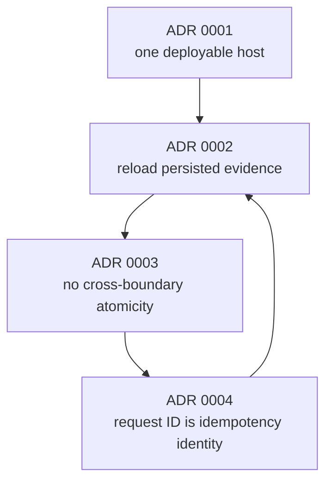

# Architecture Decision Record Index

- **Status**: Current
- **Last reviewed**: 2026-07-23

## Purpose

Architecture decision records explain decisions whose rationale would otherwise be
lost when reading only the current code. They complement the
[as-built architecture](../architecture.md):

- the architecture document states how the system works now;
- an ADR records why a significant choice was made, alternatives considered, its
  consequences, and when to revisit it.

## Decisions

| ADR | Status | Decision | Principal consequence |
|---|---|---|---|
| [0001: Use One Deployable Service, Including the MCP Endpoint](0001-use-one-deployable-service-including-mcp.md) | Accepted | Host React, the same-origin API, AI orchestration, real `/mcp` endpoint, persistence, workflow, and synthetic provisioning in one ASP.NET Core executable. | The MVP has one deployment and process while retaining logical and protocol boundaries. |
| [0002: Validate Persisted Workflow Evidence at Provisioning](0002-validate-persisted-workflow-evidence-at-provisioning.md) | Accepted | Reload request, approval, operation, and grant evidence before provisioning, but do not repeat fixed synthetic reference-data lookups. | Provisioning distrusts caller assertions without modeling mutation of a dataset that cannot change through supported behavior. |
| [0003: Do Not Model Provider Execution and Workflow Persistence as Atomic](0003-do-not-model-provider-and-workflow-persistence-as-atomic.md) | Accepted | Treat provider execution and local workflow persistence as separate consistency boundaries. | Partial outcomes remain possible and are recovered with provider idempotency and scoped retry rather than a false distributed-transaction guarantee. |
| [0004: Use Request ID as the Provisioning Idempotency Identity](0004-use-request-id-as-provisioning-idempotency-identity.md) | Accepted | Use the immutable server-generated request UUID as the sole logical provisioning and provider idempotency identity. | One request maps directly to one operation and at most one grant without a redundant operation identifier. |

## Decision relationships



ADR 0001 establishes the proportional single-host boundary. ADR 0002 defines what the
protected handler must reload inside that boundary. ADR 0003 states the honest
consistency guarantee around provider calls. ADR 0004 supplies the stable identity
used to recover safely across that partial-failure boundary.

## Revisit summary

| ADR | Revisit when |
|---|---|
| 0001 | A capability gains independent ownership, deployment cadence, scaling, availability, isolation, or a real external trust boundary. |
| 0002 | Reference data becomes mutable, externally sourced, administratively writable, or subject to authority/approval expiry. |
| 0003 | Real provisioning requires bounded automatic recovery, compensation, status polling, or durable delivery. |
| 0004 | One request must own multiple independently addressable provisioning operations. |

The complete and authoritative criteria remain in each ADR.

## When to write an ADR

Create an ADR when a decision changes or establishes:

- deployable units or process boundaries;
- trust, identity, authorization, or credential boundaries;
- AI or MCP capability exposure;
- persistence ownership or consistency guarantees;
- idempotency, retry, reconciliation, or compensation behavior;
- a foundational runtime, protocol, database, or framework choice; or
- a deliberate exception to established architecture rules.

Do not create an ADR for:

- a routine implementation detail with no durable trade-off;
- formatting, naming, or local refactoring;
- a decision already governed directly by an accepted ADR;
- a temporary experiment that has not been adopted; or
- feature requirements that belong in a specification.

## Format

Use the next four-digit sequence number and a short kebab-case title:

```text
docs/adr/0005-short-decision-title.md
```

Use this structure:

```markdown
# ADR 0005: Decision Title

- **Status**: Proposed
- **Date**: YYYY-MM-DD
- **Decision owners**: Project maintainer
- **Related artifacts**: ...

## Context

## Decision

## Rationale

## Consequences

### Positive

### Negative and risks

## Alternatives considered

## Revisit criteria
```

Prefer one clear decision per ADR. Record meaningful rejected alternatives and
concrete revisit criteria.

## Lifecycle

Use one of:

- `Proposed`: under review and not yet authoritative;
- `Accepted`: current decision;
- `Superseded`: replaced by another ADR, with a link to its number; or
- `Deprecated`: no longer applicable without a direct replacement.

Do not rewrite the decision history after acceptance. Add clarifications through a
dated update when the decision is unchanged, or write a superseding ADR when the
decision changes.

When accepting or superseding an ADR:

1. update this index;
2. update the as-built architecture and security model if their current description
   changes;
3. update contracts and tests in the same change; and
4. verify that related ADR links and revisit criteria remain accurate.

## Related documentation

- [As-built architecture](../architecture.md)
- [Security and trust model](../security-model.md)
- [Product baseline](../governed-production-access-product-baseline.md)
- [Implementation plan](../../specs/001-governed-production-access/plan.md)
