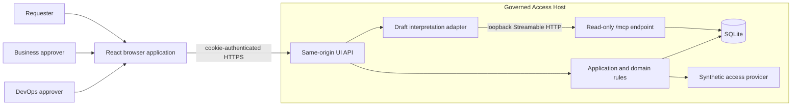
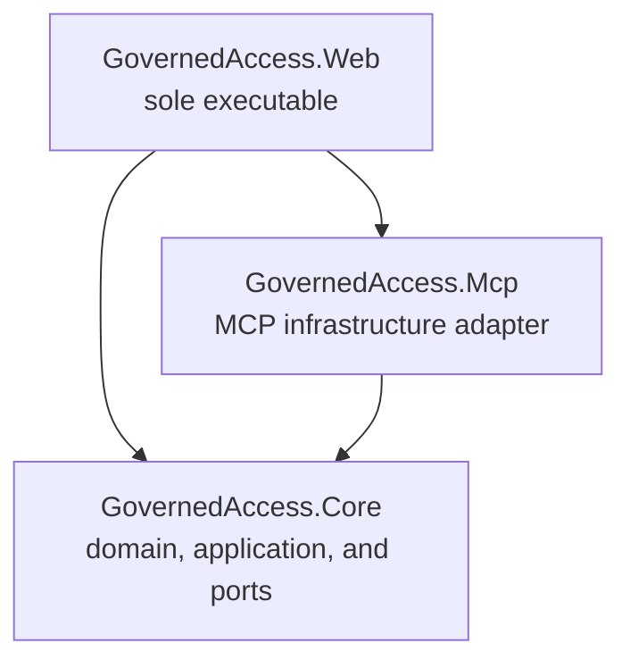
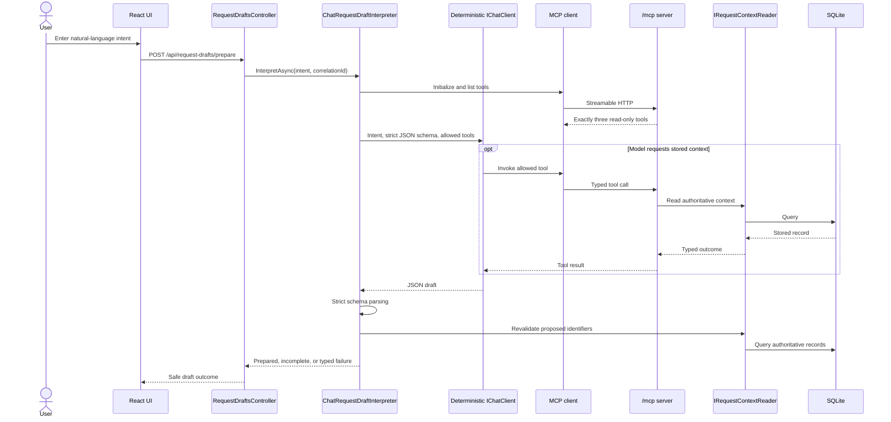
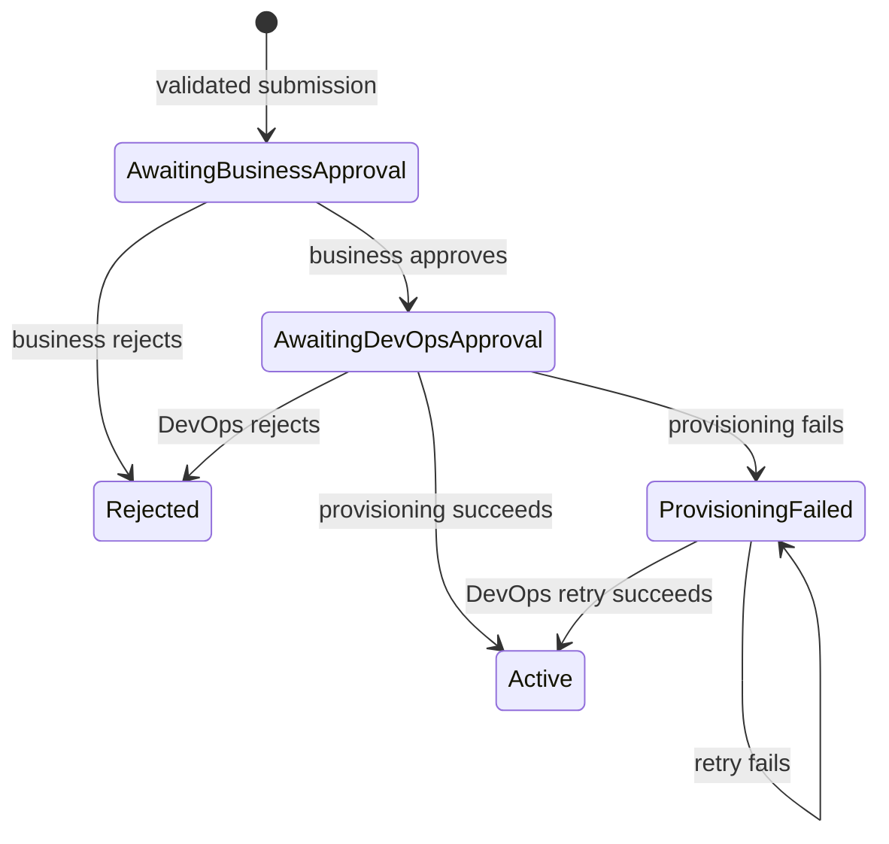

# As-Built Architecture

- **Status**: Current
- **Last reviewed**: 2026-07-23
- **Scope**: Governed Production Access Request Assistant MVP

## Purpose

This document describes the architecture implemented in the repository. It explains
the runtime shape, source dependencies, trust boundaries, principal workflows,
persistence and consistency model, and important operational characteristics.

The governing design rule is:

> AI interprets and gathers context. Humans approve. Deterministic services authorize
> and execute.

This document is an as-built view. Product intent and requirements remain in the
[product baseline](governed-production-access-product-baseline.md), while the reasons
for significant design choices are recorded in the
[architecture decision records](adr/).

## Architectural drivers

The implementation is shaped by the following constraints:

- one executable ASP.NET Core host;
- a thin React application served from that host;
- local SQLite persistence and a fixed synthetic dataset;
- synthetic cookie authentication with exactly four demo principals;
- a deterministic chat client instead of a live model;
- a real, read-only MCP endpoint with exactly three tools;
- no model-visible approval, workflow, or provisioning capability;
- immutable submitted requests and request-bound approvals;
- deterministic authorization and validation for every state change;
- idempotent synthetic provisioning;
- explicit typed outcomes, bounded timeouts, and cancellation propagation; and
- no distributed infrastructure introduced solely for the portfolio scenario.

## System context

The system has four human roles represented by fixed synthetic principals: requester,
Client Alpha business approver, Client Beta business approver, and DevOps approver.
The browser never supplies authoritative identity or role claims. It selects a known
demo principal, and the server issues an HttpOnly authentication cookie containing
server-defined claims.



The synthetic access provider creates only local demonstration grants. The system has
no connection to a real identity provider, incident system, client environment, or
access-control provider.

## Deployment and runtime view

`GovernedAccess.Web` is the only executable and the only deployment unit. One process
hosts:

- ASP.NET Core MVC controllers;
- cookie authentication and authorization;
- antiforgery protection;
- correlation middleware and application instrumentation;
- the compiled React static assets and SPA fallback;
- draft interpretation and the deterministic `IChatClient`;
- a real MCP client;
- the stateless Streamable HTTP `/mcp` server;
- request validation and workflow application services;
- EF Core with one SQLite database; and
- the synthetic access provisioner.

The drafting adapter reaches `/mcp` over HTTP, even though client and server are in the
same process. This preserves the real MCP initialization, tool discovery,
serialization, invocation, timeout, and failure boundary without creating another
deployable service.

The SPA fallback handles browser routes only. Unknown `/api/*` and `/mcp/*` paths
return `404` and are never rewritten to `index.html`.

## Source dependency view



### `GovernedAccess.Core`

Core contains:

- domain entities and workflow evidence;
- business and DevOps decision policies;
- workflow evidence validation;
- request validation, submission, query, workflow, and protected provisioning
  services;
- explicit application and provider outcomes; and
- ports for request context, workflow persistence, time, draft interpretation, and
  provisioning.

Core does not reference ASP.NET Core MVC, EF Core, React, `Microsoft.Extensions.AI`,
or the MCP SDK. AI-provider and protocol-specific types are translated before they
cross into Core.

### `GovernedAccess.Mcp`

MCP contains:

- stateless Streamable HTTP server registration;
- explicit registration of the three allowed tools;
- typed tool input and result records; and
- translation between MCP-facing contracts and `IRequestContextReader`.

It references Core for the request-context port and domain records. It has no workflow
store, decision service, or provisioning dependency.

### `GovernedAccess.Web`

Web is the composition and infrastructure layer. It contains:

- API controllers and Problem Details translation;
- synthetic authentication and antiforgery;
- `ChatRequestDraftInterpreter` and `DeterministicChatClient`;
- the EF Core database context, request-context reader, workflow store, and seeder;
- the synthetic provisioner;
- correlation and activity instrumentation; and
- the React source and generated static assets.

Controllers remain thin: they derive the actor from `ClaimsPrincipal`, translate
request and response shapes, call application services, and map typed failures.

## Runtime components

| Component | Responsibility | Does not decide |
|---|---|---|
| React UI | Collect intent, display server-returned state, submit structured actions, and show audit evidence. | Identity, authorization, approver assignment, or valid workflow transitions. |
| MVC controllers | Enforce endpoint authentication/antiforgery attributes, extract server identity, translate HTTP contracts, and invoke application services. | Domain policy or provisioning eligibility. |
| `ChatRequestDraftInterpreter` | Discover the exact MCP allowlist, invoke the chat abstraction, schema-parse its output, and revalidate proposed identifiers. | Approval, authorization, workflow state, or provisioning. |
| `RequestValidator` | Validate current client, environment, role, justification, and incident context. | Human authority or approval outcome. |
| `RequestSubmissionService` | Create and persist a validated immutable request and audit evidence. | Later approval or provisioning transitions. |
| `AccessRequestWorkflowService` | Coordinate business decisions, DevOps decisions, and retry using authenticated principals and deterministic policies. | Provider execution based on caller assertions. |
| `ProtectedProvisioningService` | Reload persisted workflow evidence, validate exact scope, call the provider, and persist the operation outcome. | Business or DevOps approval. |
| `RequestQueryService` | Return participant-authorized lists and detail projections with server-computed available actions. | Authorization based on UI visibility. |
| EF adapters | Translate Core persistence and context ports to SQLite. | Domain policy. |
| Synthetic provisioner | Create or return one local grant using the immutable request ID. | Eligibility, role selection, or approval validity. |

## Request preparation

Draft preparation is isolated from the state-changing workflow.



The prepared draft is untrusted and creates no request or approval. Submission is a
separate structured action that repeats authoritative validation.

The adapter defaults to:

- a 30-second overall model deadline;
- a 5-second MCP connection and call timeout;
- at most six model/tool iterations;
- no concurrent tool invocation; and
- termination on unknown tool calls.

The MCP client rejects a catalog that does not contain exactly:

- `get_production_environment`;
- `get_incident`; and
- `get_available_roles`.

The complete wire contract is
[specs/001-governed-production-access/contracts/mcp-tools.json](../specs/001-governed-production-access/contracts/mcp-tools.json).

## Governed workflow



### Submission

1. The controller obtains the requester ID from the authenticated principal.
2. `RequestValidator` resolves current stored client, environment, role, and optional
   incident context.
3. `RequestSubmissionService` creates a new server-generated request ID.
4. The immutable scope, initial `AwaitingBusinessApproval` state, validation evidence,
   and creation audit event are committed together.

There is no update endpoint for a submitted request. A correction produces a new
request and new approvals.

### Business decision

1. `AccessRequestWorkflowService` loads the authenticated principal and request.
2. It validates current stored request context.
3. It resolves the environment's configured business approver.
4. `BusinessDecisionPolicy` validates state, authority, duplicate-stage prevention,
   and exact-role binding.
5. The decision, workflow transition, and audit evidence are saved together.

The requester cannot nominate or replace the business approver.

### DevOps decision and provisioning

1. The workflow service loads the authenticated DevOps principal, request, and
   business approval.
2. It validates current request context and applies `DevOpsDecisionPolicy`.
3. Rejection records the decision and moves the request to `Rejected`.
4. Approval records the exact-role DevOps decision and creates the request-keyed
   pending provisioning operation.
5. The decision, operation, request version, and audit evidence are committed before
   provider invocation.
6. The workflow service passes only the request ID to
   `ProtectedProvisioningService`.
7. The protected service reloads the operation, immutable request, business approval,
   and DevOps approval.
8. It validates workflow state, operation scope, approval order, and exact role.
9. It persists the provisioning-attempt audit event.
10. It calls the synthetic provider with server-constructed scope.
11. Provider success finalizes the request, operation, grant, and success audit event
    in one local save.

Every successful grant expires exactly eight hours after activation. Duration is not
accepted from the requester, either approver, the browser, or the model.

### Retry

Only the authenticated DevOps approver can retry, and only when both the request and
operation are in failed states. Retry:

- accepts no replacement scope;
- uses the same protected provisioning service;
- reloads and validates persisted evidence again;
- increments the existing operation attempt count;
- reuses the request ID as the provider idempotency identity; and
- returns an already completed matching grant when concurrent work has won the race.

## Persistence model

One EF Core `GovernedAccessDbContext` uses SQLite. It stores two categories of data.

### Fixed reference context

- clients;
- production environments;
- environment roles;
- incidents; and
- authenticated principals.

`SyntheticDataSeeder` creates missing expected records and validates existing records
against the exact dataset. Startup fails when a stored reference record conflicts with
the expected synthetic definition or when an unexpected reference record exists.
There is no runtime command surface for mutating reference context.

### Workflow evidence

- access requests;
- business and DevOps approval decisions;
- provisioning operations;
- access grants; and
- audit events.

Important database guarantees include:

- `AccessRequest.PersistenceVersion` is an optimistic concurrency token;
- one decision per request and approval stage;
- one provisioning operation keyed by request ID;
- at most one access grant per request ID;
- restricted deletes across authoritative relationships; and
- ordered insert-only audit records from the application workflow.

The detailed entity definitions and transitions are in the
[data model](../specs/001-governed-production-access/data-model.md).

## Consistency and idempotency

SQLite commits tracked workflow changes and staged audit evidence atomically within
each `SaveChangesAsync`. That local guarantee does not extend across a general access
provider call.

The implementation deliberately uses this sequence:

```text
persist DevOps approval and pending operation
        |
reload and validate persisted workflow evidence
        |
persist provisioning-attempt evidence
        |
call provider with request ID as idempotency identity
        |
persist local success or typed failure outcome
```

Provider success followed by cancellation, process failure, or local persistence
failure is a possible partial outcome. The provider's get-or-create behavior, the
stable request ID, the unique grant constraint, and the scoped retry path allow the
workflow to converge without claiming cross-system atomicity.

The relevant decisions are:

- [ADR 0002: Validate Persisted Workflow Evidence at Provisioning](adr/0002-validate-persisted-workflow-evidence-at-provisioning.md)
- [ADR 0003: Do Not Model Provider and Workflow Persistence as Atomic](adr/0003-do-not-model-provider-and-workflow-persistence-as-atomic.md)
- [ADR 0004: Use Request ID as the Provisioning Idempotency Identity](adr/0004-use-request-id-as-provisioning-idempotency-identity.md)

## Interface boundaries

### Browser API

The `/api` surface is a same-origin adapter for the co-hosted React client, not a
general public API. It provides:

- antiforgery and demo-session operations;
- request draft preparation;
- request submission, list, and detail queries;
- business and DevOps decision subresources; and
- DevOps-only retry from `ProvisioningFailed`.

Unsafe endpoints require antiforgery validation. Request bodies do not accept
authoritative actor, role claims, approver identity, approval assertions, duration,
or replacement provisioning scope. The detailed shapes are in the
[UI API contract](../specs/001-governed-production-access/contracts/ui-api.md).

### MCP

The stateless `/mcp` endpoint exposes stored, read-only request context. MCP types are
translated to the Core request-context port. It exposes no resources, prompts,
generic queries, arbitrary database access, workflow commands, approvals,
provisioning, or revocation.

Tool visibility and annotations are not authorization. Safety comes from the narrow
capability set, typed schemas, stored-data lookup, and the complete absence of
state-changing dependencies in the MCP project.

### Internal ports

Core depends on focused interfaces:

- `IRequestContextReader`;
- `IWorkflowStore` and `IAuditStore`;
- `IRequestDraftInterpreter`;
- `IAccessProvisioner`; and
- `IClock`.

These interfaces exist at concrete infrastructure boundaries. The application does
not introduce a generic repository, workflow engine, event bus, or provider-neutral
abstraction without a current implementation need.

## Authentication and request security

Demo authentication maps one fixed principal key to immutable server-side claims and
issues an HttpOnly, Secure, SameSite Strict cookie. Authentication failures return
`401` and authorization failures return `403` instead of browser redirects.

The React client obtains an antiforgery token and includes `X-XSRF-TOKEN` on unsafe
same-origin requests. UI capabilities and `availableActions` are presentation hints;
controllers and application services enforce every protected action independently.

Participant filtering prevents unrelated principals from discovering request detail.
The wrong client business approver receives no authority over another client's
request.

A fuller threat and control analysis is in the
[security and trust model](security-model.md).

## Failure, cancellation, and observability

Expected failures cross application boundaries as typed outcomes and become safe
Problem Details or typed draft results. Categories include invalid input, validation,
unauthenticated, unauthorized, not found, invalid transition, concurrency conflict,
timeout, cancellation, unavailability, and dependency failure.

Timeout defaults are:

| Boundary | Default |
|---|---:|
| Draft interpretation/model operation | 30 seconds |
| MCP connection and calls | 5 seconds |
| Synthetic provisioning operation | 10 seconds |

Caller cancellation is linked through asynchronous boundaries. Cancellation does not
convert a caller-aborted provider operation into a persisted retryable provider
failure.

`CorrelationMiddleware` assigns an `X-Correlation-ID` from the current trace ID or a
new GUID and places it in the response, logging scope, persisted request/evidence, and
safe Problem Details. Model, MCP, workflow, and provisioning operations record
duration and outcome metadata. Raw prompts, secrets, and complete MCP payloads are not
required for normal logging.

OpenTelemetry export is not configured. The application exposes an `ActivitySource`
as an optional instrumentation seam.

## Frontend build and hosting

The React application is source input to `GovernedAccess.Web`, not a separate
production service.

- Vite writes hashed production assets to `GovernedAccess.Web/wwwroot`.
- the Web project runs `npm ci` when the lockfile requires restoration;
- the frontend build runs before .NET build or publish when inputs changed;
- ASP.NET Core serves the generated assets and `index.html`;
- React Router owns `/requests`, `/requests/new`, and `/requests/:requestId`; and
- Vite development mode proxies `/api` to ASP.NET Core for same-origin browser
  behavior.

The browser never calls MCP or the synthetic provisioner directly.

## Testing architecture

Unit tests reference Core and exercise deterministic domain and application rules.
Integration tests host the real Web composition with `WebApplicationFactory`, an
in-memory SQLite database, a deterministic clock, synthetic identities, the MCP
transport, and a controllable provisioner. Frontend tests exercise the thin React
session and workflow wiring.

No automated suite requires a live model or external production system. The
[quickstart validation guide](../specs/001-governed-production-access/quickstart.md)
contains the detailed evidence matrix and manual demonstration scenarios.

## Deliberate limitations

The architecture intentionally does not include:

- real production access or credentials;
- a real identity provider;
- mutable enterprise reference-data integration;
- automated revocation;
- multiple executable services;
- a public provisioning endpoint;
- a message broker, outbox, background reconciler, or distributed transaction;
- a generic workflow engine;
- a large retrieval subsystem; or
- independently deployed frontend infrastructure.

These are not missing layers required by the current MVP. A new requirement for real
credentials, independent ownership, mutable systems of record, automatic
reconciliation, separate scaling, or a separately versioned contract should trigger
a new ADR before changing the deployment or trust boundaries.

## Related documentation

- [Product baseline](governed-production-access-product-baseline.md)
- [Security and trust model](security-model.md)
- [Local development guide](local-development.md)
- [Testing strategy](testing-strategy.md)
- [Architecture decision index](adr/README.md)
- [Documentation plan](documentation-plan.md)
- [Feature specification](../specs/001-governed-production-access/spec.md)
- [Implementation plan](../specs/001-governed-production-access/plan.md)
- [Data model](../specs/001-governed-production-access/data-model.md)
- [UI API contract](../specs/001-governed-production-access/contracts/ui-api.md)
- [MCP tool contract](../specs/001-governed-production-access/contracts/mcp-tools.json)
- [Quickstart validation guide](../specs/001-governed-production-access/quickstart.md)
- [ADR 0001: Use One Deployable Service, Including the MCP Endpoint](adr/0001-use-one-deployable-service-including-mcp.md)
