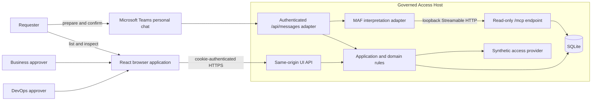
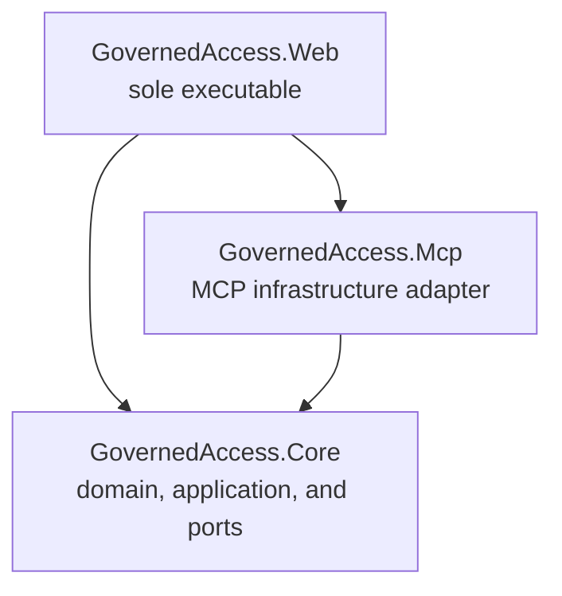
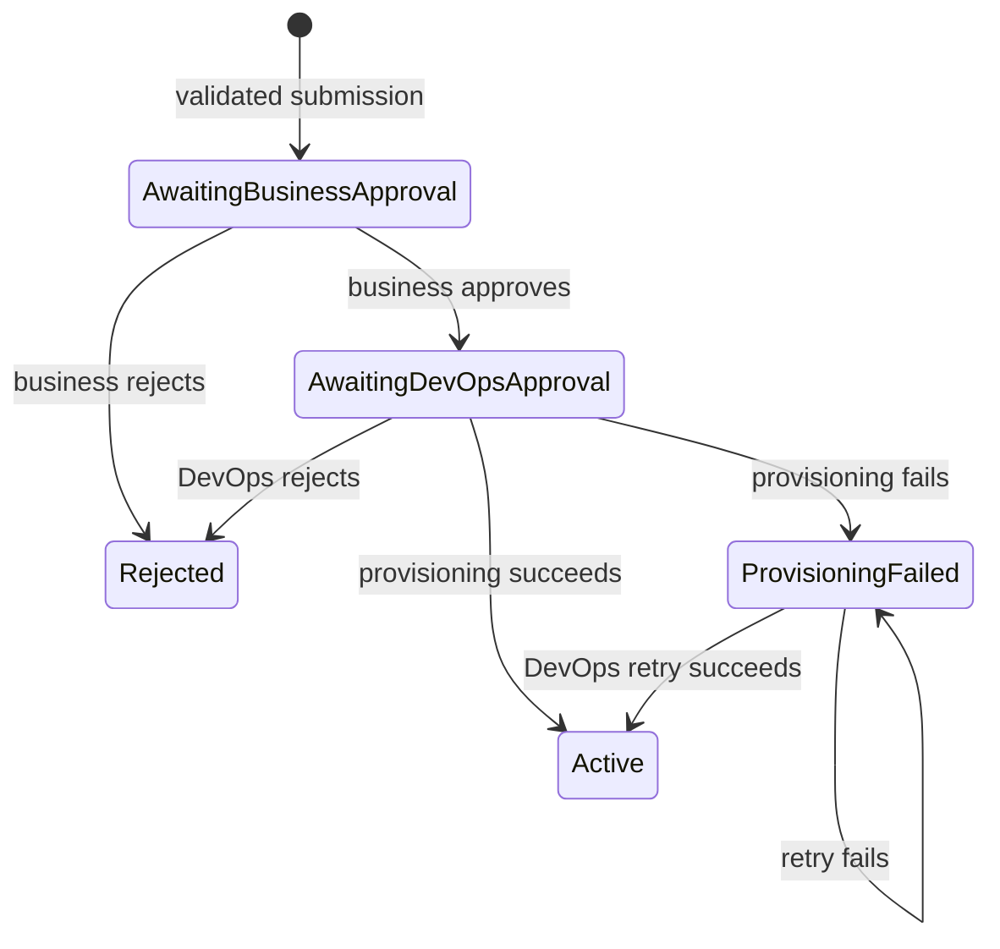

# As-Built Architecture

- **Status**: Current
- **Last reviewed**: 2026-08-10
- **Scope**: Governed Production Access Request Assistant MVP

The history-first Teams preparation and Teams-only creation boundaries described here
are implemented and covered by the current feature test suite.

## Purpose

This document describes the architecture implemented in the repository. It explains
the runtime shape, source dependencies, trust boundaries, principal workflows,
persistence and consistency model, and important operational characteristics.

The governing design rule is:

> AI interprets and gathers context. Humans approve. Deterministic services authorize
> and execute.

This document is an as-built view. Product intent and requirements remain in the
[product baseline](governed-production-access-product-baseline.md), while the reasons
for significant design choices are recorded in the
[architecture decision records](adr/).

## Architectural drivers

The implementation is shaped by the following constraints:

- one executable ASP.NET Core host;
- a thin React application served from that host;
- local SQLite persistence and a fixed synthetic dataset;
- synthetic cookie authentication with exactly six demo principals;
- one server-selected request-preparation profile: the checked-in deterministic
  client or an explicitly configured Foundry Responses client behind the same
  `IChatClient` boundary;
- a real, read-only MCP endpoint with exactly two tools;
- no model-visible approval, workflow, or provisioning capability;
- immutable submitted requests and request-bound approvals;
- deterministic authorization and validation for every state change;
- idempotent synthetic provisioning;
- explicit typed outcomes, bounded timeouts, and cancellation propagation; and
- no distributed infrastructure introduced solely for the portfolio scenario.

## System context

The system has fixed synthetic principals for the requester, the Client Alpha, Beta,
Gamma, and Theta business approvers, and the DevOps approver.
The browser never supplies authoritative identity or role claims. It selects a known
demo principal, and the server issues an HttpOnly authentication cookie containing
server-defined claims.


```mermaid
flowchart LR
    Requester[Requester]
    Business[Business approver]
    DevOps[DevOps approver]
    Teams[Microsoft Teams personal chat]
    Browser[React browser application]

    subgraph Host[Governed Access Host]
        Agent[Authenticated /api/messages adapter]
        API[Same-origin UI API]
        AI[MAF interpretation adapter]
        MCP[Read-only /mcp endpoint]
        App[Application and domain rules]
        Provider[Synthetic access provider]
        DB[(SQLite)]
    end

    Requester -->|prepare and confirm| Teams
    Requester -->|list and inspect| Browser
    Business --> Browser
    DevOps --> Browser
    Teams --> Agent
    Browser -->|cookie-authenticated HTTPS| API
    Agent --> AI
    Agent --> App
    API --> App
    AI -->|loopback Streamable HTTP| MCP
    MCP --> DB
    App --> DB
    App --> Provider
```

The synthetic access provider creates only local demonstration grants. The system has
no connection to a real identity provider, incident system, client environment, or
access-control provider.

## Deployment and runtime view

`GovernedAccess.Web` is the only executable and the only deployment unit. One process
hosts:

- ASP.NET Core MVC controllers;
- cookie authentication and authorization;
- antiforgery protection;
- correlation middleware and application instrumentation;
- the compiled React static assets and SPA fallback;
- Teams request interpretation, one process-wide selected `IChatClient`, and MAF's
  native process-local session store;
- a real MCP client;
- the stateless Streamable HTTP `/mcp` server;
- request validation and workflow application services;
- EF Core with one SQLite database; and
- the synthetic access provisioner.

The Teams interpretation adapter reaches `/mcp` over HTTP, even though client and
server are in the same process. This preserves the real MCP initialization, tool
discovery, serialization, invocation, timeout, and failure boundary without creating
another deployable service.

The SPA fallback handles browser routes only. Unknown `/api/*` and `/mcp/*` paths
return `404` and are never rewritten to `index.html`.

## Source dependency view


```mermaid
flowchart TB
    Web[GovernedAccess.Web<br/>sole executable]
    Mcp[GovernedAccess.Mcp<br/>MCP infrastructure adapter]
    Core[GovernedAccess.Core<br/>domain, application, and ports]

    Web --> Core
    Web --> Mcp
    Mcp --> Core
```

### `GovernedAccess.Core`

Core contains:

- `Domain/Drafts` for the mutable `RequestIntakeSession` aggregate;
- `Domain/ReferenceData` for authoritative clients, environments, environment-role
  assignments, supported role IDs, and incidents;
- `Domain/AccessRequests` for the immutable submitted request and its authenticated
  actor, approval, provisioning, grant, audit, and evidence invariants;
- `Application/Drafts` for mutable conversational preparation and draft validation;
- `Application/AccessRequests` for the atomic submission bridge, immutable request
  validation, human workflow commands, submitted-request visibility, and read models;
- `Application/Provisioning` for the independent persisted-evidence execution boundary;
- explicit application and provider outcomes; and
- ports for request context, workflow persistence, intake persistence, time,
  request-preparation interpretation, and provisioning.

Core does not reference ASP.NET Core MVC, EF Core, React, `Microsoft.Extensions.AI`,
or the MCP SDK. AI-provider and protocol-specific types are translated before they
cross into Core.

The application namespaces make the lifecycle dependency direction explicit.
Drafting does not reference submitted-request or provisioning services.
`RequestSubmissionService` is the only application component that consumes a ready
draft and creates an immutable `AccessRequest`. Approval/query components do not
reference draft state, and protected provisioning does not trust either UI actions or
caller-supplied approval assertions.

The domain namespaces follow aggregates rather than application operations.
`Domain.ReferenceData` is independent authoritative context. `Domain.Drafts` may use
reference data and immutable access-request construction constraints because its
purpose is to prepare that request, but it contains no approval or provisioning
transition. `Domain.AccessRequests` owns the complete post-submission evidence chain.
Its `Approvals`, `Provisioning`, and `Auditing` folders share one namespace because
their scope and sequencing invariants intentionally cross those lifecycle stages.

### `GovernedAccess.Mcp`

MCP contains:

- stateless Streamable HTTP server registration;
- explicit registration of the two allowed tools;
- typed tool input and result records; and
- translation between MCP-facing contracts and `IRequestContextReader`.

It references Core for the request-context port and domain records. It has no workflow
store, decision service, or provisioning dependency.

### `GovernedAccess.Web`

Web is the composition and infrastructure layer. It contains:

- API controllers and Problem Details translation;
- synthetic authentication and antiforgery;
- Teams activity handling, `MafRequestPreparationInterpreter`, MAF's singleton
  `InMemoryAgentSessionStore`, the process-lifetime
  `MafConversationTurnCoordinator`, and the closed deterministic/Foundry Responses
  chat-client registration;
- the EF Core database context, request-context reader, workflow store, and seeder;
- the synthetic provisioner;
- correlation and activity instrumentation; and
- the React source and generated static assets.

Controllers remain thin: they derive the actor from `ClaimsPrincipal`, translate
request and response shapes, call application services, and map typed failures.

## Runtime components

| Component | Responsibility | Does not decide |
|---|---|---|
| React UI | Display the request register/detail, submit structured approval or retry actions, and show audit evidence. | Request creation, identity, authorization, approver assignment, or valid workflow transitions. |
| MVC controllers | Enforce endpoint authentication/antiforgery attributes, extract server identity, translate HTTP contracts, and invoke application services. | Domain policy or provisioning eligibility. |
| `TeamsAccessRequestAgent` | Route authenticated personal Teams activities to preparation or deterministic confirmation. | Actor authority, readiness, approval, or provisioning. |
| `MafRequestPreparationInterpreter` | Discover the exact MCP allowlist, invoke the agent turn under request cancellation, schema-parse its proposal, and translate provider contracts. | Readiness, approval, authorization, workflow state, or provisioning. |
| `AIHostAgent` with `InMemoryAgentSessionStore` | Load and save MAF-owned conversation sessions by server-generated intake ID for the process lifetime. | Durable workflow state, candidate truth, readiness, confirmation, or authorization. |
| `MafConversationTurnCoordinator` | Serialize the complete native session load, agent run, and successful save sequence with one exact process-lifetime gate per intake. | Session retention policy, durable state, or workflow transitions. |
| `RequestDraftValidator` | Validate and canonicalize mutable, potentially incomplete draft candidates while clearing rejected identifiers. | Submission or human authority. |
| `AccessRequestValidator` | Strictly validate complete submitted-request scope against current client, environment, role, justification, and incident context. | Human authority or approval outcome. |
| `RequestDraftService` | Coordinate conversational preparation, ready-draft revision, and explicit reset over the mutable intake lifecycle. | Confirmation, submission, or downstream approval. |
| `RequestSubmissionService` | Verify authenticated confirmation ownership, reload and revalidate the ready draft, and atomically persist its terminal transition, immutable request, and audit evidence. | Public/browser submission or later approval/provisioning transitions. |
| `AccessRequestCommandContextLoader` | Load the authenticated principal, immutable request, normalized correlation identity, and command-specific environment context. | Actor authorization or workflow transitions. |
| `AccessRequestWorkflowService` | Coordinate both approval stages through one authenticated decision pipeline and handle DevOps retry. | Provider execution based on caller assertions. |
| `ProtectedProvisioningService` | Reload persisted workflow evidence, validate exact scope, call the provider, and persist the operation outcome. | Business or DevOps approval. |
| `AccessRequestVisibilityPolicy` | Determine submitted-request visibility and server-computed presentation actions from authoritative evidence. | Command authorization or workflow mutation. |
| `AccessRequestQueryService` | Load persisted submitted-request evidence and return participant-authorized list and detail projections without repeating submission validation. | Authorization based on UI visibility or current validity of immutable submitted scope. |
| EF adapters | Translate Core persistence and context ports to SQLite. | Domain policy. |
| Synthetic provisioner | Create or return one local grant using the immutable request ID. | Eligibility, role selection, or approval validity. |

### Request-preparation model profile

`RequestPreparationModel:ExecutionProfile` is resolved once when the host starts and
accepts only `Deterministic` or `FoundryResponses`. Checked-in settings select
`Deterministic`. The live profile requires the configured
`FoundryResponses:Endpoint` and `FoundryResponses:DeploymentName`, authenticates with
`DefaultAzureCredential`, and uses the existing 100-second Teams request timeout as
the single overall model/MCP deadline. Invalid configuration, missing authorization,
provider failure, and timeout fail closed; the host never substitutes the
deterministic client after `FoundryResponses` was selected.

Both profiles enter the same strict proposal schema, exact two-tool MCP allowlist,
authoritative candidate assessment, immutable confirmation, human approvals, and
protected idempotent provisioning path. Profile choice and model output are not
authorization or persisted workflow evidence.

### Bounded live-model evaluation mode

`evaluate-live-model` is an explicit mode of the existing Web executable. It is not
part of normal host startup: `Program` selects evaluation composition before normal
service and route registration, starts a loopback-only host, and maps only the
existing read-only `/mcp` endpoint. Teams, browser, confirmation, approval,
provisioning, retry, and revocation surfaces are unavailable in this mode.

The evaluator loads and validates the complete checked-in 20-scenario dataset. It
runs every conversation sequentially by default, or one exact case-sensitive
scenario selected with `--scenario`, through the real
`RequestDraftService.PrepareAsync` boundary. Each scenario receives distinct actor,
conversation, intake, and correlation identities.
The configured Foundry Responses client and the real MCP transport execute normally,
but evaluation treats both as a black box: it records no prompts, transcripts,
provider iterations, tool calls, tool ordering, raw payloads, or token usage.

Correctness is determined only from the final application-owned intake outcome and
the final facts declared by that scenario, such as canonical scope, clarification
target, validation codes, or fields that must be preserved or cleared. Wall-clock
elapsed milliseconds cover the complete scenario and are informational; latency does
not affect semantic grading. A completed full run passes only when all 20 scenarios
pass; a focused run requires its selected scenario to pass. Both require access
requests, approval decisions, provisioning operations, and access grants to remain at
zero.

Evaluation persistence is disposable. A run owns a uniquely named SQLite database in
the system temporary directory, uses process-local MAF history, and removes the
database and SQLite sidecars when the host is disposed. Completed local evidence is
limited to one run-specific `result.json` and `report.md` under the selected ignored
output parent. Both artifacts are rendered from the same sanitized run result. Failed
scenarios additionally expose a deterministic reason and observed application-owned
state—safe validation/provider codes, canonical candidate facts, clarification target,
environment options, and the final bounded, schema-validated model response
message—without adding raw model or MCP observation.

The canonical operator procedure, including the credential-free gate and live-profile
setup, is the [live-model evaluation quickstart](../specs/006-live-model-evaluation/quickstart.md).

## Teams request preparation and confirmation

Teams confirmation is the only request-creation path. Preparation is model-assisted;
confirmation is a direct deterministic application action.

```mermaid
sequenceDiagram
    actor User
    participant Teams
    participant Agent as TeamsAccessRequestAgent
    participant DraftService as RequestDraftService
    participant Submission as RequestSubmissionService
    participant Draft as MafRequestPreparationInterpreter
    participant Memory as Native MAF session store
    participant Gate as Per-intake turn coordinator
    participant Chat as IChatClient
    participant McpClient as MCP client
    participant McpServer as /mcp server
    participant Context as IRequestContextReader
    participant DB as SQLite

    User->>Teams: Describe request
    Teams->>Agent: Authenticated personal activity
    Agent->>DraftService: PrepareAsync(actor, latest message)
    DraftService->>Draft: Intake ID + complete candidate + latest message
    Draft->>McpClient: Initialize and list tools
    McpClient->>McpServer: Streamable HTTP
    McpServer-->>McpClient: Exactly two read-only tools
    Draft->>Gate: Execute turn under intake ID
    Gate->>Memory: Get or create native AgentSession
    Memory-->>Gate: Session with available prior messages
    Draft->>Chat: Current candidate, latest text, strict schema, allowed tools
    opt Model requests stored context
        Chat->>McpClient: Invoke allowed tool
        McpClient->>McpServer: Typed tool call
        McpServer->>Context: Read authoritative context
        Context->>DB: Query
        DB-->>Context: Stored record
        Context-->>McpServer: Typed outcome
        McpServer-->>Chat: Tool result
    end
    Chat-->>Draft: Closed JSON proposal
    Draft->>Draft: Strict schema parsing and boundary translation
    Draft-->>Gate: Successfully validated outcome
    Gate->>Memory: Save native session
    Draft-->>DraftService: Untrusted candidate + optional message/environment option IDs
    DraftService->>Context: Reload options and validate every identifier and relationship
    Context->>DB: Query authoritative records
    alt Identifier or candidate value is rejected
        DraftService->>DraftService: Clear rejected fields and preserve validated fields
        DraftService->>DB: Persist sanitized candidate; retain typed errors in result
    else Candidate is accepted
        DraftService->>DB: Persist clarification or immutable ready scope
    end
    DraftService-->>Agent: Typed preparation result
    Agent-->>Teams: Clarification, safe failure, or immutable card
    User->>Teams: Confirm and submit
    Teams->>Agent: Authenticated Action.Execute
    Agent->>Submission: ConfirmDraftAsync(actor, intake ID)
    Submission->>DB: Reload ownership/status/scope and revalidate
    Submission->>DB: One save: submitted intake + request + audit
    Agent-->>Teams: Submitted confirmation with stable request ID
```

The collecting candidate is untrusted and creates no request or approval. Core
validates every supplied client, environment, role, and incident value before it is
persisted. It also reloads every structured environment clarification option before
the Teams adapter may show the model-authored message beside application-rendered
authoritative choices. A valid environment or active incident supplies canonical
client ownership; display names and model prose never become stable identifiers.
When validation rejects a value or option set, Core suppresses the associated unsafe
proposal, preserves unrelated validated fields, persists the sanitized candidate,
and returns typed deterministic correction guidance without another model call. Only
an owned, unexpired ready intake can be confirmed. The model and MCP never receive a
submit capability.

When the requester sends another natural-language message while an unexpired ready
draft is active, the interpreter receives its validated candidate without first
changing durable state. Questions about alternate roles, environments, or hypothetical
changes return bounded model-authored discussion while the same draft and confirmation
card remain active. Only when deterministic assessment produces a candidate snapshot
different from the ready candidate does Core supersede the immutable ready snapshot
and persist a replacement preparation. That replacement can be ready, incomplete, or
rejected; unrelated valid fields are preserved exactly as they are before the draft
card is shown. The superseded card cannot be confirmed, and no access request exists
until the requester confirms the latest ready draft.

The Teams adapter retains the latest sent draft-card activity ID as process-local
presentation metadata. An assessed candidate change makes that prior activity
non-actionable as a **Draft being revised** card and sends the latest candidate as a
separate review card.
Clarification or validation rejection after an assessed candidate change, and explicit
reset, similarly replace a tracked card with a non-actionable status card. Discussion
does not alter the card. If presentation metadata is unavailable after restart or a
channel update fails, durable intake status remains authoritative: invoking a stale
card is rejected and replaces that clicked card with a non-actionable response.

### Explicit preparation reset

The Teams adapter intercepts only an exact trimmed, case-insensitive `/new` message
before interpretation. Core resolves the active intake from the authenticated actor
and exact conversation, marks a collecting or unexpired ready intake `Superseded`
(or an expired ready intake `Expired`), and clears candidate state through the
existing terminal transition. The command calls neither the model nor MCP, creates no
replacement intake or request, and cannot change a submitted request. The next normal
message receives a new server-generated intake ID and therefore a separate MAF
session key.

MAF history is history-first but deliberately ephemeral. The singleton native store
keys sessions by server-generated intake ID, while the singleton coordinator retains
one exact gate per intake and serializes load, run, and save. Both live for the host
process lifetime. The application applies no inactivity timeout, turn-count limit,
terminal deletion, or conversation compaction in the current low-volume baseline.
Only a completed schema-valid turn is saved; timeout, cancellation, dependency
failure, and malformed output leave the last successfully stored session unchanged.

### Known limitation: process-lifetime gate retention

`MafConversationTurnCoordinator` stores one `SemaphoreSlim` in a
`ConcurrentDictionary<Guid, SemaphoreSlim>` for every intake ID it encounters. Gates
are not removed when an intake becomes ready, submitted, superseded, expired, or
invalidated. Memory usage therefore grows monotonically with the number of distinct
intakes handled during one host process lifetime and is released only when the process
stops.

This is accepted for the current local, low-volume baseline. A long-running or
higher-volume deployment must add safe gate retirement or a bounded keyed-lock
implementation. Removal must account for current holders and waiters; deleting a gate
solely because an intake reached a terminal state could create two different gates for
the same intake and break same-intake serialization.

SQLite persists the accepted sanitized nullable candidate and intake lifecycle, not
clarification options, prompts, transcripts, or serialized MAF sessions. That compact
candidate is the durable canonical state supplied to every model turn. Process restart
clears MAF history and gates without changing the intake or losing accepted candidate
data. The next run receives the durable candidate without prior conversation messages;
an ambiguous relative reply is re-clarified rather than guessed unless the supplied
conversation itself contains its preceding question and ordering. Confirmation and
all downstream workflow actions never read this memory.

The persistence boundary and its restart, privacy, debugging, and capacity
consequences are recorded in
[ADR 0006: Persist Canonical Intake State, Not Conversation History](adr/0006-persist-canonical-intake-state-not-conversation-history.md).

Durable MAF sessions, retention/deletion policy, multi-host coordination, and native
MAF compaction are deferred until a concrete production requirement defines privacy,
capacity, and lifecycle rules. They are not hidden responsibilities of the SQLite
intake store.

The adapter defaults to:

- one 100-second ASP.NET Core request-safety deadline on the Teams activity
  endpoint, propagated through MCP and model work;
- at most 12 model/tool iterations;
- no concurrent tool invocation; and
- termination on unknown tool calls.

The MCP client rejects a catalog that does not contain exactly:

- `get_production_environment`;
- `get_incident`.

`get_production_environment` accepts `{}` for a complete bounded discovery result or
one nonblank `environmentId` for exact lookup. Both success modes return the same
ordered `environments` shape with authoritative client context and each environment's
assigned ordered roles. Potential identifiers use exact lookup first; only a typed
`NotFound` unlocks turn-local discovery fallback, and any proposed alternative still
requires deterministic reload and developer confirmation or selection. Catalog
overflow fails closed without a partial result. `get_incident` remains an exact-only
lookup for a precise requester-supplied stable identifier.
The current interpreter deliberately does not exercise that permitted fallback for
identifier-like input: exact `NotFound` produces an environment clarification with no
options. Readable environment descriptions still use bounded discovery directly.

The complete wire contract is
[specs/004-resolve-context-identifiers/contracts/mcp-tools.json](../specs/004-resolve-context-identifiers/contracts/mcp-tools.json).

## Governed workflow


```mermaid
stateDiagram-v2
    [*] --> AwaitingBusinessApproval: validated submission
    AwaitingBusinessApproval --> AwaitingDevOpsApproval: business approves
    AwaitingBusinessApproval --> Rejected: business rejects
    AwaitingDevOpsApproval --> Rejected: DevOps rejects
    AwaitingDevOpsApproval --> Active: provisioning succeeds
    AwaitingDevOpsApproval --> ProvisioningFailed: provisioning fails
    ProvisioningFailed --> Active: DevOps retry succeeds
    ProvisioningFailed --> ProvisioningFailed: retry fails
```

### Submission

1. The Teams boundary derives actor, tenant, and conversation from authenticated
   activity context.
2. `RequestSubmissionService` reloads the ready intake, verifies
   ownership/status/expiry, requires its server-reserved request ID, and revalidates
   its immutable scope.
3. The submission service stages the request plus request-created audit event and
   marks the intake submitted.
4. The intake transition, immutable `AwaitingBusinessApproval` request, and audit
   event commit in one shared `SaveChangesAsync`.

There is no update endpoint for a submitted request. A correction produces a new
Teams preparation, request ID, and new approvals.

From `AwaitingBusinessApproval` onward, the existing browser-driven human approval,
protected provisioning, retry, and audit flow is unchanged. Teams creates the same
immutable request aggregate consumed by that flow; it does not bypass or duplicate it.

### Human approval decision

The business and DevOps endpoints remain separate business-facing subresources, but
both pass a server-owned `ApprovalStage` into the same
`AccessRequestWorkflowService.DecideAsync` pipeline. The stage is never accepted from
the browser request body. The shared pipeline normalizes input, loads the authenticated
actor and request, detects an existing stage decision, applies
`ApprovalDecisionPolicy`, records rejected attempts, and saves decision plus audit
evidence. It returns one `ApprovalDecisionCompletion`; only an approved DevOps
decision carries its subsequent `ProvisioningCompletion`.

For the business stage, the pipeline additionally loads current environment and client
context and verifies that the actor is the owning client's configured approver. The
shared policy binds an approval to the immutable requested role and advances the
request to DevOps review; rejection ends the request.

The requester cannot nominate or replace the business approver.

### DevOps decision and provisioning

1. The shared decision pipeline requires the authenticated DevOps principal, reloads
   the business approval, and validates current request context.
2. `ApprovalDecisionPolicy` checks the DevOps transition, prior approval integrity,
   duplicate-stage prevention, and exact role continuity.
3. Rejection records the decision and moves the request to `Rejected`.
4. Approval records the exact-role DevOps decision and creates the request-keyed
   pending provisioning operation.
5. The decision, operation, request version, and audit evidence are committed before
   provider invocation.
6. The workflow service passes only the request ID to
   `ProtectedProvisioningService`.
7. The protected service reloads the operation, immutable request, business approval,
   and DevOps approval.
8. It validates workflow state, operation scope, approval order, and exact role.
9. It persists the provisioning-attempt audit event.
10. It calls the synthetic provider with server-constructed scope.
11. Provider success finalizes the request, operation, grant, and success audit event
    in one local save.

Every successful grant expires exactly eight hours after activation. Duration is not
accepted from the requester, either approver, the browser, or the model.

### Retry

Only the authenticated DevOps approver can retry, and only when both the request and
operation are in failed states. Retry:

- accepts no replacement scope;
- uses the same protected provisioning service;
- reloads and validates persisted evidence again;
- increments the existing operation attempt count;
- reuses the request ID as the provider idempotency identity; and
- returns an already completed matching grant when concurrent work has won the race.

## Persistence model

One EF Core `GovernedAccessDbContext` uses SQLite. It stores three categories of data.

### Fixed reference context

- clients;
- production environments;
- environment roles;
- incidents; and
- authenticated principals.

`SyntheticDataSeeder` creates missing expected records and validates existing records
against the exact dataset. Startup fails when a stored reference record conflicts with
the expected synthetic definition or when an unexpected reference record exists.
There is no runtime command surface for mutating reference context.

### Request intake state

- one `RequestIntakeSession` row per server-generated intake;
- authenticated channel, tenant, actor, requester, and personal-conversation binding;
- the complete nullable candidate while collecting;
- immutable ready scope, reserved request ID, and 30-minute confirmation expiry; and
- terminal status and correlation metadata for replay-safe old-card handling.

Terminal intake rows are retained for the lifetime of the SQLite database. Terminal
transitions clear candidate content but keep the minimal binding and lifecycle
evidence needed to classify stale-card confirmation and recover submitted replay.
There is no automatic purge or retention window in the current local baseline. See
[ADR 0005: Retain Terminal Request-Intake Tombstones](adr/0005-retain-terminal-request-intake-tombstones.md).

The database stores no raw activity, prompt, transcript, clarification option list,
model response, or serialized MAF session. Ready scope is immutable, active binding
and reserved request IDs are unique, and optimistic concurrency protects terminal
transitions.

### Workflow evidence

- access requests;
- business and DevOps approval decisions;
- provisioning operations;
- access grants; and
- audit events.

Important database guarantees include:

- `AccessRequest.PersistenceVersion` is an optimistic concurrency token;
- one decision per request and approval stage;
- one provisioning operation keyed by request ID;
- at most one access grant per request ID;
- restricted deletes across authoritative relationships; and
- ordered insert-only audit records from the application workflow.

The Teams intake entity and save boundary are defined in the
[Teams intake data model](../specs/002-teams-access-intake/data-model.md). Existing
workflow entities remain defined in the
[governed workflow data model](../specs/001-governed-production-access/data-model.md).

## Consistency and idempotency

SQLite commits tracked workflow changes and staged audit evidence atomically within
each `SaveChangesAsync`. That local guarantee does not extend across a general access
provider call.

The implementation deliberately uses this sequence:

```text
persist DevOps approval and pending operation
        |
reload and validate persisted workflow evidence
        |
persist provisioning-attempt evidence
        |
call provider with request ID as idempotency identity
        |
persist local success or typed failure outcome
```

Typed provider failures other than caller cancellation move both request and operation
to their failed states, after which the scoped retry path and provider get-or-create
behavior converge on the stable request ID. Provider success followed by caller
cancellation, process failure, or unavailable local persistence can instead leave
local evidence pending. The current MVP has no pending-operation reconciliation or
retry route; operator intervention or a future reconciler is required for that partial
outcome. The implementation therefore does not claim cross-system atomicity.

The relevant decisions are:

- [ADR 0002: Validate Persisted Workflow Evidence at Provisioning](adr/0002-validate-persisted-workflow-evidence-at-provisioning.md)
- [ADR 0003: Do Not Model Provider and Workflow Persistence as Atomic](adr/0003-do-not-model-provider-and-workflow-persistence-as-atomic.md)
- [ADR 0004: Use Request ID as the Provisioning Idempotency Identity](adr/0004-use-request-id-as-provisioning-idempotency-identity.md)

## Interface boundaries

### Browser API

The `/api` surface is a same-origin adapter for the co-hosted React request register,
not a general public API. It provides:

- antiforgery and demo-session operations;
- request list and detail queries;
- business and DevOps decision subresources; and
- DevOps-only retry from `ProvisioningFailed`.

It does not map `POST /api/request-drafts/prepare` or a request-creating
`POST /api/requests`. Existing request rows and downstream workflow contracts are
unchanged.

Unsafe endpoints require antiforgery validation. Request bodies do not accept
authoritative actor, role claims, approver identity, approval assertions, duration,
or replacement provisioning scope. The detailed shapes are in the
[UI API contract](../specs/001-governed-production-access/contracts/ui-api.md).

### MCP

The stateless `/mcp` endpoint exposes stored, read-only request context. MCP types are
translated to the Core request-context port. It exposes no resources, prompts,
generic queries, arbitrary database access, workflow commands, approvals,
provisioning, or revocation.

Its exact allowlist contains `get_production_environment`, which provides bounded
discovery and exact lookup with authoritative client and assigned-role context, and
exact-only `get_incident`. It exposes no separate role-listing capability. The model
interprets readable environment wording against the bounded catalog, while Core
independently validates every proposed environment, derived client, role assignment,
and optional exact incident identifier.

Tool visibility and annotations are not authorization. Safety comes from the narrow
capability set, typed schemas, stored-data lookup, and the complete absence of
state-changing dependencies in the MCP project.

### Internal ports

Core depends on focused interfaces:

- `IRequestContextReader`;
- `IWorkflowStore`, including insert-only audit staging and reads;
- `IRequestPreparationInterpreter` and `IRequestIntakeStore`;
- `IAccessProvisioner`; and
- `IClock`.

These interfaces exist at concrete infrastructure boundaries. The application does
not introduce a generic repository, workflow engine, event bus, or provider-neutral
abstraction without a current implementation need.

## Authentication and request security

Demo authentication maps one fixed principal key to immutable server-side claims and
issues an HttpOnly, Secure, SameSite Strict cookie. Authentication failures return
`401` and authorization failures return `403` instead of browser redirects.

The React client obtains an antiforgery token and includes `X-XSRF-TOKEN` on unsafe
same-origin requests. UI capabilities and `availableActions` are presentation hints;
controllers and application services enforce every protected action independently.

Participant filtering prevents unrelated principals from discovering request detail.
The wrong client business approver receives no authority over another client's
request.

A fuller threat and control analysis is in the
[security and trust model](security-model.md).

## Failure, cancellation, and observability

Expected failures cross application boundaries as typed outcomes and become safe
Problem Details or typed draft results. Categories include invalid input, validation,
unauthenticated, unauthorized, not found, invalid transition, concurrency conflict,
timeout, cancellation, unavailability, and dependency failure.

Timeout defaults are:

| Boundary | Default |
|---|---:|
| Teams activity HTTP request, including MCP and model work | 100 seconds |
| Synthetic provisioning operation | 10 seconds |

Caller cancellation is linked through asynchronous boundaries. Cancellation does not
convert a caller-aborted provider operation into a persisted retryable provider
failure.

`CorrelationMiddleware` assigns an `X-Correlation-ID` from the current trace ID or a
new GUID and places it in the response, logging scope, persisted request/evidence, and
safe Problem Details. Teams preparation, reset, and confirmation record aggregate
duration and outcome metadata; MCP tools and the synthetic provisioner record their
own duration and outcomes. Workflow decisions persist actor, stage, decision, status,
correlation, and audit evidence but do not emit separate duration measurements. Raw
prompts, secrets, and complete MCP payloads are not required for normal logging.

OpenTelemetry export is not configured. The application exposes an `ActivitySource`
as an optional instrumentation seam.

## Frontend build and hosting

The React application is source input to `GovernedAccess.Web`, not a separate
production service.

- Vite writes hashed production assets to `GovernedAccess.Web/wwwroot`.
- the Web project runs `npm ci` when the lockfile requires restoration;
- the frontend build runs before .NET build or publish when inputs changed;
- ASP.NET Core serves the generated assets and `index.html`;
- React Router owns `/requests` and `/requests/:requestId`; and
- Vite development mode proxies `/api` to ASP.NET Core for same-origin browser
  behavior.

The browser never calls MCP or the synthetic provisioner directly.

## Testing architecture

Unit tests reference Core and exercise deterministic domain and application rules.
Component tests use real SQLite, native MAF sessions, or the MCP transport without
starting the full application when that is the lowest faithful boundary. A small
`WebApplicationFactory` slice is retained for authentication, middleware, Activity
Protocol, logging, and one Teams-to-provisioning journey. Frontend tests exercise the
thin React session and workflow wiring.

No automated suite requires a live model or external production system. The
[Teams intake quickstart](../specs/002-teams-access-intake/quickstart.md) contains the
detailed evidence matrix and manual demonstration scenarios.

Evaluation coverage also remains credential-free. `EvaluationEngineTests` owns the
fixed dataset, final-outcome grader, non-gating latency, and aggregate policy.
`EvaluationCommandTests` owns command parsing and exit codes, evaluation-
only route composition, deterministic execution through the real intake boundary,
cancellation and timeout behavior, temporary-database cleanup, and zero workflow side
effects. These tests replace the live chat client with a deterministic fake and never
resolve a Foundry credential or make a provider call.

## Deliberate limitations

The architecture intentionally does not include:

- real production access or credentials;
- a real identity provider;
- mutable enterprise reference-data integration;
- automated revocation;
- multiple executable services;
- a public provisioning endpoint;
- a message broker, outbox, background reconciler, or distributed transaction;
- a generic workflow engine;
- a large retrieval subsystem; or
- independently deployed frontend infrastructure.

These are not missing layers required by the current MVP. A new requirement for real
credentials, independent ownership, mutable systems of record, automatic
reconciliation, separate scaling, or a separately versioned contract should trigger
a new ADR before changing the deployment or trust boundaries.

## Related documentation

- [Product baseline](governed-production-access-product-baseline.md)
- [Security and trust model](security-model.md)
- [Local development guide](local-development.md)
- [Testing strategy](testing-strategy.md)
- [Request intake orchestration rules](request-intake-orchestration.md)
- [Architecture decision index](adr/README.md)
- [Teams intake feature specification](../specs/002-teams-access-intake/spec.md)
- [Teams intake implementation plan](../specs/002-teams-access-intake/plan.md)
- [Teams intake data model](../specs/002-teams-access-intake/data-model.md)
- [Governed workflow data model](../specs/001-governed-production-access/data-model.md)
- [UI API contract](../specs/001-governed-production-access/contracts/ui-api.md)
- [Current MCP tool contract](../specs/004-resolve-context-identifiers/contracts/mcp-tools.json)
- [Teams intake quickstart](../specs/002-teams-access-intake/quickstart.md)
- [Live-model evaluation quickstart](../specs/006-live-model-evaluation/quickstart.md)
- [ADR 0001: Use One Deployable Service, Including the MCP Endpoint](adr/0001-use-one-deployable-service-including-mcp.md)
