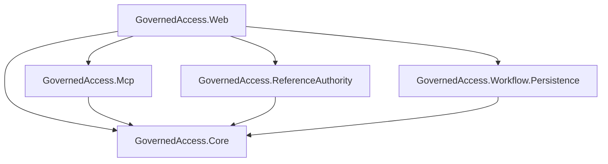
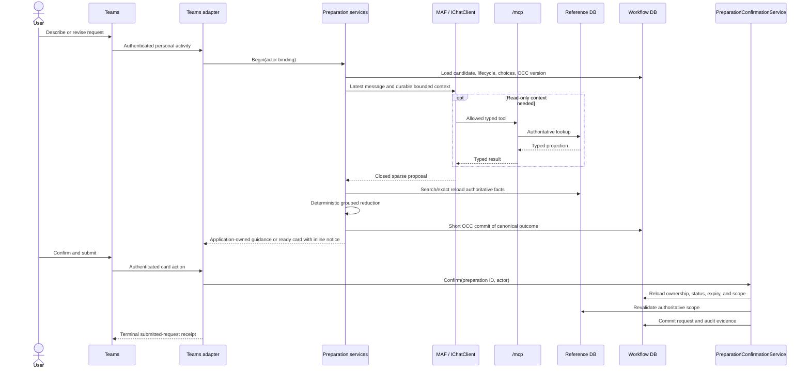

# Architecture

- **Status**: Current
- **Last reviewed**: 2026-08-28
- **Scope**: Governed Production Access Request Assistant MVP

## Architectural shape

The repository contains one executable ASP.NET Core host. It serves the React
application, receives Teams activities, runs request interpretation, exposes the
read-only MCP endpoint, persists workflow state in SQLite, and invokes the synthetic
provisioner.

The governing boundary is:

> AI interprets and gathers context. Humans approve. Deterministic services authorize
> and execute.

The design stays within one process because no current capability has independent
ownership, deployment, scaling, or availability requirements. Logical and protocol
boundaries remain explicit inside that host.

```mermaid
flowchart LR
    Requester[Requester]
    Business[Business approver]
    DevOps[DevOps approver]
    Teams[Microsoft Teams]
    BotService[Azure Bot Service]
    Browser[React browser]

    subgraph Host[GovernedAccess.Web]
        Activity[/api/messages]
        API[/api]
        AI[MAF interpretation]
        MCP[/mcp]
        App[Core application rules]
        ReferenceDB[(Reference SQLite)]
        WorkflowDB[(Workflow SQLite)]
        Provider[Synthetic provisioner]
    end

    Requester <--> Teams
    Teams <--> BotService
    BotService <-->|authenticated Activity Protocol| Activity
    Requester --> Browser
    Business --> Browser
    DevOps --> Browser
    Browser -->|cookie-authenticated HTTPS| API
    Activity --> AI
    Activity --> App
    API --> App
    AI -->|Streamable HTTP| MCP
    MCP --> ReferenceDB
    App --> ReferenceDB
    App --> WorkflowDB
    App --> Provider
```

`GovernedAccess.Web` is the only deployment unit. The normal host maps Teams, browser,
MCP, static assets, and SPA routes. Unknown `/api/*` and `/mcp/*` paths return `404`
instead of `index.html`.

## Source boundaries


```mermaid
flowchart TB
    Web[GovernedAccess.Web]
    Mcp[GovernedAccess.Mcp]
    Reference[GovernedAccess.ReferenceAuthority]
    Workflow[GovernedAccess.Workflow.Persistence]
    Core[GovernedAccess.Core]

    Web --> Core
    Web --> Mcp
    Web --> Reference
    Web --> Workflow
    Mcp --> Core
    Reference --> Core
    Workflow --> Core
```

### `GovernedAccess.Core`

Core owns domain entities, deterministic policies, application services, typed
outcomes, and focused ports for request context, intake persistence, workflow
persistence, time, interpretation, and provisioning.

It has no dependency on ASP.NET Core MVC, EF Core, Teams, Microsoft Agent Framework,
React, `Microsoft.Extensions.AI`, or the MCP SDK. Provider and protocol contracts are
translated before entering Core.

### `GovernedAccess.Mcp`

MCP registers the stateless Streamable HTTP server and exactly four typed read-only
tools. It translates tool contracts to focused Core authority ports. The project has
no workflow store, decision service, or provisioning dependency.

### `GovernedAccess.ReferenceAuthority`

Reference Authority exclusively owns its EF Core context, migration, synthetic
reference seeding, and direct reads of clients, eligible production environments,
environment-role assignments, and incidents. It implements Core's focused search,
exact environment, entitlement, and incident authority ports. Neither MCP nor Web
adapters receive its `DbContext`.

### `GovernedAccess.Workflow.Persistence`

Workflow Persistence exclusively owns its EF Core context, migration, synthetic
principal snapshots, preparation storage, and downstream workflow storage. It
implements Core persistence ports and shares no entity, transaction, or database file
with Reference Authority.

Those focused Core ports are the extraction seam: a future approved remote authority
can replace the in-process reference adapters without moving workflow persistence or
using the model-facing MCP endpoint as an application authority API. The present
runtime deliberately keeps both modules in process.

### `GovernedAccess.Web`

Web is the composition and infrastructure layer. It contains controllers, browser and
Teams authentication, antiforgery, the Teams adapter, MAF interpreter and session
creation, model-client selection, module composition, the synthetic
provisioner, correlation middleware, and React source and assets.

Controllers translate HTTP contracts and derive actors from authenticated context;
application services make authorization and transition decisions.

## Runtime responsibilities

| Component | Owns |
|---|---|
| React UI | Participant-visible request list/detail, human-decision forms, retry action, and audit presentation. |
| Teams adapter | Authenticated personal-activity routing, `/new`, preparation responses, card confirmation, and presentation updates. |
| MAF interpreter | Exact MCP catalog validation, one fresh bounded agent turn, strict sparse-proposal parsing, and provider-failure translation. |
| `RequestPreparationOrchestrator` | Builds the provider-neutral turn envelope from the durable candidate and clarification context, invokes the interpreter, and passes the proposal to Core. |
| `PreparationTurnService` and `RequestPreparationReducer` | Preparation lifecycle, grouped canonical reduction, authoritative validation, clarification, revision, optimistic commit, and reset. |
| `PreparationConfirmationService` | Owned ready-preparation confirmation, authoritative revalidation, immutable request creation, and audit staging. |
| `AccessRequestWorkflowService` | Business decision, DevOps decision, and failed-operation retry. |
| `ProtectedProvisioningService` | Persisted-evidence reload, provider input construction, provider call, and operation finalization. |
| Query and visibility services | Participant filtering and server-computed presentation actions. |
| Reference Authority | Reference-only migrations, seeding, authoritative reads, and search policy integration. |
| Workflow Persistence | Workflow-only migrations, principal seeding, preparation OCC, and downstream workflow persistence. |
| Synthetic provisioner | Request-keyed local grant get-or-create. |

Core remains the authority for readiness, scope, approver responsibility, legal
transitions, provisioning eligibility, and fixed grant lifetime. UI state, model
output, MCP annotations, and provider behavior do not replace those decisions.

## Request preparation

Teams confirmation is the only request-creation path. Preparation is model-assisted;
confirmation is a direct deterministic application action.


```mermaid
sequenceDiagram
    actor User
    participant Teams
    participant Agent as Teams adapter
    participant Prepare as Preparation services
    participant Model as MAF / IChatClient
    participant MCP as /mcp
    participant Reference as Reference DB
    participant Workflow as Workflow DB
    participant Submit as PreparationConfirmationService

    User->>Teams: Describe or revise request
    Teams->>Agent: Authenticated personal activity
    Agent->>Prepare: Begin(actor binding)
    Prepare->>Workflow: Load candidate, lifecycle, choices, OCC version
    Prepare->>Model: Latest message and durable bounded context
    opt Read-only context needed
        Model->>MCP: Allowed typed tool
        MCP->>Reference: Authoritative lookup
        Reference-->>MCP: Typed projection
        MCP-->>Model: Typed result
    end
    Model-->>Prepare: Closed sparse proposal
    Prepare->>Reference: Search/exact reload authoritative facts
    Prepare->>Prepare: Deterministic grouped reduction
    Prepare->>Workflow: Short OCC commit of canonical outcome
    Prepare-->>Agent: Application-owned guidance or ready card with inline notice
    User->>Teams: Confirm and submit
    Teams->>Agent: Authenticated card action
    Agent->>Submit: Confirm(preparation ID, actor)
    Submit->>Workflow: Reload ownership, status, expiry, and scope
    Submit->>Reference: Revalidate authoritative scope
    Submit->>Workflow: Commit request and audit evidence
    Agent-->>Teams: Terminal submitted-request receipt
```

The collecting candidate creates no request or approval. Core reloads every proposed
identifier and every structured environment option before accepting it. Only an owned,
unexpired ready intake can be confirmed; the model and MCP receive no submit
capability.

Discussion, value-equal and wholly rejected proposals, unrelated or unclear input, and
transient failures preserve an existing ready preparation. An accepted material or
clarification-producing revision atomically supersedes it and creates a new
predecessor-linked preparation. Durable lifecycle state rejects stale cards regardless
of whether Teams presentation metadata survived restart or activity update.

An exact trimmed, case-insensitive `/new` command bypasses the model and MCP,
terminally clears the active unsubmitted preparation, and atomically creates a clean
collecting replacement.

The Teams presentation result explicitly distinguishes actionable ready cards from
terminal status cards. Only actionable ready cards enter the process-local draft-card
tracker. Confirmation removes the matching active draft; a submitted receipt is not
tracked, while a ready successor produced by authoritative revalidation replaces the
original activity and carries the authoritative-change explanation in its own body.

The complete turn algorithm, tool policy, and clarification rules are maintained in
[request-intake orchestration](request-intake-orchestration.md).

## Durable turn context

Every normal message creates a fresh MAF session for one bounded turn; the application
does not retain provider conversation sessions or a process-local choice store. The
turn envelope contains only the latest requester message, canonical candidate,
lifecycle, and at most one persisted ordered environment/role clarification context.

The workflow database stores that provider-neutral state plus one optimistic
concurrency version. Restart therefore preserves accepted candidate values and active
displayed choices without retaining transcripts. General references that cannot be
resolved from canonical state and the active bounded choices return conservative
guidance. Confirmation and all downstream actions use persisted state and authority
ports, never model memory.

## Model and MCP profiles

`RequestPreparationModel:ExecutionProfile` accepts only `Deterministic` or
`FoundryResponses`; checked-in settings select `Deterministic`. The live profile
requires a validated Foundry endpoint and deployment, uses `DefaultAzureCredential`,
and fails closed on configuration, credential, provider, or timeout failure. It never
falls back to the deterministic client after live selection.

Both profiles use the same closed response schema, four-tool MCP allowlist,
authoritative assessment, confirmation, approval, and provisioning boundaries. The
Teams activity has one configured deadline of at most 100 seconds covering model and
MCP work. Function invocation allows at most six sequential iterations, disallows
concurrent tool invocation, and terminates on unknown calls.

The client requires the catalog to contain exactly
`search_production_environments`, `get_production_environment`,
`get_environment_roles`, and `get_incident`, all marked read-only. Environment
search is bounded to five complete results, each tool may be called at most once per
turn, and a turn allows at most four tool calls.

The same Web executable also supports `evaluate-live-model`. That mode starts an
isolated loopback host exposing the same four read-only MCP tools, uses separate
temporary reference and workflow SQLite databases, runs the fixed evaluation
inventory through the grouped preparation path, optionally selects one variation for
a non-promotable diagnostic run, records only sanitized outcomes and safety evidence,
and removes temporary database files on disposal. It cannot confirm, approve,
provision, retry, or revoke. Operator instructions live in
the [live-model evaluation guide](live-model-evaluation.md).

## Governed workflow


```mermaid
stateDiagram-v2
    [*] --> AwaitingBusinessApproval: Teams confirmation
    AwaitingBusinessApproval --> AwaitingDevOpsApproval: business approves
    AwaitingBusinessApproval --> Rejected: business rejects
    AwaitingDevOpsApproval --> Rejected: DevOps rejects
    AwaitingDevOpsApproval --> Active: provisioning succeeds
    AwaitingDevOpsApproval --> ProvisioningFailed: provisioning fails
    ProvisioningFailed --> Active: DevOps retry succeeds
    ProvisioningFailed --> ProvisioningFailed: retry fails
```

Submission commits the terminal intake, immutable request, and audit event together.
There is no request update endpoint.

Business decisions reload the current environment/client ownership and configured
approver. DevOps decisions require the request-bound business approval and current
canonical request context. DevOps approval commits the decision and pending operation
before calling `ProtectedProvisioningService` with only the request ID.

Protected provisioning reloads the request, approvals, operation, and grant; validates
their states; constructs provider input from immutable request details; and calls the
synthetic provider. Every successful grant expires exactly eight hours after
activation. Only authenticated DevOps may retry, and only from matching failed request
and operation states.

## Persistence and consistency

Two independently owned EF Core SQLite databases remain inside the one executable:

- Reference Authority stores fixed clients, eligible production environments,
  assigned roles, and incidents in its own context and migration history.
- Workflow Persistence stores authenticated principal snapshots, preparations,
  access requests, approval decisions, provisioning operations, grants, and audit
  events in its own context and migration history.

Stable identifiers cross the module boundary; there are no shared entities, EF
relationships, database files, cross-database queries, or transactions. Startup
accepts only a fresh database or the exact final migration/table inventory, applies
the owning migration, and seeds its owned synthetic records. Any old, transitional,
or otherwise incompatible schema fails with bounded explicit-reset guidance and is
never deleted automatically. There is no supported in-place upgrade or compatibility
path for disposable local data.

Database guarantees include reference-owned foreign keys, one active preparation per
actor/conversation, predecessor linkage for revisions, one optimistic concurrency
token per preparation, unique request `PreparationId`, one decision per request/stage,
one request-keyed operation, at most one grant per request, and restricted deletes.

One `SaveChangesAsync` atomically commits tracked local state and staged audit evidence.
That guarantee does not cross the provider call:

```text
persist DevOps approval and pending operation
        |
reload and validate persisted evidence
        |
persist attempt evidence
        |
call provider with request ID
        |
persist success or typed failure
```

Provider success followed by cancellation or local persistence failure is possible.
Request-keyed provider idempotency, the unique grant constraint, and scoped retry allow
convergence without claiming distributed atomicity.

## Interfaces and authentication

The same-origin browser API provides antiforgery/session operations, participant-
filtered request list/detail queries, business and DevOps decision subresources, and
DevOps-only retry. It exposes no draft or request-creation POST. Unsafe browser actions
require antiforgery validation.

Demo browser authentication maps one of six fixed keys to server-owned claims and
issues an HttpOnly, Secure, SameSite Strict cookie. Teams uses a separate Azure Bot
Service bearer policy; the actor resolver additionally requires the configured tenant,
`msteams` channel, personal non-group conversation, and stable actor/conversation
identifiers.

The stateless `/mcp` route is unauthenticated in the local MVP. Its normal consumer is
the server-side interpreter, and its fixed synthetic read-only scope makes this
acceptable only under the current local assumptions. Real or sensitive data requires
endpoint authentication, authorization, and network controls.

## Failure and observability

Expected invalid input, validation, authentication, authorization, not-found,
transition, concurrency, timeout, cancellation, dependency, and provider failures use
typed outcomes. Browser failures become safe Problem Details; preparation failures
become typed Teams responses.

`CorrelationMiddleware` assigns `X-Correlation-ID` and carries it through response
metadata, logging scopes, persisted workflow evidence, and safe errors. Model, MCP,
workflow, and provisioning operations record duration and outcome without requiring
secrets, raw prompts, transcripts, card bodies, or complete MCP payloads.

The synthetic provider has a ten-second deadline. OpenTelemetry export is not
configured; the host exposes an `ActivitySource` as an optional instrumentation seam.

## Frontend and tests

Vite builds React assets into `GovernedAccess.Web/wwwroot`; ASP.NET Core serves them
and owns the SPA fallback. React Router owns the request list and detail routes. The
browser never calls MCP or the provisioner directly.

Core rules use unit tests. Independent SQLite modules, bounded MAF turns, MCP,
authentication, HTTP, concurrency, and
provider coordination use component or full-host tests. Frontend tests cover session
and workflow wiring. No automated suite requires a live model or external production
system. Test ownership and the required command sequence are in the
[testing strategy](testing-strategy.md).

## Deliberate limits

The architecture excludes real production access and identity federation, mutable
enterprise reference integrations, automated revocation, a public provisioning API,
background reconciliation, cross-database transactions, message brokers, generic
workflow engines, large retrieval systems, multiple executable services, and a
separately deployed frontend.

New requirements for real credentials, mutable authorities, automatic reconciliation,
independent ownership, separate scaling, or versioned external contracts require a new
[architecture decision](adr/README.md).
