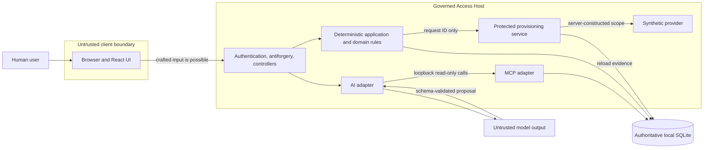

# Security and Trust Model

- **Status**: Current
- **Last reviewed**: 2026-07-23
- **Scope**: Local synthetic Governed Production Access Request Assistant MVP

## Purpose

This document explains what the implemented system trusts, what it treats as
untrusted, which security properties are enforced, and which risks remain because the
application is a local portfolio demonstration.

The central security claim is:

> AI interprets and gathers context. Humans approve. Deterministic services authorize
> and execute.

The model, browser, MCP tool catalog, UI action visibility, and caller-supplied data
are never authorization evidence.

This is not a claim that the application is ready to govern real production access.
It uses synthetic identities, data, and provisioning and intentionally omits the
controls required around real credentials and enterprise systems.

## Scope and assumptions

The security model assumes:

- one application-owned ASP.NET Core process;
- one application-owned local SQLite database;
- no supported out-of-band database writers;
- an exact, fail-fast synthetic reference dataset;
- four fixed demo principals;
- no real secrets or provider credentials;
- no real client production environments;
- no runtime administration surface for clients, environments, roles, incidents, or
  approver assignments; and
- a local or otherwise controlled demonstration environment.

If any of these assumptions changes, the residual risks and required controls must be
reassessed before the new behavior is released.

## Security objectives

The MVP protects the following properties:

### Authorization integrity

- only an authenticated requester can submit a request;
- only the configured client business approver can make the business decision;
- only an authenticated DevOps approver can make the DevOps decision or retry;
- neither the requester nor DevOps can replace the business-approved role;
- no request grants access to a different client environment; and
- the model cannot invoke approval or provisioning.

### Workflow integrity

- submitted request scope is immutable;
- approvals bind to one immutable request ID and exact role;
- decisions occur in the required order;
- invalid and duplicate transitions do not alter protected state;
- provisioning uses stored evidence rather than caller assertions; and
- one request produces at most one logical grant.

### Evidence integrity

- acting identity and correlation ID are recorded with human decisions;
- request, decision, provisioning, retry, success, failure, and rejected attempts
  produce structured audit evidence;
- operation and grant uniqueness is enforced in persistence; and
- optimistic concurrency detects competing request transitions.

### Controlled disclosure

- request lists and details are filtered to workflow participants;
- unrelated client approvers cannot discover another client's request through normal
  query endpoints;
- expected errors use safe typed responses; and
- normal application logging does not require raw prompts, secrets, or complete MCP
  payload capture.

Availability against hostile traffic is not a security objective of the local MVP.
There is no rate limiting, edge protection, or production capacity design.

## Protected assets

| Asset | Required protection |
|---|---|
| Immutable request scope | Integrity and participant-limited visibility |
| Authenticated actor identity | Integrity |
| Business and DevOps decisions | Integrity, ordering, attribution, and request binding |
| Provisioning operation | Integrity, idempotency, and exact-scope binding |
| Access grant | Integrity, uniqueness, exact role/environment binding, and fixed expiry |
| Audit history | Attribution, ordering, and application-level insert-only behavior |
| Synthetic reference context | Integrity within the fixed dataset |
| Correlation and outcome metadata | Integrity and safe disclosure |

All stored records are synthetic. The repository and local database must not be used
for real client, incident, identity, credential, or production-access data.

## Actors and trust levels

| Actor or component | Trust treatment |
|---|---|
| Requester | Authenticated human actor; request intent and fields remain untrusted input. |
| Business approver | Authenticated human actor; authority is resolved against stored environment responsibility. |
| DevOps approver | Authenticated human actor; may decide or retry only within deterministic state and scope rules. |
| Browser and React UI | Untrusted presentation client. It may be modified, bypassed, or send crafted requests. |
| Chat model | Untrusted interpreter. Its output and proposed identifiers require schema and authoritative validation. |
| MCP client and wire data | Untrusted protocol-boundary data until typed parsing and application validation succeed. |
| MCP server adapter | Trusted only to translate typed read-only requests to the request-context port. It is not an authorization boundary. |
| Application and domain services | Trusted enforcement boundary for validation, authority, state transitions, and exact scope. |
| SQLite workflow store | Authoritative store under the current single-writer application assumption. |
| Synthetic provisioner | Trusted to implement get-or-create for already authorized server-constructed scope; not trusted to decide eligibility. |

## Trust boundaries

The primary authorization boundary is the deterministic application layer backed by
persisted authoritative state. Moving a check into the browser, prompt, MCP
description, or provider adapter would not preserve this boundary.

## Enforced invariants

| Invariant | Principal enforcement |
|---|---|
| Browser claims cannot establish identity or authority | Cookie authentication creates claims from one server-held principal map; controllers read `ClaimsPrincipal`. |
| Unsafe browser actions resist cross-site request forgery | ASP.NET Core antiforgery validation is applied to sign-in, sign-out, draft preparation, request submission, both decisions, and retry. |
| Requester cannot choose the business approver | Environment context stores the responsible approver; business decision logic reloads it. |
| Client Alpha approval cannot authorize Client Beta | Principal client responsibility, environment client, and request client must agree. |
| Submitted scope cannot change | Request scope properties have no workflow mutation path; correction creates a new request ID. |
| Business approval binds exact scope | The decision references the immutable request ID and approved role. |
| DevOps cannot change role or duration | The decision body contains no scope or duration; policy uses persisted role; grant lifetime is server-owned. |
| Model output is not trusted | Closed JSON schema, strict parsing, known-role constraints, identifier revalidation, and full submission validation. |
| MCP cannot mutate workflow | The MCP project has only three read-only context tools and no workflow or provisioning dependency. |
| Provisioning does not trust its caller | The protected service accepts a request ID and reloads request, operation, and both approvals. |
| Retry cannot replace scope | Retry has no body and reuses the same request, operation, evidence checks, and provider idempotency identity. |
| Duplicate work cannot create multiple logical grants | Request ID is the idempotency identity; operation and grant constraints are unique per request; concurrent completion is reloaded. |
| UI action visibility is not authorization | Application services independently authenticate, authorize, and validate every action. |

## Browser, identity, and session boundary

### Demo identity establishment

`POST /api/demo/session` accepts only a fixed principal key. The server maps that key
to one immutable principal definition and issues the authentication cookie. It does
not accept caller-provided:

- principal IDs;
- role or principal kind;
- client responsibility;
- claims; or
- approver assignments.

The authentication cookie is:

- named `__Host-GovernedAccess.Auth`;
- HttpOnly;
- Secure;
- SameSite Strict;
- non-persistent;
- fixed to an eight-hour expiry; and
- not renewed through sliding expiration.

Unknown principal keys return validation failure. Authentication and authorization
failures return API `401` and `403` responses rather than browser redirects.

The identity selector is intentionally not real authentication. Anyone who can reach
the local demo can select any of the four principals. This makes the workflow easy to
demonstrate but provides no real proof of human identity.

### Antiforgery

The antiforgery flow uses:

- the framework's HttpOnly, Secure, SameSite Strict antiforgery cookie;
- a separate readable `XSRF-TOKEN` request-token cookie; and
- the `X-XSRF-TOKEN` request header on unsafe calls.

The sign-in endpoint itself requires antiforgery validation, so selecting a powerful
demo identity cannot be forced by a cross-site form submission. Missing or invalid
tokens return a safe typed failure without invoking the protected action.

HTTPS is the intended browser transport. Both the authentication and antiforgery
cookies are always marked Secure.

### Browser authority

Session capabilities and request `availableActions` help the UI decide what to show.
They are not access tokens or policy results that a server command trusts.

Crafting a hidden button, altering JavaScript, calling an endpoint directly, or
adding actor, role, duration, approval, or scope fields does not grant authority.
Command request types omit those fields, and services derive protected values from
authenticated and persisted state.

React renders stored strings through normal JSX text nodes. The current client does
not use `dangerouslySetInnerHTML` or another raw HTML rendering path.

## Request visibility

`RequestQueryService` calculates participation on the server:

- the requester can view their own request;
- the configured business approver can view the responsible client's request;
- DevOps can view requests from the DevOps stage onward, including a rejection on
  which DevOps acted; and
- other principals are treated as nonparticipants.

List filtering cannot expand this visibility. Request detail returns a not-found
outcome to a nonparticipant rather than confirming the existence of an inaccessible
request.

This is application-level isolation for the fixed demonstration identities, not
database row-level security.

## AI boundary

Natural-language intent may include misleading instructions, prompt injection, false
identifiers, or requests for excess privilege. Security does not depend on the prompt
convincing the model to behave.

The adapter constrains the model interaction with:

- a closed JSON response schema with no additional properties;
- strict JSON deserialization with unmapped members rejected;
- a fixed role enumeration;
- an explicit expected MCP tool-name set;
- termination on unknown tool calls;
- no concurrent tool calls;
- bounded model iterations and timeouts; and
- safe typed failure outcomes.

After parsing, the adapter revalidates client, environment, role, and incident
relationships against stored data. Request submission validates current data again
before anything is persisted.

A valid-looking draft is still only a proposal shown for review. It cannot create an
approval, transition workflow, or invoke provisioning. If the model is compromised or
malfunctioning, the maximum intended effect is an incorrect or unavailable draft that
the requester must correct and that deterministic submission validation may reject.

The default implementation uses a deterministic fake `IChatClient`. Replacing it with
a live provider must preserve the same schema, allowlist, timeout, logging, and
revalidation boundaries.

## MCP boundary

The `/mcp` endpoint exposes exactly:

- `get_production_environment`;
- `get_incident`; and
- `get_available_roles`.

Inputs use closed schemas. Results contain stable identifiers and typed safe failure
envelopes. The MCP project has no dependency on the workflow store or provisioner and
cannot approve, reject, transition, provision, revoke, or issue arbitrary database
queries.

The drafting adapter lists server tools and rejects the catalog unless its names
exactly equal the expected allowlist. Tool annotations and discovery are defense in
depth; the absence of state-changing dependencies is the stronger capability
boundary.

The endpoint is not authenticated in the current local MVP. This is acceptable only
under the current assumptions because it exposes a fixed synthetic read-only dataset
and no protected command. On an untrusted network it would still permit synthetic
data enumeration and resource consumption. Any real or sensitive context requires
endpoint authentication, caller authorization, transport/network controls, and a
fresh threat assessment.

The browser does not call `/mcp`; only the server-side drafting adapter uses it.

## Workflow authorization boundary

### Submission

Only the requester role can call draft preparation and submission. Submission derives
the requester ID from the authenticated principal, validates stored client,
environment, role, and incident context, creates a server-generated request ID, and
persists an immutable request.

### Business decision

The workflow service:

1. loads the authenticated principal from the stored principal dataset;
2. loads the immutable request and current environment context;
3. requires a business-approver principal;
4. compares the principal with the environment's configured approver;
5. applies the business decision state and duplicate-stage policy; and
6. records rejected authorization or transition attempts.

The browser decision body contains only `Approve` or `Reject` plus an optional
comment.

### DevOps decision

The workflow service requires a DevOps principal, current validated request context,
a valid prior business approval, the correct workflow state, and exact role
consistency. The browser cannot provide a role, environment, client, duration, or
approval assertion.

DevOps approval first commits the authenticated decision and pending request-keyed
operation. It then passes only the request ID into protected provisioning.

### Retry

Retry is limited to an authenticated DevOps principal and a request in
`ProvisioningFailed`. Retry outside that state is rejected and audited. The endpoint
accepts no body, so it cannot express replacement scope.

## Provisioning boundary

`ProtectedProvisioningService` independently reloads:

- the request-keyed provisioning operation;
- the immutable request;
- the business approval;
- the DevOps approval; and
- the existing grant when the operation is already complete.

Before provider invocation it checks:

- request and operation state compatibility;
- operation-to-request identity;
- environment and role scope equality;
- both approvals refer to the same request;
- approval stages and order are valid;
- both approvals cover the exact immutable role; and
- a completed grant matches the stored operation.

The provider request is constructed only from this stored evidence. Caller-supplied
approval assertions do not exist in the interface.

The synthetic provider has a ten-second deadline and get-or-create semantics keyed by
the immutable request ID. The access grant expiry is always activation plus eight
hours.

Provider execution and SQLite persistence are not atomic. A provider may create a
grant before a lost response, cancellation, process failure, or local save failure.
The design addresses duplicate creation through idempotency and explicit retry; it
does not provide automatic reconciliation or compensation.

## Persistence and data integrity

The database enforces:

- one business and one DevOps decision per request;
- one provisioning operation keyed by request ID;
- at most one access grant per request;
- optimistic concurrency on request transitions; and
- restricted deletion across workflow relationships.

Audit events are inserted by application workflows and have no update or delete
surface. This is an application-level insert-only model, not cryptographic
immutability or database-enforced append-only storage.

The synthetic reference seeder validates the exact known dataset and fails startup on
conflicting or unexpected reference rows. Pre-provisioning validation therefore
reloads changing workflow evidence but does not repeat reference lookups that cannot
change through supported behavior.

SQLite has no application-level encryption-at-rest, tenant row-level security, or
protection against a local operator who can directly edit or copy the database. Those
controls are outside the local synthetic scope.

## Audit, errors, and logging

The application records structured evidence for:

- request creation and validation failure;
- business and DevOps decisions;
- rejected authorization and invalid transition attempts;
- provisioning attempts, success, and failure; and
- duplicate retry return.

Correlation middleware assigns `X-Correlation-ID` from the current trace or a new
identifier and places it in the response and logging scope. Requests, decisions,
grants, operations, audit events, and safe Problem Details carry correlation data
where applicable.

Expected errors use typed application outcomes and safe Problem Details. The client
does not receive stack traces, provider credentials, raw exception details, or
caller-trusted authorization assertions.

Model, MCP, and provisioning logs record operation names, duration, correlation, and
outcome metadata. Normal logging does not require raw prompts, full MCP payloads, or
secrets.

The local audit and logs are useful demonstration evidence. They are not a
tamper-resistant compliance ledger, security information and event management system,
or long-term retention solution.

## Threat analysis

| Threat | Example attack | Implemented control | Residual risk |
|---|---|---|---|
| Identity over-posting | Browser adds `actorId`, claims, or approver fields. | Restricted request records; actor comes from authenticated server claims and stored principal context. | Demo principal selection itself is not real authentication. |
| Cross-site request forgery | Another site posts an approval using the victim's cookie. | SameSite Strict cookies and antiforgery cookie/header validation on every unsafe endpoint. | Requires correct HTTPS hosting and normal browser cookie behavior. |
| Cross-client authorization | Beta approver attempts to approve Alpha access. | Stored environment responsibility and client relationship checks; rejection is audited. | No database row-level security if application checks are bypassed by direct DB access. |
| Insecure direct object reference | User guesses another request UUID. | Server participant calculation; detail returns not found for nonparticipants. | Request metadata is visible to local DB operators. |
| Prompt injection | Intent tells the model to approve or invoke provisioning. | No such model tools; closed output schema; authoritative revalidation; separate human actions. | Model may produce an unusable draft or availability failure. |
| Invented identifiers | Model returns a plausible but nonexistent environment or incident. | Direct identifier and relationship revalidation plus submission-time validation. | A future mutable source requires freshness and consistency rules. |
| MCP capability expansion | A server advertises a workflow or provisioning tool. | Explicit server registration and client-side exact-name allowlist check. | An unauthenticated endpoint can be enumerated in the local deployment. |
| Request tampering after approval | Caller changes client, role, or environment before DevOps. | No update endpoint; immutable scope properties; approval and operation scope checks. | A direct malicious database writer is outside the trust assumption. |
| DevOps privilege expansion | Crafted approval adds a stronger role or longer duration. | Restricted body; exact stored role; fixed server-owned eight-hour expiry. | Current design has no generalized privilege hierarchy by intent. |
| Forged approval assertion | Caller tells provisioner both stages approved. | Protected service accepts only request ID and reloads persisted evidence. | A compromised application process can bypass in-process controls. |
| Replay or concurrent retry | Many retries attempt to create duplicate grants. | Request-keyed get-or-create, unique grant constraint, concurrency recovery. | No distributed provider guarantee exists beyond the adapter contract. |
| Lost provider response | Provider creates access but caller sees failure. | Stable idempotency identity and scoped retry converge on the existing grant. | No automatic reconciliation; human retry is required. |
| Information disclosure through errors or logs | Exception or prompt is returned or logged. | Safe typed failures, Problem Details mapping, metadata-only operation logging. | Local framework or infrastructure logging configuration still requires review before real data. |
| Denial of service | Repeated MCP, model, or provisioning calls consume resources. | Bounded 5/30/10-second operations and cancellation propagation. | No rate limiting, quotas, edge controls, or capacity SLO. |
| Stored script injection | Justification contains HTML or script. | React renders values as escaped JSX text; no raw HTML rendering API is used. | Future rich-text or HTML rendering would require a new control. |

## Verification evidence

Security behavior is exercised by automated tests, including:

- [API security tests](../tests/GovernedAccess.IntegrationTests/Security/ApiSecurityTests.cs):
  unauthenticated access, antiforgery coverage, over-posting resistance, and SPA
  fallback exclusion;
- [demo authentication tests](../tests/GovernedAccess.IntegrationTests/Authentication/DemoAuthenticationTests.cs):
  fixed identity mapping and cookie/session behavior;
- [business decision tests](../tests/GovernedAccess.IntegrationTests/Approvals/BusinessDecisionTests.cs):
  configured approver, wrong-client denial, duplicates, audit, and antiforgery;
- [DevOps decision tests](../tests/GovernedAccess.IntegrationTests/Approvals/DevOpsDecisionTests.cs):
  exact scope, actor restrictions, no grant on rejection, and safe failures;
- [protected provisioning tests](../tests/GovernedAccess.IntegrationTests/Provisioning/ProtectedProvisioningTests.cs):
  evidence reload, missing or mismatched evidence, and fixed grant lifetime;
- [retry tests](../tests/GovernedAccess.IntegrationTests/Provisioning/RetryProvisioningTests.cs):
  lost response, actor/state restrictions, and persisted-scope validation;
- [idempotency tests](../tests/GovernedAccess.IntegrationTests/Provisioning/ProvisioningIdempotencyTests.cs):
  concurrent attempts converging on one operation and grant; and
- [MCP contract tests](../tests/GovernedAccess.IntegrationTests/Mcp/McpContractTests.cs):
  exact allowlist, closed schemas, typed identifiers, failures, and forbidden
  capability absence.

Unit tests separately exercise request validation, exact-scope decision policies, and
workflow evidence rules without infrastructure dependencies.

Automated tests do not prove the security of hosting infrastructure, browsers,
external identity, a live model provider, or a real access provider because those
systems are outside the MVP.

## Residual risks and non-production limitations

The following limitations are accepted only for the synthetic portfolio scope:

- any demo user can switch to any fixed identity;
- `/mcp` has no authentication or rate limiting;
- local SQLite is not encrypted or protected from a machine/database operator;
- audit evidence is not cryptographically tamper-evident;
- no secrets management system is configured because there are no runtime secrets;
- no automatic access revocation occurs when the displayed eight-hour expiry passes;
- no automatic reconciliation follows a cross-boundary partial provisioning outcome;
- no security headers beyond framework and cookie behavior are documented as a
  hardened policy;
- no malware, dependency, container, or infrastructure scanning pipeline is defined;
- no incident response, backup, recovery, retention, or regulatory control set is
  implemented; and
- no rate limiting, abuse detection, lockout, or production monitoring is present.

These limitations must not be obscured when presenting the application.

## Requirements before real production access

Connecting the design to real identities, data, credentials, or access providers
would require at least:

1. replace the demo switcher with an enterprise identity provider and strong
   authentication;
2. define claims issuance, approver-group ownership, lifecycle, and revocation;
3. authenticate and authorize MCP callers or isolate the endpoint behind an
   appropriate network boundary;
4. add transport, host, security-header, rate-limit, and edge hardening;
5. use managed secret storage and a separately reviewed credential-bearing provider
   boundary;
6. define fresh validation against mutable authoritative systems immediately before
   access is granted;
7. add automatic expiry enforcement or revocation in the real access system;
8. design durable reconciliation for provider success/local failure partial outcomes;
9. provide tamper-resistant audit retention and operational monitoring;
10. establish database encryption, backup, recovery, access control, and data
    classification;
11. perform privacy, threat-model, dependency, penetration, and abuse-case reviews;
    and
12. define incident response, ownership, SLOs, and emergency access procedures.

Those changes require new architectural decisions. They must preserve the rule that
model output and MCP visibility are not authorization.

## Security review triggers

Review this document and the related tests whenever a change:

- adds an endpoint, unsafe HTTP action, identity, role, or available action;
- changes request scope, workflow states, approval rules, or grant lifetime;
- adds an MCP tool, resource, prompt, or external MCP client;
- replaces the deterministic chat client with a live provider;
- introduces mutable or external reference data;
- connects a real provisioner or stores credentials;
- changes provider idempotency or retry behavior;
- changes request visibility or audit data;
- adds raw HTML, rich text, file upload, or user-controlled links;
- changes deployment topology, network exposure, or database ownership; or
- introduces another executable or external consumer.

## Related documentation

- [Product baseline](governed-production-access-product-baseline.md)
- [As-built architecture](architecture.md)
- [Local development guide](local-development.md)
- [Testing strategy](testing-strategy.md)
- [Architecture decision index](adr/README.md)
- [Documentation plan](documentation-plan.md)
- [Feature specification](../specs/001-governed-production-access/spec.md)
- [Data model](../specs/001-governed-production-access/data-model.md)
- [UI API contract](../specs/001-governed-production-access/contracts/ui-api.md)
- [MCP tool contract](../specs/001-governed-production-access/contracts/mcp-tools.json)
- [Quickstart validation guide](../specs/001-governed-production-access/quickstart.md)
- [ADR 0001: Use One Deployable Service, Including the MCP Endpoint](adr/0001-use-one-deployable-service-including-mcp.md)
- [ADR 0002: Validate Persisted Workflow Evidence at Provisioning](adr/0002-validate-persisted-workflow-evidence-at-provisioning.md)
- [ADR 0003: Do Not Model Provider and Workflow Persistence as Atomic](adr/0003-do-not-model-provider-and-workflow-persistence-as-atomic.md)
- [ADR 0004: Use Request ID as the Provisioning Idempotency Identity](adr/0004-use-request-id-as-provisioning-idempotency-identity.md)
