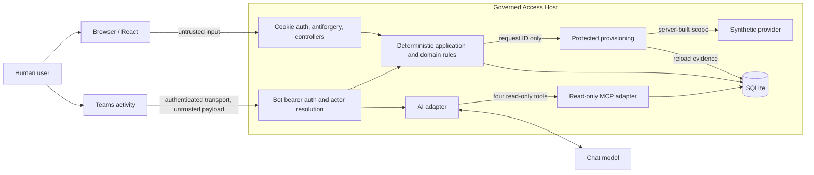

# Security and Trust Model

- **Status**: Current
- **Last reviewed**: 2026-08-10
- **Scope**: Local synthetic MVP

## Security boundary

The application protects the integrity of request scope, human decisions,
provisioning evidence, grants, and audit history inside one application-owned process
and SQLite database.

> AI interprets and gathers context. Humans approve. Deterministic services authorize
> and execute.

Requester text, model output, MCP wire data, browser input, card payloads, UI action
visibility, and caller assertions are not authorization evidence. Deterministic
application services backed by persisted state form the authorization boundary.

The current assessment assumes:

- fixed synthetic identities and reference data;
- one ASP.NET Core process and one application-owned SQLite database;
- no supported out-of-band database writer;
- a local or otherwise controlled demonstration environment;
- no real client, incident, credential, or production-access data; and
- no real access-control provider.

Changing any assumption requires a new threat assessment.

## Trust map

```mermaid
flowchart LR
    Human[Human user]
    Browser[Browser / React]
    Teams[Teams activity]
    Model[Chat model]

    subgraph Host[Governed Access Host]
        Web[Cookie auth, antiforgery, controllers]
        Activity[Bot bearer auth and actor resolution]
        AI[AI adapter]
        MCP[Read-only MCP adapter]
        App[Deterministic application and domain rules]
        Protected[Protected provisioning]
        Provider[Synthetic provider]
        DB[(SQLite)]
    end

    Human --> Browser
    Human --> Teams
    Browser -->|untrusted input| Web
    Teams -->|authenticated transport, untrusted payload| Activity
    Activity --> AI
    Activity --> App
    AI <--> Model
    AI -->|four read-only tools| MCP
    MCP --> DB
    Web --> App
    App --> DB
    App -->|request ID only| Protected
    Protected -->|reload evidence| DB
    Protected -->|server-built scope| Provider
```

| Component | Trust treatment |
|---|---|
| Browser and React | Untrusted presentation client; hidden controls and displayed actions do not grant authority. |
| Teams activity | Untrusted payload received through the protected Activity Protocol endpoint. |
| Chat model | Untrusted interpreter; output requires closed-schema parsing and authoritative validation. |
| MCP client and wire data | Untrusted protocol data until typed translation and application validation complete. |
| MAF session memory | Best-effort conversational context; never durable candidate truth or authorization evidence. |
| Application and domain services | Enforcement boundary for validation, authorization, transitions, and scope. |
| SQLite | Authoritative under the single application-writer assumption. |
| Synthetic provisioner | Executes already-authorized server-built scope; it does not decide eligibility. |

## Identity and request entry

### Browser

`POST /api/demo/session` accepts one of six fixed principal keys. The server maps the
key to immutable claims for one requester, four client business approvers, or one
DevOps approver. Caller-supplied IDs, roles, claims, and client responsibility are not
accepted.

The authentication cookie is `__Host-GovernedAccess.Auth`, HttpOnly, Secure,
SameSite Strict, non-persistent, fixed to eight hours, and not sliding. This identity
selector is convenient synthetic authentication and does not prove a real human
identity.

Unsafe same-origin browser actions require the framework antiforgery cookie plus the
readable `XSRF-TOKEN` value in the `X-XSRF-TOKEN` header. Authentication failures
return `401`; authorization failures return `403` instead of redirects.

The browser has no request-creation endpoint, route, form, or capability. It can list
participant-visible requests, display details and audit evidence, record authorized
business or DevOps decisions, and invoke the DevOps-only failed-operation retry.

### Teams

`POST /api/messages` uses a dedicated Azure Bot Service JWT bearer policy rather than
the demo cookie. After bearer validation, the actor resolver requires:

- the `msteams` channel;
- a personal, non-group conversation;
- the configured tenant ID;
- a nonblank channel actor ID; and
- a nonblank conversation ID.

The accepted channel identity is bound to the fixed synthetic requester. Activity
payload values cannot select an approver or another application principal. The exact
tenant, actor, and conversation remain part of intake ownership and confirmation.

The Teams bot credential is loaded from ignored local state outside the repository.
The application must not print or send it to the model. The optional Foundry profile
uses `DefaultAzureCredential`; it does not store a model API key in application
settings.

## Model and MCP boundary

The model receives one closed response schema and exactly:

- `search_production_environments` for bounded deterministic discovery;
- `get_production_environment` for exact environment and owning-client context;
- `get_environment_roles` for current environment-scoped role assignments; and
- `get_incident` for exact incident lookup.

The client rejects any different tool catalog or non-read-only annotation. Function
invocation is sequential, bounded, and terminates on unknown calls. Provider,
transport, timeout, configuration, and authorization failures fail closed without
falling back from the selected live profile to the deterministic client.

The `/mcp` endpoint is unauthenticated in the local MVP. It exposes only the fixed
synthetic read-only dataset and has no workflow or provisioning dependency. This is
not suitable for real or sensitive context; such use requires endpoint authentication,
caller authorization, rate controls, and an appropriate network boundary.

Model proposals remain untrusted after successful tool use. Core reloads every
proposed identifier and validates client ownership, environment existence, assigned
role, incident status, and incident compatibility. Structured environment choices are
also reloaded before the Teams adapter may show the model's bounded message beside
application-rendered authoritative options. Prose is never parsed into scope.

## Intake and conversation memory

An intake binds the authenticated channel, tenant, actor, conversation, and synthetic
requester. SQLite stores its sanitized candidate and lifecycle, not raw activities,
prompts, transcripts, model responses, clarification option lists, or serialized MAF
sessions.

MAF sessions are keyed by the server-generated intake ID. One process-local gate per
intake serializes session load, model execution, and successful save. Failed,
cancelled, timed-out, or malformed turns do not replace the last successfully stored
session.

Sessions and gates remain allocated until the host stops. Restart loses conversation
history but retains accepted candidate state. Without the preceding question and
ordering, a relative reply must be clarified again. Confirmation and every downstream
workflow action ignore conversation memory.

An exact trimmed, case-insensitive `/new` command bypasses the model and MCP,
terminally clears an active unsubmitted intake, and causes the next message to use a
new intake ID. It cannot modify a submitted request.

### Ready-draft revisions

Discussion, a value-equal proposal, or a valid unresolved revision clarification
preserves the existing ready intake, reserved request ID, deadline, and confirmation
card. Other differing assessed outcomes supersede it:

- a different ready candidate receives a separate review card;
- a rejected candidate or an incomplete proposal without an applicable clarification
  leaves a replacement intake collecting corrections.

Every card carries its own preparation ID. Confirmation reloads that exact intake and
rejects terminal or stale status. Process-local card updates improve presentation but
are not the safety control; a stale-looking card cannot submit superseded scope.

## Workflow authorization

### Submission

Confirmation verifies the authenticated Teams ownership binding, ready status,
30-minute expiry, immutable prepared details, and current authoritative context. The
submitted intake, new request, and request-created audit event commit together. There
is no submitted-request update operation.

### Human decisions

For each decision the service reloads the authenticated principal, request, current
environment/client relationship, configured business approver, prior decision, and
workflow state.

- Only the owning client's business approver may make the business decision.
- Only the fixed DevOps approver may make the DevOps decision or retry.
- Decisions bind to the immutable request ID. Their bodies do not accept acting
  identity, scope, role replacement, duration, or approval assertions.
- Invalid, duplicate, wrong-client, and wrong-state actions do not perform the
  protected transition and produce typed safe outcomes.

### Provisioning and retry

DevOps approval and the pending request-keyed operation commit before the provider is
called. The protected service then accepts only the request ID and reloads the request,
both approvals, operation, and existing grant. It validates their states and constructs
provider input exclusively from immutable request details.

Only a failed request and failed operation may be retried. Retry accepts no scope and
uses the same protected path and request-ID idempotency identity. Provider success
followed by cancellation or local-save failure remains possible; the stable identity,
provider get-or-create behavior, unique grant constraint, and human retry allow the
workflow to converge without claiming a distributed transaction.

## Persistence, visibility, and audit

SQLite enforces authoritative foreign keys, one decision per request/stage, one
request-keyed operation, at most one grant per request, unique active-intake and
reserved-request bindings, and optimistic concurrency on mutable aggregates.

Lists and details are filtered to the requester, responsible business approver, and
DevOps approver. Nonparticipants receive no detail through normal query endpoints.
`availableActions` is a presentation hint; command services authorize independently.

Audit records capture request and actor IDs where applicable, timestamp, correlation
ID, transition or operation type, outcome, and bounded structured details. Normal
logging records operation names, duration, correlation, and safe outcome metadata. It
does not require secrets, raw prompts, transcripts, card bodies, raw exception text, or
complete MCP payloads.

## Threat register

| Threat | Implemented control | Residual risk |
|---|---|---|
| Identity or scope over-posting | Restricted command contracts; identity and scope come from authenticated and persisted state. | Demo identity switching is not real authentication. |
| CSRF against browser actions | SameSite Strict cookies and antiforgery cookie/header validation. | Requires intended HTTPS browser hosting. |
| Wrong-client approval or guessed request ID | Stored approver responsibility and participant filtering. | Direct database access is outside the application boundary. |
| Prompt injection or invented identifiers | No state-changing model tools; closed schema; authoritative reload and validation. | The model can still produce unusable or confusing text. |
| Silent substitution after lookup failure | Exact identifier policy, typed failures, and deterministic blocking of discovery after every exact outcome. | Natural-language shortlist quality on the separate readable-wording discovery path remains model-dependent. |
| MCP capability expansion | Explicit four-tool server registration and exact client catalog check. | The unauthenticated local route can be enumerated or abused for resource consumption. |
| Request tampering after approval | Immutable request details and request-bound decisions and operations. | A compromised host process can bypass in-process controls. |
| Duplicate or lost provisioning outcome | Request-keyed get-or-create, unique grant constraint, and scoped retry. | No automatic reconciliation or distributed provider guarantee. |
| Conversation cross-talk or restart loss | Per-intake session key and gate; durable canonical candidate; safe re-clarification. | Process memory grows with intake count and has no compaction policy. |
| Stored script injection | React renders values as escaped JSX text. | Any future rich-text rendering needs separate review. |
| Resource exhaustion | Teams and provisioning deadlines, bounded tool iterations, and cancellation propagation. | No rate limiting, edge protection, quotas, or production capacity SLO. |

## Residual risks

The local MVP also lacks database encryption and row-level security, cryptographic
audit integrity, automatic expiry revocation, automatic partial-outcome reconciliation,
production secret management, hardened security-header policy, dependency or container
scanning, backup and disaster recovery, privacy retention controls, incident response,
abuse detection, and production monitoring.

Deterministic justification validation currently checks presence and length, not
semantic intent. Human approval remains mandatory, but a future requirement to reject
malicious justification before confirmation needs an explicit deterministic policy and
tests rather than reliance on the model.

Before using real identities, data, credentials, or access providers, the design must
add enterprise authentication and claims governance, authenticated MCP access,
network and rate controls, managed secrets, fresh validation against mutable systems,
real expiry enforcement, durable reconciliation, protected audit retention, database
hardening and recovery, privacy controls, operational monitoring, incident response,
and an updated threat assessment.

## Review triggers

Review this model whenever a change affects identity, endpoint exposure, unsafe HTTP
actions, request scope, workflow states, approval rules, grant lifetime, MCP tools,
model providers, conversation retention, mutable reference data, provisioning,
idempotency, visibility, audit content, HTML rendering, deployment topology, or the
number of executable services.

Automated evidence ownership and the required validation sequence are documented in
the [testing strategy](testing-strategy.md).
