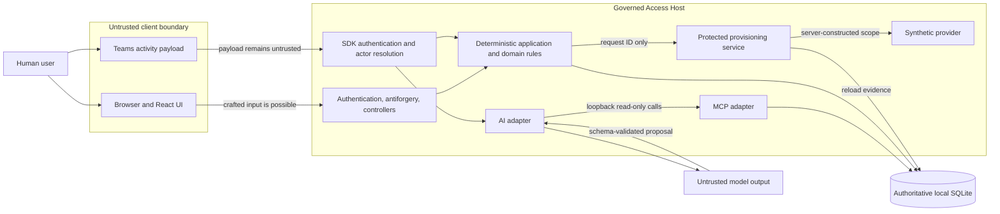

# Security and Trust Model

- **Status**: Current
- **Last reviewed**: 2026-08-05
- **Scope**: Local synthetic Governed Production Access Request Assistant MVP

## Purpose

This document explains what the implemented system trusts, what it treats as
untrusted, which security properties are enforced, and which risks remain because the
application is a local portfolio demonstration.

The central security claim is:

> AI interprets and gathers context. Humans approve. Deterministic services authorize
> and execute.

The model, browser, MCP tool catalog, UI action visibility, and caller-supplied data
are never authorization evidence.

This is not a claim that the application is ready to govern real production access.
It uses synthetic identities, data, and provisioning and intentionally omits the
controls required around real credentials and enterprise systems.

## Scope and assumptions

The security model assumes:

- one application-owned ASP.NET Core process;
- one application-owned local SQLite database;
- no supported out-of-band database writers;
- an exact, fail-fast synthetic reference dataset;
- six fixed demo principals;
- no model API key in application configuration; an optional live-model exercise uses
  the developer's external Microsoft Entra credential chain;
- no real client production environments;
- no runtime administration surface for clients, environments, roles, incidents, or
  approver assignments; and
- a local or otherwise controlled demonstration environment.

If any of these assumptions changes, the residual risks and required controls must be
reassessed before the new behavior is released.

## Security objectives

The MVP protects the following properties:

### Authorization integrity

- only an SDK-authenticated personal Teams actor mapped server-side to the requester
  can confirm and submit a prepared request;
- only the configured client business approver can make the business decision;
- only an authenticated DevOps approver can make the DevOps decision or retry;
- neither the requester nor DevOps can replace the business-approved role;
- no request grants access to a different client environment; and
- the model cannot invoke approval or provisioning.

### Workflow integrity

- submitted request scope is immutable;
- approvals bind to one immutable request ID whose validated details cannot change;
- decisions occur in the required order;
- invalid and duplicate transitions do not alter protected state;
- provisioning uses stored evidence rather than caller assertions; and
- one request produces at most one logical grant.

### Evidence integrity

- acting identity and correlation ID are recorded with human decisions;
- request, decision, provisioning, retry, success, failure, and rejected attempts
  produce structured audit evidence;
- operation and grant uniqueness is enforced in persistence; and
- optimistic concurrency detects competing request transitions.

### Controlled disclosure

- request lists and details are filtered to workflow participants;
- unrelated client approvers cannot discover another client's request through normal
  query endpoints;
- expected errors use safe typed responses; and
- normal application logging does not require raw prompts, secrets, or complete MCP
  payload capture.

Availability against hostile traffic is not a security objective of the local MVP.
There is no rate limiting, edge protection, or production capacity design.

## Protected assets

| Asset | Required protection |
|---|---|
| Immutable request scope | Integrity and participant-limited visibility |
| Intake binding and canonical candidate | Integrity, actor/conversation isolation, and safe restart recovery |
| Authenticated actor identity | Integrity |
| Business and DevOps decisions | Integrity, ordering, attribution, and request binding |
| Provisioning operation | Integrity, request binding, lifecycle state, and retry metadata |
| Access grant | Integrity, request binding, uniqueness, and fixed expiry |
| Audit history | Attribution, ordering, and application-level insert-only behavior |
| Synthetic reference context | Integrity within the fixed dataset |
| Correlation and outcome metadata | Integrity and safe disclosure |

All stored records are synthetic. The repository and local database must not be used
for real client, incident, identity, credential, or production-access data.

## Actors and trust levels

| Actor or component | Trust treatment |
|---|---|
| Requester | Authenticated human actor; request intent and fields remain untrusted input. |
| Business approver | Authenticated human actor; authority is resolved against stored environment responsibility. |
| DevOps approver | Authenticated human actor; may decide or retry only within deterministic state and scope rules. |
| Browser and React UI | Untrusted presentation client. It may be modified, bypassed, or send crafted requests. |
| Microsoft Teams activity | Untrusted payload carried through an authenticated SDK boundary; tenant, actor, channel, and conversation are derived from authenticated context. |
| Chat model | Untrusted interpreter. Its output and proposed identifiers require schema and authoritative validation. |
| Foundry Responses provider and Entra credential chain | External dependency used only when the server selects the live profile; authentication or provider failure must fail closed without deterministic fallback. |
| MCP client and wire data | Untrusted protocol-boundary data until typed parsing and application validation succeed. |
| MCP server adapter | Trusted only to translate typed read-only requests to the request-context port. It is not an authorization boundary. |
| Application and domain services | Trusted enforcement boundary for validation, authority, state transitions, and exact scope. |
| Native process-local MAF session store and turn coordinator | Best-effort untrusted conversation context, isolated by server-generated intake ID and excluded from authorization and durable evidence. |
| SQLite workflow store | Authoritative store under the current single-writer application assumption. |
| Synthetic provisioner | Trusted to implement get-or-create for already authorized server-constructed scope; not trusted to decide eligibility. |

## Trust boundaries

```mermaid
flowchart LR
    Human[Human user]

    subgraph UntrustedClient[Untrusted client boundary]
        Browser[Browser and React UI]
        Teams[Teams activity payload]
    end

    subgraph Host[Governed Access Host]
        HTTP[Authentication, antiforgery, controllers]
        Activity[SDK authentication and actor resolution]
        App[Deterministic application and domain rules]
        AI[AI adapter]
        MCP[MCP adapter]
        Protected[Protected provisioning service]
        Provider[Synthetic provider]
    end

    Model[Untrusted model output]
    DB[(Authoritative local SQLite)]

    Human --> Browser
    Human --> Teams
    Browser -->|crafted input is possible| HTTP
    Teams -->|payload remains untrusted| Activity
    HTTP --> App
    Activity --> App
    Activity --> AI
    AI --> Model
    Model -->|schema-validated proposal| AI
    AI -->|loopback read-only calls| MCP
    MCP --> DB
    App --> DB
    App -->|request ID only| Protected
    Protected -->|reload evidence| DB
    Protected -->|server-constructed scope| Provider
```

The primary authorization boundary is the deterministic application layer backed by
persisted authoritative state. Moving a check into the browser, prompt, MCP
description, or provider adapter would not preserve this boundary.

## Enforced invariants

| Invariant | Principal enforcement |
|---|---|
| Browser claims cannot establish identity or authority | Cookie authentication creates claims from one server-held principal map; controllers read `ClaimsPrincipal`. |
| Unsafe browser actions resist cross-site request forgery | ASP.NET Core antiforgery validation is applied to sign-in, sign-out, both decisions, and retry. Teams activities use the separate SDK-authenticated Activity Protocol boundary. |
| Requester cannot choose the business approver | Environment context stores the responsible approver; business decision logic reloads it. |
| Client Alpha approval cannot authorize Client Beta | Principal client responsibility, environment client, and request client must agree. |
| Submitted scope cannot change | Request scope properties have no workflow mutation path; correction creates a new request ID. |
| Business approval binds exact scope | The decision references the immutable request ID; compatibility views project scope from that request. |
| DevOps cannot change role or duration | The decision body contains no scope or duration; policy uses persisted role; grant lifetime is server-owned. |
| Model output is not trusted | Closed JSON schema, strict parsing, known-role constraints, identifier revalidation, and full submission validation. |
| Conversation history cannot authorize or establish candidate truth | Only the canonical typed candidate is durable; native MAF history is process-local, isolated per intake, and never read by confirmation or downstream workflow actions. |
| Missing history cannot reinterpret a relative answer | After restart the model receives the durable candidate but no prior conversation messages; ambiguous references require self-contained re-clarification and cannot be reconstructed or guessed from persisted options. |
| MCP cannot mutate workflow | The MCP project has only two read-only context tools and no workflow or provisioning dependency. |
| Discovery cannot mask an exact-lookup failure | A fresh per-turn gate permits discovery after exact lookup only when the structured outcome is typed `NotFound`; other outcomes retain their explicit correction or retry semantics. |
| Model prose cannot create selectable scope | Structured environment option IDs are independently validated and reloaded before the bounded model message or authoritative choices are rendered; prose is never parsed into scope or authority. |
| Discussion cannot silently replace a ready scope | Core compares the complete deterministically assessed candidate with the immutable ready candidate. Equality preserves the same confirmation identity; any difference supersedes that identity and requires a separately confirmable preparation. |
| A stale card cannot confirm revised fields | Every card carries its own opaque preparation ID. Confirmation reloads that exact durable intake and rejects superseded status; process-local card updates are presentation only. |
| Provisioning does not trust its caller | The protected service accepts a request ID and reloads request, operation, and both approvals. |
| Retry cannot replace scope | Retry has no body and reuses the same request, operation, evidence checks, and provider idempotency identity. |
| Duplicate work cannot create multiple logical grants | Request ID is the idempotency identity; operation and grant constraints are unique per request; concurrent completion is reloaded. |
| UI action visibility is not authorization | Application services independently authenticate, authorize, and validate every action. |

## Live-model and reset boundaries

The process-wide `RequestPreparationModel` configuration accepts only
`Deterministic` or `FoundryResponses`. The live profile validates its trusted Foundry
Responses base URL and deployment name, obtains tokens through
`DefaultAzureCredential`, and remains subject to the Teams endpoint's single
100-second request timeout. Endpoint, deployment, credentials, quota, transport, or
timeout failure returns a closed unavailable/timeout outcome; it never falls back to
the deterministic client. Provider provenance does not weaken schema validation,
the exact read-only MCP allowlist, authoritative candidate assessment, authenticated
confirmation, either human approval, or protected provisioning.

An exact trimmed, case-insensitive `/new` is deterministic authenticated lifecycle
input, not model intent. The Teams adapter intercepts it before model or MCP work, and
Core may terminate only the active unsubmitted intake owned by that actor and exact
conversation. Reset records safe lifecycle metadata, clears the candidate through an
existing terminal transition, creates no request, and cannot mutate an immutable
submitted request. Longer messages containing `/new` remain untrusted conversational
input.

## Ready-draft revision and presentation boundary

When another message arrives for an unexpired ready intake, the model receives the
complete validated candidate before durable state changes. A discussion or hypothetical
that returns the same deterministically assessed candidate produces `DraftDiscussion`
and leaves the preparation ID, reserved request ID, deadline, and confirmation card
active. If the assessed candidate differs, the application marks the old intake
`Superseded` and creates a new intake before persisting the replacement outcome. The
old card can therefore never submit fields shown only by the replacement card.

`TeamsDraftCardTracker` stores only one preparation/activity reference per exact
authenticated actor and conversation for the host lifetime. It lets the transport
adapter replace a prior activity with a non-actionable **Draft being revised** card.
The tracker is neither candidate state nor authorization evidence. Restart loss,
missing activity metadata, or an `UpdateActivityAsync` failure can leave the old card
visually actionable, but confirmation still reloads the terminal intake and returns a
non-actionable stale-card response without creating workflow state.

## Conversation-memory boundary

History-first clarification uses MAF's native singleton
`InMemoryAgentSessionStore`, addressed by the opaque server-generated intake ID. It
exists only to preserve conversational meaning across turns in the current host
process. Before interpretation, the durable intake has already established the
authenticated actor and personal-conversation binding. A singleton
`MafConversationTurnCoordinator` retains one exact gate per intake and serializes the
complete native session load, agent run, and successful save sequence, preventing two
activities for the same intake from branching or overwriting one another.

Sessions and gates remain in memory until process termination. The application has no
inactivity timeout, turn-count limit, terminal cleanup, removal race, durable session
row, or compaction policy in the current local low-volume baseline. Only completed
schema-valid turns are saved. Timeout, cancellation, dependency failure, and malformed
output preserve the last successfully stored session.

Process termination loses both native history and gates but causes no domain
transition. SQLite retains the complete accepted candidate and intake lifecycle. A
fresh session receives that durable candidate without prior conversation messages and
must repeat a self-contained clarification before interpreting relative text. The
application persists no option list and supplies no reconstructed history marker.

No raw activity, prompt, model response, option list, transcript, or serialized MAF
session is persisted or logged by default. Session presence and content are neither
authorization nor audit evidence and are never inputs to confirmation, approval,
provisioning, retry, or revocation. Durable session retention/deletion, multi-host
coordination, and native MAF compaction require a future privacy and capacity design.

## Browser, identity, and session boundary

### Demo identity establishment

`POST /api/demo/session` accepts only a fixed principal key. The server maps that key
to one immutable principal definition and issues the authentication cookie. It does
not accept caller-provided:

- principal IDs;
- role or principal kind;
- client responsibility;
- claims; or
- approver assignments.

The authentication cookie is:

- named `__Host-GovernedAccess.Auth`;
- HttpOnly;
- Secure;
- SameSite Strict;
- non-persistent;
- fixed to an eight-hour expiry; and
- not renewed through sliding expiration.

Unknown principal keys return validation failure. Authentication and authorization
failures return API `401` and `403` responses rather than browser redirects.

The identity selector is intentionally not real authentication. Anyone who can reach
the local demo can select any of the four principals. This makes the workflow easy to
demonstrate but provides no real proof of human identity.

### Antiforgery

The antiforgery flow uses:

- the framework's HttpOnly, Secure, SameSite Strict antiforgery cookie;
- a separate readable `XSRF-TOKEN` request-token cookie; and
- the `X-XSRF-TOKEN` request header on unsafe calls.

The sign-in endpoint itself requires antiforgery validation, so selecting a powerful
demo identity cannot be forced by a cross-site form submission. Missing or invalid
tokens return a safe typed failure without invoking the protected action.

HTTPS is the intended browser transport. Both the authentication and antiforgery
cookies are always marked Secure.

### Browser authority

Session capabilities and request `availableActions` help the UI decide what to show.
They are not access tokens or policy results that a server command trusts.

The browser is not a request-creation channel. It has no draft endpoint,
request-creating `POST /api/requests`, `/requests/new` route, creation form,
navigation action, or `createRequest` capability. It remains an authenticated request
register and business-decision, DevOps-decision, retry, and audit surface. Removed
browser calls create no request or audit state.

Crafting a hidden button, altering JavaScript, calling an endpoint directly, or
adding actor, role, duration, approval, or scope fields does not grant authority.
Command request types omit those fields, and services derive protected values from
authenticated and persisted state.

React renders stored strings through normal JSX text nodes. The current client does
not use `dangerouslySetInnerHTML` or another raw HTML rendering path.

## Request visibility

`RequestQueryService` calculates participation on the server:

- the requester can view their own request;
- the configured business approver can view the responsible client's request;
- DevOps can view requests from the DevOps stage onward, including a rejection on
  which DevOps acted; and
- other principals are treated as nonparticipants.

List filtering cannot expand this visibility. Request detail returns a not-found
outcome to a nonparticipant rather than confirming the existence of an inaccessible
request.

This is application-level isolation for the fixed demonstration identities, not
database row-level security.

## AI boundary

Natural-language intent may include misleading instructions, prompt injection, false
identifiers, or requests for excess privilege. Security does not depend on the prompt
convincing the model to behave.

The adapter constrains the model interaction with:

- a closed JSON response schema with no additional properties;
- strict JSON deserialization with unmapped members rejected;
- a fixed role enumeration;
- an explicit expected MCP tool-name set;
- termination on unknown tool calls;
- no concurrent tool calls;
- bounded model iterations and propagated request cancellation; and
- safe typed failure outcomes.

Readable environment context uses bounded catalog discovery. A potential environment
identifier uses exact lookup first, and an application-controlled per-turn tool
wrapper permits discovery fallback only after typed `NotFound`. Prompt instructions
do not enforce this security-relevant sequencing rule. Timeout, cancellation,
invalid-input, unavailable, malformed, and successful exact outcomes cannot be
converted into discovery-based correction.

After parsing, the adapter revalidates client, environment, role, and incident
relationships against stored data. For environment clarification, it also validates
and reloads the complete structured option set before allowing the bounded
model-authored message to be displayed beside application-rendered authoritative
choices. Unknown, duplicate, excessive, or otherwise invalid options suppress the
associated message and choices. Deterministic confirmation validates current data
again before creating a request.

A valid-looking proposal is still only untrusted input to deterministic preparation.
It cannot create an approval, transition workflow, or invoke provisioning. If the
model is compromised or malfunctioning, the maximum intended effect is an incorrect
or unavailable proposal that the requester must correct and that deterministic
confirmation validation may reject.

The default implementation uses a deterministic fake `IChatClient`. Replacing it with
a live provider must preserve the same schema, allowlist, timeout, logging, and
revalidation boundaries.

## MCP boundary

The `/mcp` endpoint exposes exactly:

- `get_production_environment`;
- `get_incident`.

`get_production_environment` accepts `{}` for a bounded complete-catalog discovery
read or a nonblank `environmentId` for exact lookup. Both success modes return the
same ordered environment shape with authoritative client relationships and assigned
roles. The server fails closed above 20 candidates and never returns a truncated
catalog. `get_incident` remains exact-only for a precise requester-supplied stable
identifier; incident listing, title search, partial-ID lookup, and inference are not
available. No separate role-listing tool exists.

Inputs use closed schemas. Results contain stable identifiers and typed safe failure
envelopes. The MCP project has no dependency on the workflow store or provisioner and
cannot approve, reject, transition, provision, revoke, or issue arbitrary database
queries.

The Teams preparation adapter lists server tools and rejects the catalog unless its names
exactly equal the expected allowlist. Tool annotations and discovery are defense in
depth; the absence of state-changing dependencies is the stronger capability
boundary.

The endpoint is not authenticated in the current local MVP. This is acceptable only
under the current assumptions because it exposes a fixed synthetic read-only dataset
and no protected command. On an untrusted network it would still permit synthetic
data enumeration and resource consumption. Any real or sensitive context requires
endpoint authentication, caller authorization, transport/network controls, and a
fresh threat assessment.

The browser does not call `/mcp`; only the server-side Teams preparation adapter uses
it.

## Workflow authorization boundary

### Submission

Authenticated confirmation of a server-owned Teams intake is the only request-creation
path. The Activity Protocol boundary derives tenant, channel actor, and personal
conversation from authenticated SDK context and maps the actor server-side to the
fixed synthetic requester. The action carries only a schema version and opaque intake
ID; payload identity, role, duration, approval, and scope fields are rejected.

`RequestIntakeService` reloads the intake, verifies exact actor/conversation ownership,
readiness, expiry, and supersession, and revalidates the prepared canonical details.
The same confirmation use case constructs `AccessRequest` with the reserved
server-generated request ID and stages request-created audit evidence. One shared
`SaveChangesAsync` commits the `Ready -> Submitted` intake transition,
`AwaitingBusinessApproval` request, and audit event. Confirmation does not read MAF
history and cannot approve or provision access.

After creation, the request follows the unchanged browser-driven business approval,
DevOps approval, protected provisioning, retry, and audit path. Teams supplies no
alternate decision or provisioning route.

### Business decision

The workflow service:

1. loads the authenticated principal from the stored principal dataset;
2. loads the immutable request and current environment context;
3. requires a business-approver principal;
4. compares the principal with the owning client's configured approver;
5. applies the business decision state and duplicate-stage policy; and
6. records rejected authorization or transition attempts.

The browser decision body contains only `Approve` or `Reject` plus an optional
comment.

### DevOps decision

The workflow service requires a DevOps principal, current validated request context,
a valid request-bound business approval, and the correct workflow state. The browser
cannot provide a role, environment, client, duration, or approval assertion.

DevOps approval first commits the authenticated decision and pending request-keyed
operation. It then passes only the request ID into protected provisioning.

### Retry

Retry is limited to an authenticated DevOps principal and a request in
`ProvisioningFailed`. Retry outside that state is rejected and audited. The endpoint
accepts no body, so it cannot express replacement scope.

## Provisioning boundary

`ProtectedProvisioningService` independently reloads:

- the request-keyed provisioning operation;
- the immutable request;
- the business approval;
- the DevOps approval; and
- the existing grant when the operation is already complete.

Before provider invocation it checks:

- request and operation state compatibility;
- required decisions and the operation were loaded by request-keyed persistence
  queries;
- both persisted approval outcomes authorize provisioning; and
- a completed grant belongs to the same request-keyed operation.

The provider request's requester, environment, and role are constructed exclusively
from the reloaded `AccessRequest.Details`. Approval, operation, and grant records do
not carry independently writable scope. Caller-supplied approval assertions do not
exist in the interface.

The application trusts structural relationships established by its own keyed queries,
foreign keys, unique constraints, and constructors. It does not repeat request-ID,
stage, scope, or audit-projection comparisons after those guarantees apply. Checks are
reserved for external input, authenticated authority, mutable workflow state,
persistence/concurrency outcomes, and the separate provider boundary.

The synthetic provider has a ten-second deadline and get-or-create semantics keyed by
the immutable request ID. The access grant expiry is always activation plus eight
hours.

Provider execution and SQLite persistence are not atomic. A provider may create a
grant before a lost response, cancellation, process failure, or local save failure.
The design addresses duplicate creation through idempotency and explicit retry; it
does not provide automatic reconciliation or compensation.

## Persistence and data integrity

The database enforces:

- unique active intake binding and reserved request identity;
- optimistic concurrency on intake transitions;
- one business and one DevOps decision per request;
- one provisioning operation keyed by request ID;
- at most one access grant per request;
- optimistic concurrency on request transitions; and
- restricted deletion across workflow relationships.

Audit events are inserted by application workflows and have no update or delete
surface. This is an application-level insert-only model, not cryptographic
immutability or database-enforced append-only storage.

The synthetic reference seeder validates the exact known dataset and fails startup on
conflicting or unexpected reference rows. Pre-provisioning validation therefore
reloads changing workflow evidence but does not repeat reference lookups that cannot
change through supported behavior.

SQLite has no application-level encryption-at-rest, tenant row-level security, or
protection against a local operator who can directly edit or copy the database. Those
controls are outside the local synthetic scope.

## Audit, errors, and logging

The application records structured evidence for:

- request creation and validation failure;
- business and DevOps decisions;
- rejected authorization and invalid transition attempts;
- provisioning attempts, success, and failure; and
- duplicate retry return.

Correlation middleware assigns `X-Correlation-ID` from the current trace or a new
identifier and places it in the response and logging scope. Requests, decisions,
grants, operations, audit events, and safe Problem Details carry correlation data
where applicable.

Expected errors use typed application outcomes and safe Problem Details. The client
does not receive stack traces, provider credentials, raw exception details, or
caller-trusted authorization assertions.

Model, MCP, and provisioning logs record operation names, duration, correlation, and
outcome metadata. Normal logging does not record raw requester messages, prompts,
transcripts, complete environment catalogs, full clarification choices, full MCP
payloads, or secrets.

The local audit and logs are useful demonstration evidence. They are not a
tamper-resistant compliance ledger, security information and event management system,
or long-term retention solution.

## Threat analysis

| Threat | Example attack | Implemented control | Residual risk |
|---|---|---|---|
| Identity over-posting | Browser adds `actorId`, claims, or approver fields to a decision. | Restricted decision records; actor comes from authenticated server claims and stored principal context. | Demo principal selection itself is not real authentication. |
| Cross-site request forgery | Another site posts an approval using the victim's cookie. | SameSite Strict cookies and antiforgery cookie/header validation on every unsafe endpoint. | Requires correct HTTPS hosting and normal browser cookie behavior. |
| Cross-client authorization | Beta approver attempts to approve Alpha access. | Stored environment responsibility and client relationship checks; rejection is audited. | No database row-level security if application checks are bypassed by direct DB access. |
| Insecure direct object reference | User guesses another request UUID. | Server participant calculation; detail returns not found for nonparticipants. | Request metadata is visible to local DB operators. |
| Prompt injection | Intent tells the model to approve or invoke provisioning. | No such model tools; closed output schema; authoritative revalidation; separate human actions. | Model may produce an unusable draft or availability failure. |
| Invented identifiers | Model returns a plausible but nonexistent environment or incident. | Direct identifier and relationship revalidation plus submission-time validation. | A future mutable source requires freshness and consistency rules. |
| Silent environment correction | Exact lookup times out or fails, and the model attempts discovery to substitute another scope. | Per-turn gate permits discovery only after typed exact `NotFound`; every fallback option requires authoritative reload and developer confirmation or selection. | Semantic shortlist quality remains model-dependent and is evaluated separately. |
| Prose-only choice injection | A model clarification names an environment that is absent from its structured options. | The application validates only structured IDs, renders choices from reloaded records, and never parses prose into scope or authority. | The informational model message may still contain confusing wording. |
| MCP capability expansion | A server advertises a workflow or provisioning tool. | Explicit server registration and client-side exact-name allowlist check. | An unauthenticated endpoint can be enumerated in the local deployment. |
| Request tampering after approval | Caller changes client, role, or environment before DevOps. | No update endpoint; immutable `AccessRequest.Details`; decisions and operations bind to the request ID. | A direct malicious database writer is outside the trust assumption. |
| DevOps privilege expansion | Crafted approval adds a stronger role or longer duration. | Restricted body; exact stored role; fixed server-owned eight-hour expiry. | Current design has no generalized privilege hierarchy by intent. |
| Forged approval assertion | Caller tells provisioner both stages approved. | Protected service accepts only request ID and reloads persisted evidence. | A compromised application process can bypass in-process controls. |
| Replay or concurrent retry | Many retries attempt to create duplicate grants. | Request-keyed get-or-create, unique grant constraint, concurrency recovery. | No distributed provider guarantee exists beyond the adapter contract. |
| Lost provider response | Provider creates access but caller sees failure. | Stable idempotency identity and scoped retry converge on the existing grant. | No automatic reconciliation; human retry is required. |
| Information disclosure through errors or logs | Exception or prompt is returned or logged. | Safe typed failures, Problem Details mapping, metadata-only operation logging. | Local framework or infrastructure logging configuration still requires review before real data. |
| Conversation cross-talk or restart loss | Concurrent turns overwrite history, or a relative answer is interpreted after memory loss. | Exact per-intake load/run/save gate, native sessions keyed by intake ID, durable canonical candidate, and self-contained re-clarification after restart. | Sessions and gates are retained until process termination and have no current compaction policy. |
| Denial of service | Repeated Teams, MCP, model, or provisioning calls consume resources. | One 100-second Teams request deadline, a ten-second provisioning deadline, bounded model iterations, and cancellation propagation. | No rate limiting, quotas, edge controls, or capacity SLO. |
| Stored script injection | Justification contains HTML or script. | React renders values as escaped JSX text; no raw HTML rendering API is used. | Future rich-text or HTML rendering would require a new control. |

## Verification evidence

Security behavior is exercised by automated tests, including:

- [API security tests](../tests/GovernedAccess.IntegrationTests/Security/ApiSecurityTests.cs):
  unauthenticated access, antiforgery coverage, over-posting resistance, and SPA
  fallback exclusion;
- [demo authentication tests](../tests/GovernedAccess.IntegrationTests/Endpoints/SessionEndpointsTests.cs):
  fixed identity mapping and cookie/session behavior;
- [workflow service component tests](../tests/GovernedAccess.IntegrationTests/Approvals/AccessRequestWorkflowServiceTests.cs):
  client isolation, duplicate/invalid transitions, actor authorization, and durable
  decision behavior against real SQLite;
- [business decision boundary tests](../tests/GovernedAccess.IntegrationTests/Approvals/BusinessDecisionTests.cs):
  authenticated actor mapping, over-posting resistance, response contract, audit, and
  antiforgery;
- [DevOps decision tests](../tests/GovernedAccess.IntegrationTests/Approvals/DevOpsDecisionTests.cs):
  exact scope, actor restrictions, no grant on rejection, and safe failures;
- [protected provisioning tests](../tests/GovernedAccess.IntegrationTests/Provisioning/ProtectedProvisioningTests.cs):
  evidence reload, missing or mismatched evidence, and fixed grant lifetime;
- [retry tests](../tests/GovernedAccess.IntegrationTests/Provisioning/RetryProvisioningTests.cs):
  lost response, actor/state restrictions, persisted-scope validation, and idempotent
  operation/grant recovery;
- [MCP contract tests](../tests/GovernedAccess.IntegrationTests/Mcp/McpContractTests.cs):
  exact two-tool allowlist, discovery/exact schemas, embedded roles, exact-only
  incidents, stable identifiers, and forbidden capability absence;
- [MCP failure and MAF tool-boundary tests](../tests/GovernedAccess.IntegrationTests/Mcp/McpFailureTests.cs):
  typed failure envelopes, fail-closed catalog overflow, cancellation, unexpected
  catalogs, and exact-`NotFound`-only discovery fallback together with
  [`MafToolBoundaryTests`](../tests/GovernedAccess.IntegrationTests/Mcp/MafToolBoundaryTests.cs);
- [MAF session-store tests](../tests/GovernedAccess.IntegrationTests/Ai/MafConversationSessionStoreTests.cs):
  native session reuse, intake isolation, restart-equivalent loss, exact turn
  serialization, and last-good-session preservation;
- [Teams actor tests](../tests/GovernedAccess.IntegrationTests/Teams/TeamsActorResolverComponentTests.cs):
  channel, tenant, personal-conversation, actor, and forged-payload boundaries;
- [request-intake unit tests](../tests/GovernedAccess.UnitTests/RequestIntakeServiceTests.cs):
  ownership, terminal states, stale context, deterministic option reload, invalid
  option rejection, ready-draft discussion identity preservation, changed-candidate
  replacement, candidate preservation, and confirmation behavior;
- [Teams preparation tests](../tests/GovernedAccess.IntegrationTests/Teams/TeamsRequestPreparationTests.cs):
  bounded model-message preservation beside authoritative choices, prose-only option
  exclusion, natural-language ready-draft revision, hidden pre-submission request
  identity, and zero request/approval/provisioning side effects;
- [Teams confirmation and card-tracker tests](../tests/GovernedAccess.IntegrationTests/Teams/TeamsRequestConfirmationTests.cs):
  stale superseded-card rejection, non-actionable invoke replacement, and exact
  process-local tracker binding. Direct outbound activity-update verification remains
  tracked by feature task T096;
- [confirmation concurrency tests](../tests/GovernedAccess.IntegrationTests/Persistence/RequestIntakeConfirmationConcurrencyTests.cs):
  one atomic submitted intake, request, and audit result under competing confirmations;
  and
- [governed full-host journey](../tests/GovernedAccess.IntegrationTests/Teams/TeamsGovernedWorkflowTests.cs):
  authenticated Teams creation, wrong-client rejection, human approvals, exact scope,
  fixed lifetime, and persisted provisioning evidence.

Unit tests separately exercise request validation, decision policies, and
request-identity/sequence evidence rules without infrastructure dependencies.

Automated tests do not prove the security of hosting infrastructure, browsers,
external identity, a live model provider, or a real access provider because those
systems are outside the MVP.

## Residual risks and non-production limitations

The following limitations are accepted only for the synthetic portfolio scope:

- any demo user can switch to any fixed identity;
- `/mcp` has no authentication or rate limiting;
- local SQLite is not encrypted or protected from a machine/database operator;
- audit evidence is not cryptographically tamper-evident;
- no secrets management system is configured because there are no runtime secrets;
- no automatic access revocation occurs when the displayed eight-hour expiry passes;
- no automatic reconciliation follows a cross-boundary partial provisioning outcome;
- no security headers beyond framework and cookie behavior are documented as a
  hardened policy;
- no malware, dependency, container, or infrastructure scanning pipeline is defined;
- no incident response, backup, recovery, retention, or regulatory control set is
  implemented; and
- no rate limiting, abuse detection, lockout, or production monitoring is present.
- native MAF sessions and per-intake gates are retained for the process lifetime with
  no inactivity eviction, terminal cleanup, compaction, or durable restart continuity.

These limitations must not be obscured when presenting the application.

## Requirements before real production access

Connecting the design to real identities, data, credentials, or access providers
would require at least:

1. replace the demo switcher with an enterprise identity provider and strong
   authentication;
2. define claims issuance, approver-group ownership, lifecycle, and revocation;
3. authenticate and authorize MCP callers or isolate the endpoint behind an
   appropriate network boundary;
4. add transport, host, security-header, rate-limit, and edge hardening;
5. use managed secret storage and a separately reviewed credential-bearing provider
   boundary;
6. define fresh validation against mutable authoritative systems immediately before
   access is granted;
7. add automatic expiry enforcement or revocation in the real access system;
8. design durable reconciliation for provider success/local failure partial outcomes;
9. provide tamper-resistant audit retention and operational monitoring;
10. establish database encryption, backup, recovery, access control, and data
    classification;
11. perform privacy, threat-model, dependency, penetration, and abuse-case reviews;
    and
12. define conversation-session privacy, retention/deletion, compaction, and
    multi-host behavior if durable or higher-volume history is required; and
13. define incident response, ownership, SLOs, and emergency access procedures.

Those changes require new architectural decisions. They must preserve the rule that
model output and MCP visibility are not authorization.

## Security review triggers

Review this document and the related tests whenever a change:

- adds an endpoint, unsafe HTTP action, identity, role, or available action;
- changes request scope, workflow states, approval rules, or grant lifetime;
- adds an MCP tool, resource, prompt, or external MCP client;
- replaces the deterministic chat client with a live provider;
- changes the MAF session store, retention/deletion, compaction, or concurrency model;
- introduces mutable or external reference data;
- connects a real provisioner or stores credentials;
- changes provider idempotency or retry behavior;
- changes request visibility or audit data;
- adds raw HTML, rich text, file upload, or user-controlled links;
- changes deployment topology, network exposure, or database ownership; or
- introduces another executable or external consumer.

## Related documentation

- [Product baseline](governed-production-access-product-baseline.md)
- [As-built architecture](architecture.md)
- [Local development guide](local-development.md)
- [Testing strategy](testing-strategy.md)
- [Architecture decision index](adr/README.md)
- [Teams intake feature specification](../specs/002-teams-access-intake/spec.md)
- [Teams intake data model](../specs/002-teams-access-intake/data-model.md)
- [Environment-resolution specification](../specs/004-resolve-context-identifiers/spec.md)
- [Environment-resolution turn contract](../specs/004-resolve-context-identifiers/contracts/environment-resolution-turn-contract.md)
- [Governed workflow data model](../specs/001-governed-production-access/data-model.md)
- [UI API contract](../specs/001-governed-production-access/contracts/ui-api.md)
- [Current MCP tool contract](../specs/004-resolve-context-identifiers/contracts/mcp-tools.json)
- [Teams intake quickstart](../specs/002-teams-access-intake/quickstart.md)
- [ADR 0001: Use One Deployable Service, Including the MCP Endpoint](adr/0001-use-one-deployable-service-including-mcp.md)
- [ADR 0002: Validate Persisted Workflow Evidence at Provisioning](adr/0002-validate-persisted-workflow-evidence-at-provisioning.md)
- [ADR 0003: Do Not Model Provider and Workflow Persistence as Atomic](adr/0003-do-not-model-provider-and-workflow-persistence-as-atomic.md)
- [ADR 0004: Use Request ID as the Provisioning Idempotency Identity](adr/0004-use-request-id-as-provisioning-idempotency-identity.md)
