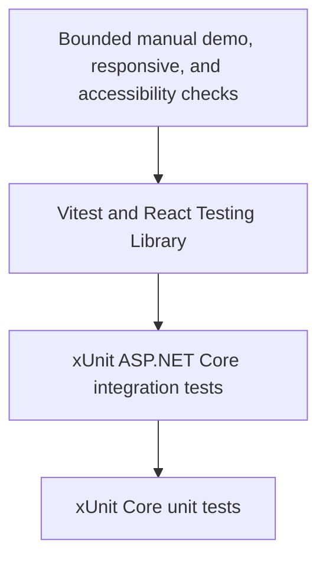

# Testing Strategy

- **Status**: Current
- **Last reviewed**: 2026-07-23
- **Scope**: Automated and bounded manual verification for the local MVP

## Purpose

The test strategy demonstrates that authorization and workflow safety come from
deterministic code and persisted evidence, not from the browser, model, or MCP tool
metadata.

The suites run without:

- a live LLM;
- external client or incident systems;
- a real identity provider;
- a real access provider;
- containers; or
- a persistent shared test database.

Negative scenarios are first-class tests because most important product guarantees
describe actions the system must reject.

## Test layers



The diagram represents breadth, not desired test count. Most security and workflow
evidence belongs in fast Core tests or realistic host integration tests.

| Layer | Main responsibility | Real components | Replaced or controlled components |
|---|---|---|---|
| Core unit | Domain policies, validation, immutable scope, evidence rules, fixed expiry | Core domain and application objects | Ports use small fakes where required |
| Host integration | HTTP security, persistence, MCP transport, workflow coordination, provisioning, queries, observability | ASP.NET Core pipeline, controllers, Core services, EF Core mappings, SQLite, MCP server/client | In-memory SQLite, deterministic clock/chat, controllable provisioner |
| React component | Session bootstrap, typed client wiring, route/action presentation, accessible labels | React components, router, client contracts | Network calls are mocked |
| Manual | Published bundle, keyboard use, zoom, narrow layout, understandable workflow | Running single host and browser | Synthetic identities, data, chat, and provider |

## Unit-test scope

`tests/GovernedAccess.UnitTests` references only `GovernedAccess.Core`.

Representative coverage:

- `RequestValidationTests`: client/environment relationship, allowed role,
  justification, and incident rules;
- `RequestSubmissionServiceTests`: authenticated requester binding, normalized
  immutable scope, and typed submission outcomes;
- `BusinessDecisionPolicyTests`: state, exact-role binding, rejection, and duplicate
  business decisions;
- `DevOpsDecisionPolicyTests`: prior approval, exact role, fixed scope, rejection, and
  operation creation;
- `WorkflowEvidencePolicyTests`: request, approval, operation, and grant consistency;
  and
- `AccessGrantTests`: activation, fixed eight-hour expiry, and scope construction.

Use a unit test when the behavior can be proved without ASP.NET Core, EF Core, MCP, or
serialization. Domain rules should not require a host fixture.

## Integration-test architecture

`GovernedAccessWebFactory` hosts the real `Program` composition with:

- ASP.NET Core authentication, authorization, antiforgery, routing, and middleware;
- MVC controllers and Problem Details;
- Core application services;
- EF Core against an open in-memory SQLite connection;
- the real MCP Streamable HTTP endpoint and client path;
- a deterministic clock;
- replaceable deterministic chat modes; and
- a controllable synthetic access provider.

Each test can reset its database to known seed state. Tests never depend on execution
order or the developer's `governed-access.db`.

### Integration coverage

| Area | Evidence |
|---|---|
| Hosting | Service composition, route mapping, static/SPAs fallbacks, and exact endpoint separation |
| Authentication | Four fixed identities, server-issued claims, anonymous behavior, and session changes |
| Antiforgery | Every unsafe API endpoint rejects missing tokens without protected side effects |
| Request preparation | Valid, incomplete, malformed, unsupported, unavailable, timeout, and cancellation outcomes |
| Submission | Current-data revalidation, identity over-posting resistance, immutable request creation, and no premature approval/grant |
| MCP | Exact three-tool advertisement, closed schemas, stable identifiers, forbidden capability absence, typed failures, and cancellation |
| Business decisions | Configured approver, wrong-client rejection, duplicate/invalid transitions, audit evidence, and restricted payloads |
| DevOps decisions | Actor authorization, exact role, no caller duration, fixed expiry, rejection, and safe provisioning failure |
| Protected provisioning | Persisted evidence reload, missing/mismatched evidence rejection, operation scope, and grant finalization |
| Retry and idempotency | Failed-state restriction, lost response, existing-grant recovery, and 100 concurrent attempts producing one grant |
| Queries | Participant-filtered list/detail, nonparticipant nonvisibility, available actions, audit order, and logical expiry |
| Persistence | Keys, uniqueness, concurrency token, relationships, UTC conversion, and exact synthetic seeding |
| Observability | Correlation creation, propagation, response header, and safe Problem Details metadata |

Integration tests should assert both the response and persisted side effects. A
rejected action is not safe merely because it returned an error; tests also verify
that requests, decisions, operations, grants, and audit evidence changed only as
intended.

## Deterministic dependency testing

### Chat client

`DeterministicChatClient` supports:

- `Valid`;
- `Incomplete`;
- `Malformed`;
- `Unsupported`;
- `Timeout`;
- `Cancellation`; and
- `Unavailable`.

The production-shaped local host registers `Valid`. Tests replace the `IChatClient`
to exercise other outcomes through the real draft interpreter. This validates strict
schema parsing, identifier revalidation, timeout distinction, and safe failure
translation without network or model nondeterminism.

### MCP

MCP contract tests initialize and call the real server transport. Focused failure
tests replace `IRequestContextReader` to produce not-found, invalid-input, timeout,
cancellation, and unavailable outcomes.

Do not replace MCP with direct in-process functions in tests intended to prove the
model-facing protocol contract.

### Provisioner

`SyntheticAccessProvisionerControl` configures calls that start after the change:

- success;
- typed failure;
- grant creation followed by lost response;
- timeout; and
- optional delay.

Provider state is deliberately separate from EF workflow state. That allows tests to
reproduce the real partial-failure shape in which a grant exists but local workflow
has not observed success.

### Time

Integration tests replace `IClock`. Assertions for decision ordering, operation
attempts, grant activation/expiry, audit order, and logical expiry do not depend on
wall-clock timing.

## Frontend tests

The React suite uses Vitest, jsdom, and React Testing Library.

- `AppSession.test.tsx` covers session loading, sign-in requirements, all fixed
  identities, requester navigation, identity switching, and sign-out.
- `UiWiringSmoke.test.tsx` covers typed request data, human-readable workflow state,
  restricted action payloads, safe grant presentation, and accessible action names.

The frontend suite intentionally avoids:

- CSS snapshots;
- exhaustive visual regression;
- duplicating server authorization rules;
- asserting internal component implementation details; and
- treating hidden UI actions as a security guarantee.

## Manual verification

Automated tests do not fully establish presentation quality. Before a portfolio
demonstration or release:

1. run the ASP.NET-hosted production bundle;
2. traverse all routes with keyboard only;
3. test signed-out and each applicable identity;
4. inspect loading, empty, validation, rejection, provisioning, active, and expired
   presentation states;
5. repeat at 360px width or 200% browser zoom; and
6. confirm long identifiers and timestamps remain complete and readable.

The detailed checklist is in the
[quickstart validation guide](../specs/001-governed-production-access/quickstart.md).

## Commands

### Restore and build

```powershell
dotnet restore ProductionAccessRequestAssistant.sln
npm ci --prefix src/GovernedAccess.Web/ClientApp
npm run build --prefix src/GovernedAccess.Web/ClientApp
dotnet build ProductionAccessRequestAssistant.sln --no-restore
```

### Complete automated suite

```powershell
npm test --prefix src/GovernedAccess.Web/ClientApp -- --run
dotnet test ProductionAccessRequestAssistant.sln --no-build
```

Run build first when using `--no-build`.

### Individual .NET layers

```powershell
dotnet test tests/GovernedAccess.UnitTests/GovernedAccess.UnitTests.csproj --no-build
dotnet test tests/GovernedAccess.IntegrationTests/GovernedAccess.IntegrationTests.csproj --no-build
```

### Focused integration area

```powershell
dotnet test tests/GovernedAccess.IntegrationTests/GovernedAccess.IntegrationTests.csproj --no-build --filter "FullyQualifiedName~Provisioning"
dotnet test tests/GovernedAccess.IntegrationTests/GovernedAccess.IntegrationTests.csproj --no-build --filter "FullyQualifiedName~Mcp"
dotnet test tests/GovernedAccess.IntegrationTests/GovernedAccess.IntegrationTests.csproj --no-build --filter "FullyQualifiedName~Security"
```

### Frontend watch mode

```powershell
npm test --prefix src/GovernedAccess.Web/ClientApp
```

### Frontend one-shot mode

```powershell
npm run test:run --prefix src/GovernedAccess.Web/ClientApp
```

## Current test baseline

At the last documentation review, the repository passed:

- 42 .NET unit tests;
- 126 .NET integration tests; and
- 5 frontend tests in 2 files.

These counts are a useful snapshot, not an acceptance criterion. A change may
legitimately alter the count, but the required rule and negative-scenario coverage
must remain.

## Recommended validation order

For normal development:

1. run the focused unit or integration test area while editing;
2. run the frontend suite when UI contracts or presentation change;
3. build the full solution with warnings treated as errors;
4. run all .NET and frontend tests; and
5. perform the bounded manual check for UI or workflow changes.

For a documentation-only change, validate Markdown links and run `git diff --check`.
Run code suites when the documentation exposes a suspected code/contract mismatch or
changes executable examples.

## Adding or changing tests

When introducing behavior:

- place deterministic policy tests in the Core unit project;
- use integration tests for ASP.NET, EF Core, serialization, MCP, authentication,
  antiforgery, or cross-service coordination;
- assert unauthorized and invalid-state behavior alongside success;
- assert persisted state and audit evidence, not only HTTP status;
- preserve caller cancellation in fakes;
- avoid `Task.Delay` for ordering when a deterministic clock or synchronization point
  can express the behavior;
- do not call a live model or real provider;
- keep test identities and reference records synthetic; and
- add concurrency tests when uniqueness or idempotency changes.

## What is not covered

The current strategy does not include:

- live-model quality or safety evaluation;
- real identity-provider integration;
- real provider contract or credential testing;
- browser end-to-end automation;
- exhaustive accessibility certification;
- penetration testing;
- dependency or container scanning;
- enterprise-scale load testing;
- deployment smoke tests; or
- disaster-recovery testing.

These are proportional omissions for the local MVP. They become requirements if the
corresponding integration or deployment becomes real.

## Related documentation

- [Local development guide](local-development.md)
- [As-built architecture](architecture.md)
- [Security and trust model](security-model.md)
- [Quickstart validation guide](../specs/001-governed-production-access/quickstart.md)
- [Completed task list](../specs/001-governed-production-access/tasks.md)
