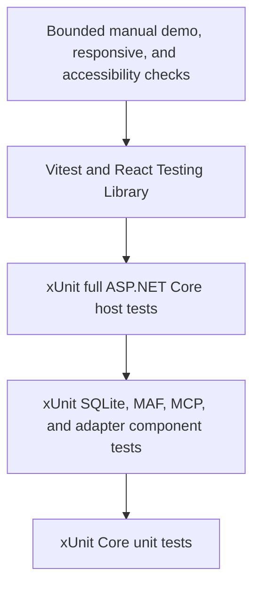

# Testing Strategy

- **Status**: Current
- **Last reviewed**: 2026-08-07
- **Scope**: Automated and bounded manual verification for the local MVP

## Purpose

The test strategy demonstrates that authorization and workflow safety come from
deterministic code and persisted evidence, not from the browser, model, or MCP tool
metadata.

The suites run without:

- a live LLM;
- external client or incident systems;
- a real identity provider;
- a real access provider;
- containers; or
- a persistent shared test database.

Negative scenarios are first-class tests because most important product guarantees
describe actions the system must reject.

Automated acceptance for the Teams intake is intentionally model-independent. It
uses the production MAF/session and MCP boundaries with deterministic chat clients
and fake authenticated activities. No automated test may require a Foundry endpoint,
deployment, Azure credential, quota, provider network call, or Teams tenant.

Live Foundry Responses exercises are separate deliberate manual gates. The canonical
[live-model evaluation quickstart](../specs/006-live-model-evaluation/quickstart.md)
runs the fixed 20-case outcome baseline after the credential-free suite. Historical
provider and Teams walkthroughs remain useful for transport and presentation, but no
live gate replaces repeatable deterministic tests, runs in CI, or may confirm or
submit a request.

## Test layers


```mermaid
flowchart TB
    Manual[Bounded manual demo, responsive, and accessibility checks]
    UI[Vitest and React Testing Library]
    FullHost[xUnit full ASP.NET Core host tests]
    Component[xUnit SQLite, MAF, MCP, and adapter component tests]
    Unit[xUnit Core unit tests]

    Manual --> UI
    UI --> FullHost
    FullHost --> Component
    Component --> Unit
```

The diagram represents breadth, not desired test count. Most security and workflow
evidence belongs in fast Core tests or realistic component tests. A complete host is
reserved for behavior that depends on authentication, middleware, routing,
serialization, SDK ingress, or Web-boundary logging.

| Layer | Main responsibility | Real components | Replaced or controlled components |
|---|---|---|---|
| Core unit | Domain policies, validation, immutable scope, evidence rules, fixed expiry | Core domain and application objects | Ports use small fakes where required |
| Component | EF constraints, application coordination, MAF sessions, MCP transport, provisioning evidence, and query policy | Core services plus the minimum real adapter (SQLite, MAF, or MCP) | Deterministic clock/chat/provisioner |
| Full host | Authentication, antiforgery, route availability, Activity Protocol/card translation, HTTP contracts, and Web-boundary logging | Complete ASP.NET Core `Program` composition | In-memory SQLite, deterministic clock/chat, controllable provisioner |
| React component | Session bootstrap, typed client wiring, route/action presentation, accessible labels | React components, router, client contracts | Network calls are mocked |
| Manual | Published bundle, keyboard use, zoom, narrow layout, understandable workflow | Running single host and browser | Synthetic identities, data, chat, and provider |

## Unit-test scope

`tests/GovernedAccess.UnitTests` references only `GovernedAccess.Core`.

Representative coverage:

- `RequestValidationTests`: client/environment relationship, allowed role,
  justification, and incident rules;
- `RequestDraftAndSubmissionServiceTests`: authenticated ownership, deterministic readiness,
  structured environment-option validation and authoritative reload, ready-draft
  discussion identity preservation, changed-candidate replacement, candidate
  preservation, reserved identity, confirmation revalidation, exact immutable scope,
  and one-save staging outcomes;
- `RequestPreparationTests`: clarification target and bounded unique option-list
  invariants independent of provider or transport contracts;
- `BusinessDecisionPolicyTests`: state, exact-role binding, rejection, and duplicate
  business decisions;
- `DevOpsDecisionPolicyTests`: prior approval, exact role, fixed scope, rejection, and
  operation creation;
- `WorkflowEvidencePolicyTests`: request, approval, operation, and grant consistency;
  and
- `AccessGrantTests`: activation, fixed eight-hour expiry, and scope construction.

Use a unit test when the behavior can be proved without ASP.NET Core, EF Core, MCP, or
serialization. Domain rules should not require a host fixture.

## Component and full-host architecture

Tests that create `GovernedAccessWebFactory` and start the real `Program` composition
are full-host tests. They exercise:

- ASP.NET Core authentication, authorization, antiforgery, routing, and middleware;
- MVC controllers and Problem Details;
- Core application services;
- EF Core against an open in-memory SQLite connection;
- the real MCP Streamable HTTP endpoint and client path;
- a deterministic clock;
- replaceable deterministic chat modes; and
- a controllable synthetic access provider.

Each test can reset its database to known seed state. Tests never depend on execution
order or the developer's `governed-access.db`.

Keep the full-host layer deliberately small:

- exercise a real boundary: hosted HTTP/authentication, SQLite persistence, MCP
  transport, provider coordination, or SDK translation;
- use one cohesive scenario to assert its response, persisted state, and audit
  evidence instead of repeating the same workflow at service and HTTP levels;
- keep variant matrices inside one test when setup and expected behavior are the
  same;
- do not integration-test deterministic test fakes, factory helpers, pure mapping
  methods, or middleware by direct construction; and
- retain separate tests only when they prove a distinct security boundary,
  transaction boundary, concurrency rule, or external contract.

The remaining tests in `GovernedAccess.IntegrationTests` are component tests. They
may use Web-owned EF, MAF, MCP, or SDK adapter types directly, but they do not start
the complete application. This project name is historical and does not define the
test level.

### Coverage placement

| Area | Evidence |
|---|---|
| Hosting | Service composition, route mapping, static/SPAs fallbacks, and exact endpoint separation |
| Authentication | Four fixed identities, server-issued claims, anonymous behavior, and session changes |
| Antiforgery | Every unsafe API endpoint rejects missing tokens without protected side effects |
| Teams preparation | Full host: authenticated personal activity, authoritative clarification rendering, ready-draft discussion and revision, hidden pre-submission request identity, reset, safe provider failure, confirmation boundary, and one governed journey. Component/unit: strict proposal parsing, structured choice validation, single-pass candidate validation, unchanged-draft identity preservation, changed-candidate replacement, sanitized rejection persistence, model-history isolation/restart behavior, and failure outcomes |
| Teams-only creation | Teams confirmation creates one immutable request/audit event; former browser draft/submit calls create no state; no creation route, navigation, form, DTO, or capability |
| Confirmation | Ownership/expiry/status checks, current-data revalidation, reserved request identity, exact scope, replay, one shared save, and no premature approval/grant |
| MCP | Exact two-tool advertisement, `{}` discovery and exact environment lookup, embedded ordered roles, exact-only incident lookup, closed schemas, fail-closed overflow, typed failures, cancellation, forbidden capability absence, and exact-`NotFound`-only fallback gating |
| Business decisions | Unit/component: approver, duplicate/invalid transitions, and audit state. Full host: authenticated overposting/response contract |
| DevOps decisions | Unit/component: authorization, exact role, fixed scope, rejection, and provisioning state. Full host: authenticated overposting/failure response contract |
| Protected provisioning | Persisted evidence reload, missing/mismatched evidence rejection, operation scope, and grant finalization |
| Retry and idempotency | Component: failed-state restriction, lost response, scope mismatch, and existing-grant recovery. Full host: representative actor rejection |
| Explicit concurrency | 100 concurrent retry attempts producing one operation and one grant; intentionally outside the routine integration suite |
| Queries | Component: participant-filtered list/detail, nonparticipant nonvisibility, available actions, audit order, and logical expiry. Full host: representative response serialization and authentication |
| Persistence | Keys, uniqueness, concurrency token, relationships, UTC conversion, and exact synthetic seeding |
| Observability | Correlation creation, propagation, response header, and safe Problem Details metadata |
| Live-model evaluator | Closed 20-case dataset, exact single-scenario selection, final application-outcome grading, non-gating scenario latency, full-run 20-of-20 and focused-run 1-of-1 aggregation, isolated command composition, cancellation/timeouts, cleanup, and zero workflow side effects |

Integration tests should assert both the response and persisted side effects. A
rejected action is not safe merely because it returned an error; tests also verify
that requests, decisions, operations, grants, and audit evidence changed only as
intended.

`TeamsDraftCardTrackerTests` pins exact actor/conversation binding, and stale invoke
coverage proves a superseded preparation returns a non-actionable card without creating
a request. Feature task T096 remains open for direct capture of the outbound
`UpdateActivityAsync` call that changes the previously sent activity to **Draft being
revised**; documentation does not treat that presentation update as authorization
evidence.

`TeamsOnlyRequestCreationTests` plus `ApiSecurityTests` pin the server boundary.
`AppSession.test.tsx` and `UiWiringSmoke.test.tsx` pin the removed creation navigation,
route behavior, form/submission absence, empty requester creation capabilities, and
retained list/detail/business/DevOps controls.

### Teams intake acceptance evidence

| Concern | Primary automated evidence | Required negative assertion |
|---|---|---|
| Native session lifecycle | [`MafConversationSessionStoreTests`](../tests/GovernedAccess.IntegrationTests/Ai/MafConversationSessionStoreTests.cs) | Fresh-store restart simulation preserves the supplied durable candidate, isolates intake histories, serializes same-intake turns, permits different-intake progress, and excludes failed turns from the last saved session. |
| Model failure boundary | [`MafRequestPreparationFailureTests`](../tests/GovernedAccess.IntegrationTests/Ai/MafRequestPreparationFailureTests.cs) | Malformed schema, caller cancellation, and provider unavailability fail closed without replacing the last good session. |
| MCP contract and capability boundary | [`McpContractTests`](../tests/GovernedAccess.IntegrationTests/Mcp/McpContractTests.cs), [`McpFailureTests`](../tests/GovernedAccess.IntegrationTests/Mcp/McpFailureTests.cs), and [`MafToolBoundaryTests`](../tests/GovernedAccess.IntegrationTests/Mcp/MafToolBoundaryTests.cs) | Missing/additional tools, unavailable calls, cancellation, catalog overflow, or a non-`NotFound` exact failure cannot expose another capability or trigger discovery fallback. |
| Structured environment choices | [`RequestPreparationTests`](../tests/GovernedAccess.UnitTests/RequestPreparationTests.cs) and [`RequestDraftAndSubmissionServiceTests`](../tests/GovernedAccess.UnitTests/RequestDraftAndSubmissionServiceTests.cs) | Duplicate, excessive, target-incompatible, or unknown option IDs are rejected; unrelated valid candidate fields survive; choices never enter durable candidate scope. |
| Authoritative clarification rendering | [`TeamsRequestPreparationTests`](../tests/GovernedAccess.IntegrationTests/Teams/TeamsRequestPreparationTests.cs) | Model wording is shown only after its option set validates, authoritative names and IDs are appended, prose-only values are not selectable, and no workflow state is created. |
| Teams-only creation | [`TeamsOnlyRequestCreationTests`](../tests/GovernedAccess.IntegrationTests/Requests/TeamsOnlyRequestCreationTests.cs), [`AppSession.test.tsx`](../src/GovernedAccess.Web/ClientApp/src/test/AppSession.test.tsx), and [`UiWiringSmoke.test.tsx`](../src/GovernedAccess.Web/ClientApp/src/test/UiWiringSmoke.test.tsx) | Former browser endpoints create no request/audit state, and the UI exposes no creation route, navigation, form, DTO call, or capability. |
| Existing governed workflow | [`TeamsGovernedWorkflowTests`](../tests/GovernedAccess.IntegrationTests/Teams/TeamsGovernedWorkflowTests.cs) | A Teams-created request cannot bypass client isolation, either human decision, exact scope, persisted evidence, or the fixed grant lifetime. |

## Deterministic dependency testing

### Chat client

`DeterministicChatClient` supports:

- `Candidate`;
- `Clarification`;
- `InvalidCandidate`;
- `UnknownIncidentCandidate`;
- `CrossClientEnvironmentCandidate`;
- `CrossClientIncidentCandidate`;
- `FalseCompleteCandidate`;
- `Malformed`;
- `Timeout`;
- `Cancellation`;
- `Unavailable`; and
- `PromptInjection`.

The production-shaped local host registers `Candidate`, whose response matches the
current Teams proposal schema. Tests replace the `IChatClient` to exercise other
outcomes through the real MAF interpreter. Multi-turn tests use a scripted client
that queues exact schema-valid or malformed provider responses and records every
request and option. Assertions inspect the current-candidate envelope, restored
assistant messages, tool options, and cancellation. The fake does
not parse requester phrases or decide what a relative reply means; natural-language
interpretation quality belongs to the deliberate live-model exercise.

Scripted tool-boundary tests may invoke the environment function directly to prove
application-controlled sequencing. They establish that typed exact `NotFound`
permits discovery and every other typed outcome blocks it; they do not claim that a
real model will classify readable text or potential identifiers correctly.

Focused native-store component tests use a real `InMemoryAgentSessionStore` and
`MafConversationTurnCoordinator` to verify:

- same-intake session reuse restores prior user and assistant messages;
- a fresh store models process restart and sends no prior transcript;
- separate intake IDs never share model history;
- the exact per-intake gate serializes load/run/save for one intake while another
  intake can progress concurrently; and
- malformed or unavailable work cannot replace the last successfully saved session,
  while cancellation is propagated before a save can complete.

The current process-lifetime store has no application-owned eviction, terminal
cleanup, or compaction. Persistence assertions prove that only the complete typed
candidate and lifecycle survive: no option list, transcript, raw prompt, model body,
or serialized MAF session is stored. Restart-loss tests retain that durable candidate
in the next application-owned turn envelope while proving the prior transcript is
absent.

The coordinator's per-intake gate dictionary also has no eviction. One gate remains
for every distinct intake ID until process shutdown, so memory grows monotonically in
a long-running process. The current suite verifies serialization and isolation but
does not claim bounded gate retention.

### MCP

MCP contract tests initialize and call the real server transport. Focused failure
tests replace `IRequestContextReader` to produce not-found, invalid-input, timeout,
cancellation, unavailable, and catalog-overflow outcomes. Contract assertions own the
exact two-tool catalog, bounded discovery, common exact/discovery environment shape,
embedded ordered roles, and unchanged exact incident lookup. MAF boundary tests own
catalog rejection, cancellation propagation, unavailability, and deterministic
fallback gating. The same behavior is not repeated through FullHost Teams fixtures.

Do not replace MCP with direct in-process functions in tests intended to prove the
model-facing protocol contract.

### Provisioner

`SyntheticAccessProvisionerControl` configures calls that start after the change:

- success;
- typed failure;
- grant creation followed by lost response;
- timeout; and
- optional delay.

Provider state is deliberately separate from EF workflow state. That allows tests to
reproduce the real partial-failure shape in which a grant exists but local workflow
has not observed success.

### Time

Integration tests replace `IClock`. Assertions for decision ordering, operation
attempts, grant activation/expiry, audit order, and logical expiry do not depend on
wall-clock timing.

## Frontend tests

The React suite uses Vitest, jsdom, and React Testing Library.

- `AppSession.test.tsx` covers session loading, sign-in requirements, all fixed
  identities, requester navigation, identity switching, and sign-out.
- `UiWiringSmoke.test.tsx` covers typed request data, human-readable workflow state,
  restricted action payloads, safe grant presentation, and accessible action names.

The frontend suite intentionally avoids:

- CSS snapshots;
- exhaustive visual regression;
- duplicating server authorization rules;
- asserting internal component implementation details; and
- treating hidden UI actions as a security guarantee.

## No-live-model acceptance workflow

The repeatable acceptance path is fully local and credential-free:

1. Restore dependencies and build the solution with warnings treated as errors.
2. Run Core unit tests for deterministic intake, authorization, immutable-scope, and
   workflow rules.
3. Run the retained full-host slice. Fake SDK-authenticated activities exercise
   Activity Protocol routing, card/response serialization, Teams-only creation,
   authentication, middleware, logging, and one complete governed workflow.
4. Run the non-full-host component slice. This executes real SQLite, native MAF
   sessions, the exact per-intake coordinator, strict proposal translation, and the
   lightweight real MCP transport while every chat response remains deterministic.
5. Run Vitest to prove browser creation remains absent while the register,
   approval, retry, and audit presentation remains wired.
6. Reconcile environment-resolution evidence with the
   [feature-004 quickstart](../specs/004-resolve-context-identifiers/quickstart.md) and
   the unchanged approval/provisioning evidence with the historical Teams intake
   quickstart.

No step calls a live LLM, Teams tenant, Azure Bot, corporate identity provider,
production environment, or real provisioner. Fixed-mode and scripted chat clients
are injected behind the same `IChatClient` boundary used by the live provider. The
manual real-model exercise supplies quality, latency, cost, and provider-safety
evidence without turning natural-language behavior into a hand-written test oracle.

### Separate live-provider gate

Run the live gate only after the complete credential-free suite passes and only from
an explicitly configured `FoundryResponses` host. It is operator-invoked, may consume
provider quota, and requires a developer identity authorized through Microsoft
Entra. Record only redacted outcomes and safe metadata, then clear process-local
profile settings and complete the documented Teams/tunnel cleanup. CI and routine
developer validation must never invoke this gate automatically.

The optional Playground or real personal-chat walkthrough validates transport,
tenant authentication, packaging, and presentation. It cannot replace the automated
negative assertions because it is neither exhaustive nor deterministic.

### Bounded live-model outcome evaluation

The evaluator has exactly two owning integration fixtures, and both are
credential-free:

- `EvaluationEngineTests` validates strict dataset loading, the exact 20-case
  inventory and category distribution, declared-final-fact grading, category and
  20-of-20 aggregation, zero-tolerance side effects, informational latency, and
  the required multi-turn preservation/clearing declaration. It also verifies that a
  failed artifact explains the sanitized observed application state without changing
  grading inputs.
- `EvaluationCommandTests` validates argument and exit-code behavior, fail-closed
  live-profile prerequisites, exact single-scenario selection, evaluation-only route
  composition, deterministic execution through the real intake and loopback MCP
  boundaries, cancellation, turn timeout, disposable SQLite cleanup, and zero
  workflow side effects.

The fixtures inject deterministic chat responses and never resolve a live Foundry
client, Azure credential, or provider network dependency. Existing MCP and MAF suites
remain authoritative for tool schemas, fallback sequencing, malformed model output,
transport failures, and internal cancellation; evaluator tests do not duplicate
those contracts.

The optional live command is black-box outcome evidence. It runs the configured model
and MCP tools normally but grades only the final normalized application result and
the final facts declared by each scenario. It does not inspect calls, proposals,
iterations, prompts, transcripts, raw payloads, or token usage. Total wall-clock
milliseconds are recorded per scenario but do not affect correctness. Passing
requires all 20 scenarios for a full run or 1 of 1 for a focused run, plus
zero requests, approval decisions, provisioning operations, or grants.

Run it only after the complete credential-free gate and follow the
[live-model evaluation quickstart](../specs/006-live-model-evaluation/quickstart.md)
for configuration, execution, sanitized artifact review, and cleanup. A live result
cannot replace deterministic schema, authorization, immutable-scope, side-effect, or
failure-path assertions.

## Manual verification

Automated tests do not fully establish presentation quality. Before a portfolio
demonstration or release:

1. run the ASP.NET-hosted production bundle;
2. traverse all routes with keyboard only;
3. test signed-out and each applicable identity;
4. inspect loading, empty, validation, rejection, provisioning, active, and expired
   presentation states;
5. repeat at 360px width or 200% browser zoom; and
6. confirm long identifiers and timestamps remain complete and readable.

The Teams-specific automated scenarios and optional real-chat walkthrough are in the
[Teams intake quickstart](../specs/002-teams-access-intake/quickstart.md). The original
[governed workflow quickstart](../specs/001-governed-production-access/quickstart.md)
remains useful for detailed browser approval and provisioning presentation checks.

## Commands

### Restore and build

```powershell
dotnet restore ProductionAccessRequestAssistant.sln
npm ci --prefix src/GovernedAccess.Web/ClientApp
npm run build --prefix src/GovernedAccess.Web/ClientApp
dotnet build ProductionAccessRequestAssistant.sln --no-restore --warnaserror
```

### Required backend gate sequence

```powershell
dotnet build ProductionAccessRequestAssistant.sln --no-restore --warnaserror
dotnet test tests/GovernedAccess.UnitTests/GovernedAccess.UnitTests.csproj --no-build --no-restore
dotnet test tests/GovernedAccess.IntegrationTests/GovernedAccess.IntegrationTests.csproj --no-build --no-restore --blame-hang-timeout 3m
```

Run these commands sequentially in exactly this order. The integration command runs
component and FullHost fixtures in one test runner; give it an outer shell or tool
timeout of at least four minutes. If it times out, identify and stop only the test
runner process tree created by that command before starting another run.

Run the frontend suite separately:

```powershell
npm test --prefix src/GovernedAccess.Web/ClientApp -- --run
```

### Fast unit layer

Use this command for the fastest development feedback. Complete validation uses the
unfiltered integration command above.

```powershell
dotnet test tests/GovernedAccess.UnitTests/GovernedAccess.UnitTests.csproj --no-build --no-restore
```

Use a `FullyQualifiedName` filter from the focused-integration examples below when a
specific component or hosted area is enough during development.

### Full-host layer

Full-host tests run inside the same integration project and runner as component tests.
When diagnosing or changing a particular hosted boundary, target its class or namespace
by fully qualified name:

```powershell
dotnet test tests/GovernedAccess.IntegrationTests/GovernedAccess.IntegrationTests.csproj --no-build --no-restore --filter "FullyQualifiedName~TeamsGovernedWorkflowTests" --blame-hang-timeout 3m
```

A new test must choose `unit`, `component`, or `full-host` deliberately and use the
lowest level that faithfully proves the behavior.

### Complete .NET suite

```powershell
dotnet build ProductionAccessRequestAssistant.sln --no-restore --warnaserror
dotnet test tests/GovernedAccess.UnitTests/GovernedAccess.UnitTests.csproj --no-build --no-restore
dotnet test tests/GovernedAccess.IntegrationTests/GovernedAccess.IntegrationTests.csproj --no-build --no-restore --blame-hang-timeout 3m
```

Run the three gates sequentially. The unfiltered integration command executes all
component and FullHost fixtures in one runner.

### Explicit concurrency suite

The high-contention suite is not included in `ProductionAccessRequestAssistant.sln`
and therefore does not run as part of routine unit and integration validation:

```powershell
dotnet test tests/GovernedAccess.ConcurrencyTests/GovernedAccess.ConcurrencyTests.csproj
```

### Focused integration area

```powershell
dotnet test tests/GovernedAccess.IntegrationTests/GovernedAccess.IntegrationTests.csproj --no-build --no-restore --filter "FullyQualifiedName~Provisioning" --blame-hang-timeout 3m
dotnet test tests/GovernedAccess.IntegrationTests/GovernedAccess.IntegrationTests.csproj --no-build --no-restore --filter "FullyQualifiedName~Mcp" --blame-hang-timeout 3m
dotnet test tests/GovernedAccess.IntegrationTests/GovernedAccess.IntegrationTests.csproj --no-build --no-restore --filter "FullyQualifiedName~Security" --blame-hang-timeout 3m
```

### Frontend watch mode

```powershell
npm test --prefix src/GovernedAccess.Web/ClientApp
```

### Frontend one-shot mode

```powershell
npm run test:run --prefix src/GovernedAccess.Web/ClientApp
```

## Consolidated test inventory

Feature 004 updates owning tests instead of creating repeated semantic and resilience
matrices at persistence, MCP, MAF, and FullHost layers. The current backend runner
reports:

- 99 unit cases;
- 71 non-FullHost integration-project cases; and
- 23 FullHost cases.

The frontend retains 6 component cases in 2 files. The explicit high-contention
provisioning case remains outside the solution and routine validation.

Counts are diagnostic, not acceptance criteria. The important consolidation rules
are that session/history behavior lives in one MAF session suite, typed MCP contracts
and sequencing live at the MCP/MAF boundary, structured choice invariants and reload
live in Core, and only transport-owned clarification rendering is repeated through
the authenticated Teams host. Scripted chat clients are not semantic-resolution
evidence.

## Recommended validation order

For normal development:

1. run the focused unit or integration test area while editing;
2. run the frontend suite when UI contracts or presentation change;
3. run the required backend gates in order: warnings-as-errors build, unit tests,
   then the complete integration project in one runner;
4. reconcile environment-resolution changes with the feature-004 quickstart and
   unchanged workflow behavior with the Teams intake scenarios; and
5. perform the bounded manual check for UI or workflow changes.

For a documentation-only change, validate Markdown links and run `git diff --check`.
Run code suites when the documentation exposes a suspected code/contract mismatch or
changes executable examples.

## Adding or changing tests

When introducing behavior:

- place deterministic policy tests in the Core unit project;
- use integration tests for ASP.NET, EF Core, serialization, MCP, authentication,
  antiforgery, or cross-service coordination;
- assert unauthorized and invalid-state behavior alongside success;
- assert persisted state and audit evidence, not only HTTP status;
- preserve caller cancellation in fakes;
- avoid `Task.Delay` for ordering when a deterministic clock or synchronization point
  can express the behavior;
- do not call a live model or real provider;
- keep test identities and reference records synthetic; and
- add concurrency tests when uniqueness or idempotency changes.

## What is not covered

The automated strategy does not include:

- live-model quality or safety evaluation in CI; the optional fixed 20-case outcome
  run is sanitized manual evidence only;
- real identity-provider integration;
- real provider contract or credential testing;
- browser end-to-end automation;
- exhaustive accessibility certification;
- penetration testing;
- dependency or container scanning;
- enterprise-scale load testing;
- deployment smoke tests; or
- disaster-recovery testing.

These are proportional omissions for the local MVP. They become requirements if the
corresponding integration or deployment becomes real.

## Related documentation

- [Local development guide](local-development.md)
- [As-built architecture](architecture.md)
- [Security and trust model](security-model.md)
- [Teams intake quickstart](../specs/002-teams-access-intake/quickstart.md)
- [Teams intake test-simplification report](../specs/002-teams-access-intake/test-simplification.md)
- [Teams intake validation](../specs/002-teams-access-intake/validation.md)
- [Teams intake task list](../specs/002-teams-access-intake/tasks.md)
- [Environment-resolution quickstart](../specs/004-resolve-context-identifiers/quickstart.md)
- [Environment-resolution task list](../specs/004-resolve-context-identifiers/tasks.md)
- [Environment-resolution turn contract](../specs/004-resolve-context-identifiers/contracts/environment-resolution-turn-contract.md)
- [Live-model evaluation quickstart](../specs/006-live-model-evaluation/quickstart.md)
- [Governed workflow quickstart](../specs/001-governed-production-access/quickstart.md)
