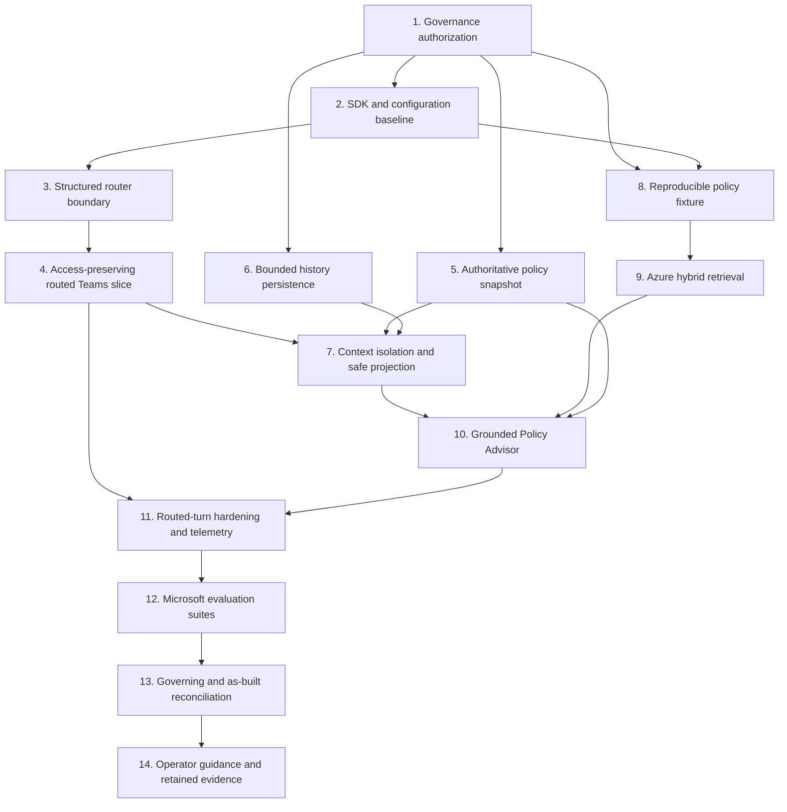

# Implementation Plan: Router-Led Policy Guidance Evolution

- **Status:** Proposed for maintainer review; no implementation has started
- **Source:** `SPEC-router-policy-evolution.md` (proposed target, 2026-09-04)
- **Task list:** `tasks/todo.md`
- **Estimated implementation effort:** approximately 33.5 hours, within the specification's 24-34 hour budget

## Overview

Evolve ordinary nonblank Teams text turns into one bounded model-router call followed
by deterministic dispatch to either the unchanged Access Request specialist or one
read-only Policy Advisor. Keep `/new`, Adaptive Card confirmation, approvals,
provisioning, the exact four-tool MCP catalog, and the single-host architecture outside
the router. Add only the bounded routed-message history, policy snapshot, Azure AI
Search hybrid retrieval, route-specific telemetry, and Microsoft evaluation evidence
needed by the target specification.

The implementation is staged so the access path remains usable and reviewable after
the router slice, before Azure retrieval and policy answer generation are introduced.
No React work, new deployable service, additional MCP tool, generic workflow, generic
ingestion platform, or general-purpose memory framework is planned.

## Authority and Repository Evidence

The plan follows the authority order in `spec.md`: constitution, current product
baseline, as-built architecture/security documents, accepted ADRs, source, and tests.
The feature specification is a target artifact and does not yet override current
governance or as-built documentation.

Key evidence shaping the plan:

- `docs/constitution.md` Principle V, the current product baseline's scope limits, and
  `docs/architecture.md` currently exclude multi-agent design, large retrieval, and
  durable conversation history without an approved amendment and architecture/security
  review. Task 1 is therefore a hard governance gate.
- ADR 0009 deliberately persists canonical preparation plus one clarification context
  and rejects full conversation history. The proposed 12-message route-tagged store is
  narrower and non-authoritative, but it still changes that accepted decision and must
  be explicitly superseded or refined.
- `TeamsRequestHandler` is the deterministic boundary for blank input, exact `/new`,
  and confirmation. `RequestPreparationOrchestrator` already isolates the existing
  Access Request specialist and passes only canonical preparation context.
- `GovernedAccess.Core` has no MAF, Teams, EF Core, or provider dependency. Workflow
  Persistence owns the current preparation store and exact-schema startup checks, so
  routed history belongs behind a Core port and in that database.
- `MafTurnProposalInterpreter` demonstrates the existing closed-schema, one-turn,
  cancellation, timeout, no-repair, and deterministic-chat-client patterns that the
  router and Policy Advisor should follow.
- `WorkflowPersistenceRegistration` accepts only a fresh database or the exact final
  migration/table inventory. Adding routed history therefore intentionally requires
  the existing explicit reset procedure for older disposable local databases.
- `ModelCallLoggingChatClient` records token counts and duration but has no route or
  component identity. `GovernedAccessInstrumentation` supplies the existing parent
  activity seam.
- The current `evaluate-live-model` implementation is a substantial product-specific
  access-intake evaluator. Its existing evidence must remain valid; the routed feature
  should reuse its command/hosting discipline while using
  `Microsoft.Extensions.AI.Evaluation` for the new router and policy quality metrics.
- The repository pins `Microsoft.Agents.AI` 1.15.0 and
  `Microsoft.Extensions.AI` 10.7.0. The restored 1.15.0 package already contains
  `TextSearchProvider`, `BeforeAIInvoke`, `RecentMessageMemoryLimit`, and MAF
  OpenTelemetry support. Azure Search is not referenced, and only the evaluation core
  is currently transitive, so Task 2 must prove and pin a compatible package set before
  feature code depends on it.

Current Microsoft sources confirm the intended SDK shapes: MAF's
[`TextSearchProvider`](https://github.com/microsoft/agent-framework/blob/main/dotnet/src/Microsoft.Agents.AI/TextSearchProvider.cs),
the [Microsoft evaluation libraries](https://learn.microsoft.com/en-us/dotnet/ai/evaluation/libraries),
the [Azure AI Search .NET client](https://learn.microsoft.com/en-us/dotnet/api/overview/azure/search.documents-readme?view=azure-dotnet),
and [hybrid search with RRF](https://learn.microsoft.com/en-us/azure/search/hybrid-search-how-to-query).
Package versions remain an implementation-time compatibility decision, not a reason to
upgrade unrelated dependencies.

## Behavior That Must Remain Unchanged

Every task and checkpoint must preserve the following regression contract:

- Exact trimmed, case-insensitive `/new` bypasses router, specialist model, retrieval,
  and MCP, and only resets the active unsubmitted preparation.
- Blank Teams text remains a deterministic application response with no semantic or
  persisted side effect.
- Access Request receives the original latest requester message, canonical preparation,
  lifecycle, and active bounded clarification choices; it receives no routed history,
  policy answer, Policy Advisor prompt, or RAG evidence.
- Access Request still returns only an untrusted closed sparse proposal. Core reloads
  and validates all identifiers, relationships, roles, and incident state.
- Teams confirmation remains the only request-creation path. Browser capabilities and
  public endpoints do not expand.
- Submitted scope remains immutable. Business and DevOps decisions remain authenticated
  structured actions bound to one immutable request ID and exact scope.
- The requester cannot select the business approver; DevOps cannot change the role or
  fixed eight-hour duration.
- The model cannot submit, approve, provision, retry, revoke, or otherwise mutate
  consequential workflow state. Provisioning remains request-keyed and idempotent.
- MCP continues to expose exactly `search_production_environments`,
  `get_production_environment`, `get_environment_roles`, and `get_incident`, all
  read-only, over the existing transport.
- The solution remains one ASP.NET Core executable with the thin existing React UI,
  separate reference/workflow SQLite databases, synthetic identity/data, and no real
  production access.
- Existing deterministic access-intake, approval, provisioning, security, frontend,
  and retained live-model evidence remains valid unless a documented version boundary
  explicitly qualifies it.

## Architecture Decisions for Implementation

- Keep direct protocol actions at `TeamsRequestHandler`. Only ordinary nonblank text
  enters `RoutedTurnCoordinator`.
- Keep MAF/provider adapters in `GovernedAccess.Web`; keep policy facts, bounded history
  records, validation rules, and persistence/search ports provider-neutral in
  `GovernedAccess.Core`; keep EF implementation in Workflow Persistence. Do not add a
  project or service.
- Use distinct server-owned router, access, and policy configurations/clients. The
  router has no tools; Access retains the exact MCP catalog; Policy uses no model-visible
  tools because `TextSearchProvider` injects evidence before invocation.
- Treat route output as untrusted advice. Validate its closed schema and route/context
  compatibility before a switch statement invokes zero or one specialist. Never repair,
  decompose, queue, replay, or fall through to a different route.
- Store each completed executable turn as one atomic requester/assistant message pair,
  using a bounded application-owned plain-text projection for card responses, then
  prune oldest-first to 12 messages. Never store raw Adaptive Card JSON. History is
  context only and never joins or participates in request authorization.
- Build router and policy windows deterministically from persisted messages with both
  count and approximate-token caps. The Access path never receives either window.
- Derive `AccessPolicyReference` from a fresh active preparation and authoritative safe
  display projections only. Exclude justification, client-sensitive details, approval
  evidence, approver identity, provisioning state, and complete payloads.
- Implement the corpus indexer as an explicit Web command in the existing executable.
  It is a bounded fixture utility, not a continuously running service or generic upload
  pipeline.
- Reuse the current evaluation command's isolated hosting, provenance, cancellation,
  and zero-side-effect discipline. Preserve the access-intake suite and add Microsoft
  evaluators/reporting for the routed feature instead of creating a second generic
  evaluation platform.

## Dependency Graph



After Task 1, Tasks 5, 6, and the corpus-only portion of Task 8 may proceed in parallel
if their owners coordinate Core namespace choices. Router Tasks 2-4 are sequential.
Tasks 9-12 are sequential at their shared contracts. Documentation is reconciled only
after deterministic and live evidence describe the actual runtime.

## Task List

### Phase 0: Governance gate

- [ ] Task 1: Authorize the bounded routed-assistant architecture

### Phase 1: Router vertical slice

- [ ] Task 2: Pin the SDK and route-configuration baseline
- [ ] Task 3: Build the closed structured router boundary
- [ ] Task 4: Route Teams text while preserving Access Request behavior

### Checkpoint: Router slice

- [ ] Governance approval is recorded and no as-built document prematurely claims the target is live.
- [ ] `/new`, blank input, card confirmation, and the exact MCP catalog bypass routing unchanged.
- [ ] Every ordinary text turn makes one validated router decision and invokes at most one specialist.
- [ ] Existing access preparation and full backend gates pass.

### Phase 2: Policy and context foundations

- [ ] Task 5: Centralize the authoritative access-policy snapshot
- [ ] Task 6: Persist bounded route-tagged history
- [ ] Task 7: Enforce route-specific context isolation
- [ ] Task 8: Build the reproducible policy fixture

### Checkpoint: Context foundations

- [ ] Policy facts retain current eight-hour, approval-order, immutability, and approver semantics.
- [ ] History survives restart, prunes deterministically, and is never authoritative workflow evidence.
- [ ] Captured router, access, retrieval, and policy inputs prove the specified non-overlapping context windows.
- [ ] The corpus produces stable current and retired chunk identities without any Azure dependency in automated tests.

### Phase 3: Grounded policy route

- [ ] Task 9: Implement bounded Azure AI Search hybrid retrieval
- [ ] Task 10: Deliver validated read-only policy answers
- [ ] Task 11: Harden routed failures and telemetry

### Checkpoint: Routed assistant

- [ ] Access -> Policy -> Access, policy continuation, route switching, ambiguous references, and mixed intents match the specification.
- [ ] Policy Guidance creates no request/preparation mutation and has no access MCP tools.
- [ ] Retired evidence, unknown citations, malformed output, retrieval failure, timeout, and provider failure fail closed.
- [ ] Route, retrieval, specialist, history, token, and end-to-end measurements are present without raw content.

### Phase 4: Evaluation and promotion

- [ ] Task 12: Add Microsoft evaluation suites
- [ ] Task 13: Reconcile governing and as-built documentation
- [ ] Task 14: Publish operator guidance and retained promotion evidence

### Checkpoint: Complete

- [ ] The credential-free build/unit/integration sequence passes in the mandated order.
- [ ] The exact four-tool MCP contract tests and all existing access workflow evidence remain green.
- [ ] A clean-source, full-inventory routed live run meets pre-recorded thresholds with at least three repetitions for important cases.
- [ ] Documentation, ADR statuses, datasets, package/model/corpus versions, and retained reports agree with the implementation.
- [ ] A human has reviewed the feature and its evidence before merge or deployment.

## Assumptions Requiring Review

1. `SPEC-router-policy-evolution.md` will be explicitly approved and the constitution
   amended before Task 2. Until then, implementation is not authorized by current
   repository governance.
2. `/new` resets only the access preparation. It bypasses the router and creates no
   routed-history message, but it does not erase prior bounded policy history. If `/new`
   is intended to wipe conversational context too, the target spec and history tests
   must say so before Task 6.
3. A completed executable route persists the normalized requester text and final
   validated application-rendered assistant text as one pair. Card responses use a
   bounded safe text projection rather than card JSON. If that non-authoritative history
   write fails after an access commit, the authoritative access result is not rolled
   back or replayed; continuity is degraded and the failure is recorded safely.
4. The existing disposable-local-data rule remains: introducing the routed-message
   migration causes older local workflow databases to fail with explicit reset
   guidance rather than receiving an in-place data migration guarantee.
5. Checked-in policy documents, identities, and search data remain synthetic. Azure
   Search, embedding, policy-answer, and judge credentials are operator-provided and
   never required by automated tests.
6. The current access-intake evaluation command and retained evidence remain available.
   New router/policy suites use Microsoft evaluation abstractions/reporting and do not
   require rewriting historical access-intake artifacts.
7. No frontend contract changes are needed. Teams text/Markdown remains the only new
   presentation surface.

## Open Questions and Decision Gates

- **Free-form policy consistency:** The fixed `PolicyAdvisorResult` contains an answer
  and citation IDs but no structured policy claims. Deterministic code cannot generally
  prove that arbitrary prose does not semantically contradict the snapshot without
  becoming another language model. Before Task 10, approve one bounded interpretation:
  exact machine-checkable guards for represented facts plus offline semantic evaluation
  (recommended for the fixed contract), or amend the contract to return structured
  claims/application-owned templates for a stronger runtime guarantee.
- **Promotion thresholds:** Route exactness, intent resolution, retrieval quality,
  groundedness, and relevance thresholds are not numeric in the target spec. Task 1
  must record them before live results are observed. Exact side-effect, context-isolation,
  citation-membership, and retired-policy gates remain 100% regardless of score thresholds.
- **Azure configuration:** The Search endpoint/index name, embedding deployment and
  dimensions, router deployment, policy deployment, and judge deployment must be
  supplied for Task 14. Implementation can finish its credential-free gates without
  those values, but the definition of done cannot.
- **Fixture policy ownership:** The maintainer must review the synthetic corpus's role
  meanings and policy wording so evaluation does not promote invented requirements that
  deterministic Core does not enforce.

## Risks and Mitigations

| Risk | Impact | Mitigation |
|---|---|---|
| Proposed routing/RAG/history conflicts with current governance | High | Block implementation at Task 1; record a scoped amendment and three ADRs before code. |
| Free-form answer cannot be fully contradiction-checked deterministically | High | Resolve the contract decision before Task 10; never overstate prompt injection or offline grading as runtime proof. |
| MAF/evaluation/Azure SDK version drift breaks existing interpreter behavior | High | Prove a minimal compatible package set in Task 2, pin it, run existing interpreter tests, and avoid unrelated upgrades. |
| Policy or history leaks into Access Request context | High | Construct separate typed envelopes and capture exact invocation inputs in canonical isolation tests. |
| Policy route mutates preparation or consequential workflow state | High | Give it read-only ports only and assert zero preparation/request/decision/operation/grant deltas on success and every failure. |
| Retrieved content contains adversarial instructions or retired policy | High | Apply server-owned active/effective filters before injection, label evidence as untrusted, validate citations, and include adversarial fixtures/tests. |
| History increases privacy/retention exposure | Medium | Store only bounded normalized requester and final rendered text, cap 12 x 2,000 characters, prune oldest-first, and never log or persist prompts/reasoning/evidence payloads. |
| History persistence and access preparation commits are not atomic | Medium | Treat history as non-authoritative, persist pairs atomically within its own boundary, never roll back/replay access state, and expose a safe degraded-continuity outcome. |
| Azure Search/embedding is unavailable or nondeterministic | Medium | Keep a provider-neutral port, deterministic adapter tests, explicit deadlines, no fallback answer, and separate live retrieval evidence. |
| Router adds latency and token cost | Medium | Enforce 8/30/60/70-second caps, measure components separately, and make no improvement claim without evidence. |
| Evaluation grows into a second platform | Medium | Reuse the existing command/hosting discipline and Microsoft reporting; custom logic is limited to exact product invariants. |
| Work exceeds the 34-hour cap | Medium | Preserve all safety/isolation requirements; reduce corpus breadth toward eight documents, indexer convenience, and presentation polish first. |

## Validation Strategy

Implementation follows the repository's narrowest-faithful-test rule. Each behavior
task starts with its focused failing test or canonical scenario-matrix extension, then
runs the backend gate in this exact order:

```powershell
dotnet build ProductionAccessRequestAssistant.sln --no-restore --warnaserror
dotnet test tests/GovernedAccess.UnitTests/GovernedAccess.UnitTests.csproj --no-build --no-restore
dotnet test tests/GovernedAccess.IntegrationTests/GovernedAccess.IntegrationTests.csproj --no-build --no-restore --blame-hang-timeout 3m
```

The integration command receives an outer timeout of at least four minutes. Package
changes first run `dotnet restore ProductionAccessRequestAssistant.sln`. No frontend
suite is planned because no frontend behavior or contract changes; if implementation
crosses that boundary, run
`npm test --prefix src/GovernedAccess.Web/ClientApp -- --run`.

Canonical evidence to add or extend:

- router schema/compatibility matrix, no-tool proof, no-repair proof, timeout/provider
  failures, and zero-specialist invocation;
- deterministic coordinator matrix covering all five routes, original-message
  forwarding, exact `/new`, blank input, and at-most-one specialist;
- history normalization, atomic pair writes, 12-message/2,000-character bounds,
  oldest-first pruning, query windows, failure behavior, and restart;
- snapshot regression matrix for eight-hour duration, Business -> DevOps order,
  immutable submitted scope, and requester-independent business approver;
- exact captured envelopes proving router gets four cross-route messages, Policy gets
  four policy-only messages plus safe projection/evidence, and Access gets neither;
- corpus chunk/ID determinism and current/retired metadata;
- hybrid query construction, server-owned filters, cancellation/timeout, maximum three
  chunks/about 1,500 tokens, and retired-policy exclusion;
- Policy Advisor output matrix for answered/insufficient/unsupported, unknown fields,
  answer bounds, current citation membership, safe Markdown rendering, adversarial
  evidence, and no tools;
- cross-route scenario matrix and negative side-effect assertions for every routing,
  retrieval, and specialist failure;
- telemetry tests proving required route/component attributes and absence of raw
  prompts, messages, answers, chunks, queries, and tool payloads;
- Microsoft evaluator/reporting component tests plus exact product checks, dataset
  schema/version/hash checks, repetition metadata, and a clean retained live run.

Documentation-only tasks validate relative links and run `git diff --check`. Final
promotion also reruns the full backend sequence and the existing exact MCP contract
tests before the credentialed live evaluation.

## Definition of Done

The feature is complete only when every task's acceptance criteria and the repository
definition of done are satisfied: runtime behavior is exercised (not merely compiled),
new behavior has deterministic tests, existing gates remain green, edge/failure paths
are covered, code remains scoped and provider-neutral at Core boundaries, configuration
and migration effects are documented, security/observability reviews are complete, a
rollback/reset path exists, current documentation is timeless and consistent, and the
maintainer has reviewed the clean retained evidence.
